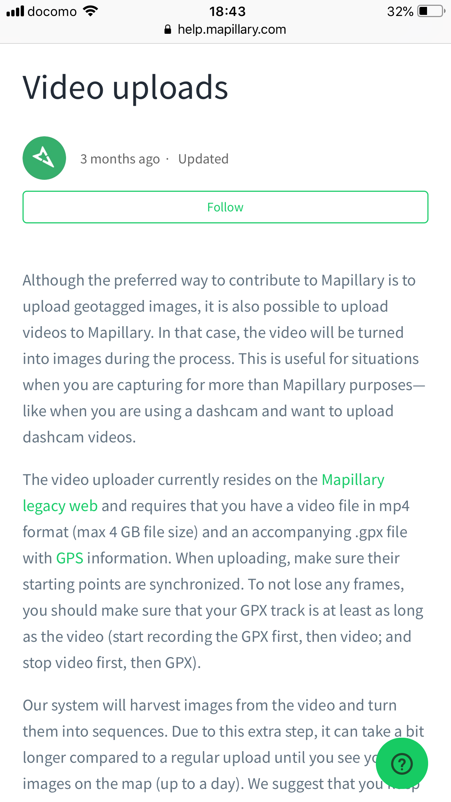

### ゼミ論進歩

今回はTHETAを使っての動画撮影とそのアップロードについてです。今回用意するもの自体は前回用意したものに加えてGPXデータを使えるアプリを併用していきます（Stravaのアプリを使用しました）。また今回はMapillaryのスマホアプリを使わずTHETAのアプリを使って撮影します。手順自体はTHETAのカメラをWi-Fi接続しアプリで撮影していけば完了します。この時撮影開始時にStravaのアプリで記録開始THETAのアプリで撮影開始、終了時にはTHETAの撮影を終了しStravaの記録を終了しておくという手順を踏みます。

さてその後Mapillaryにアップロードしていくのですがこの時StravaのアプリとTHETAのアプリで記録時間に差が出ているので注意が必要です。

今回アップロードにはMapillary Legacyというものを使いました。検索でMapillary video uploardと打ち込むと出てくるサイトにはいります。

緑の文字のMapillary legacy webをクリックして動画データとGPXデータをアップロードしていきます。動画データはTHETAのカメラとPCを接続して共有したものをアップロードするのが早いです。GPXデータはPCでStravaを開いて該当する記録から引っ張ってくるのが良いです。こうしてアップロードしたデータの誤差をサイトの説明通りに修正してからパブリッシュします。これが反映されるまで量にもよるでしょうが恐らく10時間ほどはかかるので注意が必要です。
