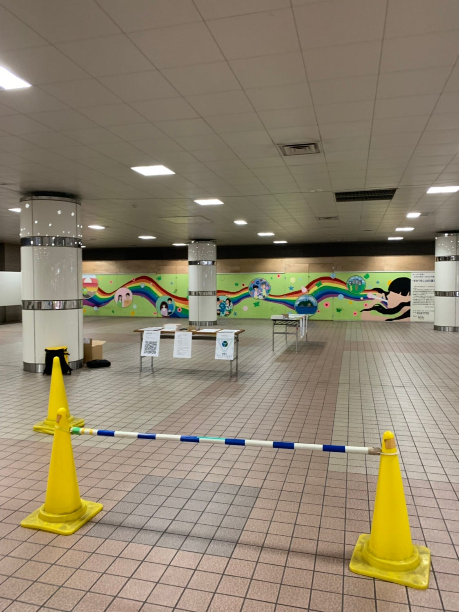
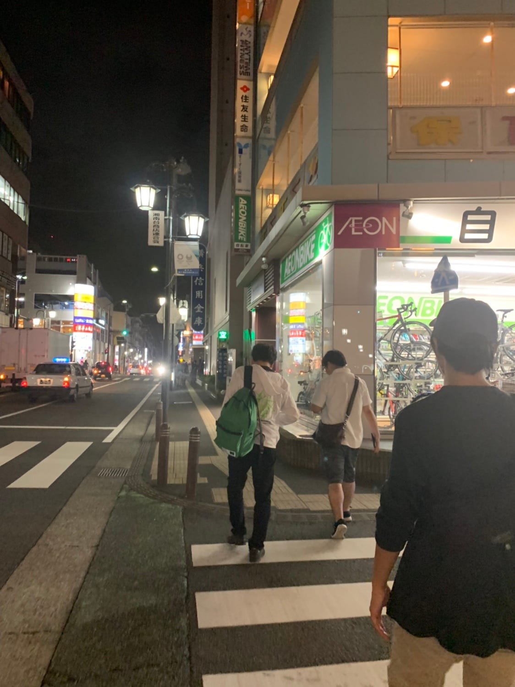
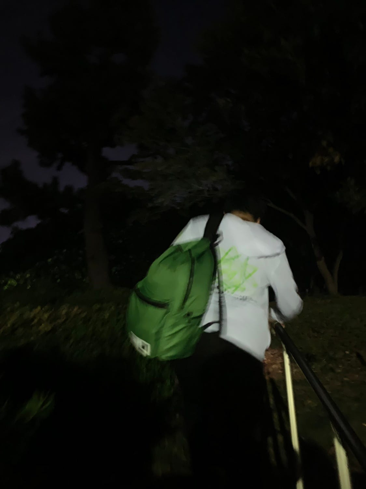
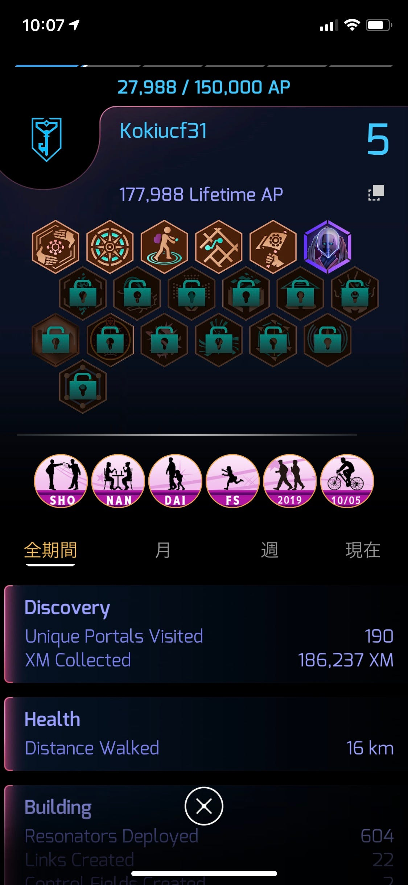

### **Ingress FS@藤沢 参加記録**

みなさんこんにちは、佐野公紀です。先日(10月5日)藤沢で開催されたイングレスのイベントに参加してきました。

集合場所は湘南台駅の改札付近。集合時間より早く着いてしまったため、最初あまりの閑散さに「イングレスってこんなにも浸透してないものなのか」と感じたが、次第に人が集まり、当初の雰囲気とは対照的になりイングレスの専門的な用語が飛び交う始末に。「おっと、着いていけないなこれ」と感じていた矢先、主催者の方がイングレス初心者を励ましてくださるお言葉を投げかけてくださりなんとか前向きに臨むことができました。

集合場所。

集まった人の中でいくつかのグループにわかれ、いざイングレス開始。しかしここで問題発生。レゾネーターをほとんど持っていなかったために、思うようにレベル上げがうまくいかないという事実に陥ってしまいました。しかしそんな初心者丸出しな状況でさえも、イングレスガチ勢の方々はとても丁寧且つ優しくレゾネーターを効率よく入手する方法などを伝授してくださいました。

街の中を歩いたり、暗い公園の中を歩いたり。どんな場所でも突き進む姿勢に驚きました。

様々の方から助けていただいたおかげで、なんとかレベル5に到達することができたが、レベル5というのはまだまだあまちゃん状態だということを同時に骨身に感じました。

#### 気づいたこと

・この時期でも未だに蚊などの虫がいるため、Ingress目的で外を徘徊する際は虫除けスプレーがあると快適に取り組むことができます。

・かなり歩くことが予想されるため、歩きやすい靴と服装で挑むことが望ましいです。

・イベント外でのレベル上げは想像以上に困難。日頃からの地道なレベル上げこそが寧ろ上達への近道と考えられます。

・「ゲームのため」に参加するのではなく、同じものに熱く取り組める仲間を作れる場であることも痛感しました。このようなイベントの副作用的な恩恵ではないでしょうか。

今回の参加をきっかけに、日頃からイングレスを取り組もうと以前より前向きな姿勢になることができました。また、ルールを知れば知るほど、どんどん上のレベルになりたいと思えることがイングレスの醍醐味ではなでしょうか。仲間と知恵を共有し、助け合うことで人との共存というものにも繋がってくると今回確信しました。

[strava.app.link](https://strava.app.link/MvY034L2z0)

今回のストラバです。
