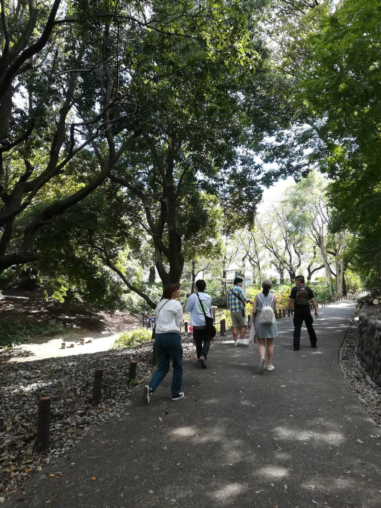
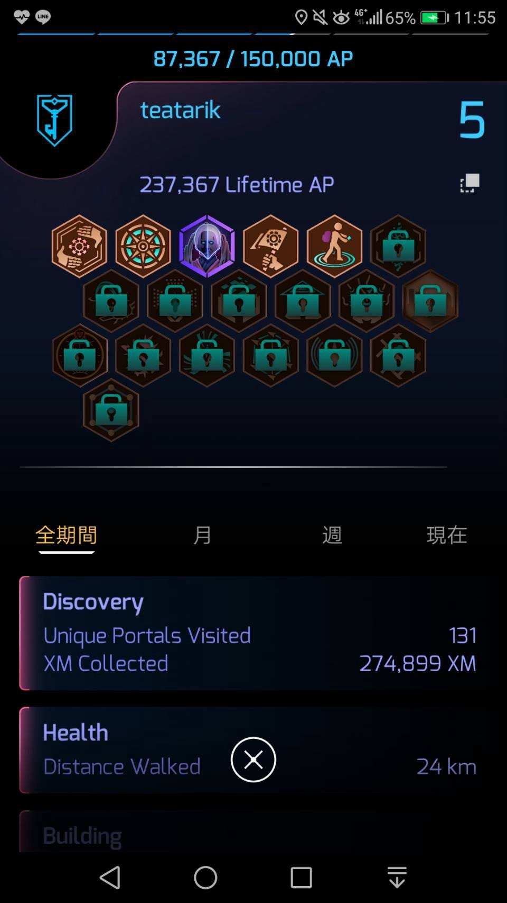
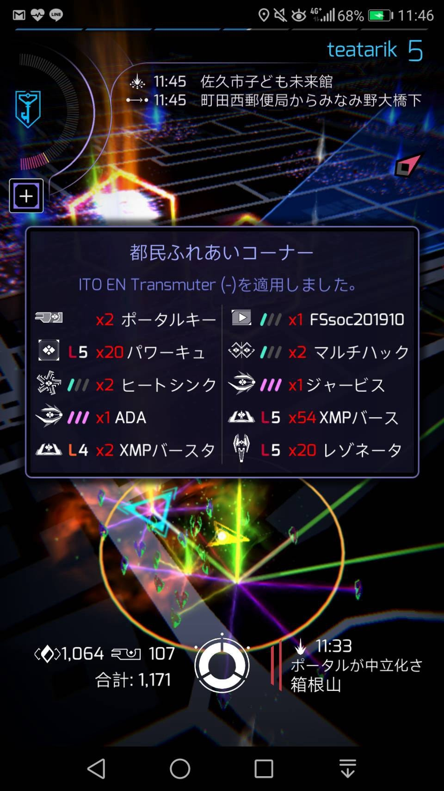

### Ingress First Saturday in Shinjyuku-city 参加報告

こんにちは。青山学院大学 地球社会共生学部３年の中西駿太です。

10/5(土)の午前中に新宿（都民ギャラリーふれあいコーナー）で開催されたファーストサタデー（通称：FS）に参加しました。

**■Ingress First Saturday in Shinjyuku-city 2019 10/5 8:00～12:30**

主催者：Rikka6

場所：都民ふれあいコーナー 戸山公園（箱根山） およびその周辺

スケジュール：

8:00～レジストレーションポータル発生（@都民ふれあいコーナー portal）

8:45 写真撮影（@箱根山麓）

9:00～11:00 ブートキャンプ （AP×２ 計測時間）

11:00～12:30 リストッキングポータル発生（@都民ふれあいコーナー portal）

今回はとにかくAPをひたすら稼ぎ、レベルを上がることが参加の目的、目標だったので面倒見がよさそうなAGにくっついて行動しました。

2倍のAP時間ではただただひたすら教官AGが焼いた 破壊したポータルにレゾネーターを差し、みどり軍によって破壊され、また教官AGが破壊し、レゾネーターを差し…というのを2時間ほど繰り返してガツガツAPを稼ぎました。

その結果…

あっという間にレベル5を超えて、レベル６が見えてくるほどまでに”成長”しました。更に、計測時間中に稼いだAPの倍の分が後日加算されるので、レベル６超えは確実となりました。こんなにも短時間でレベルアップできるのかとFSにおける生産性と効率性の高さに感激しました。

最後にリストッキングポータルでアイテムを大量にゲット♪ 無くなりかけていたレゾネーターも回復しました。

今回のFSでは親切なAGの方々のサポートで素晴らしい成果を得られることができました。残念ながら午後から用事がありAP（アフターパーティー）に参加することができませんでしたが、11月に大田区平和島で開催予定のイベントに誘っていただいたので参加を前向きに検討したいと思います。FS本当に楽しかったです。ありがとうIngress。

・今回のStrava

[https://www.strava.com/activities/2763285267](https://www.strava.com/activities/2763285267)

以上
