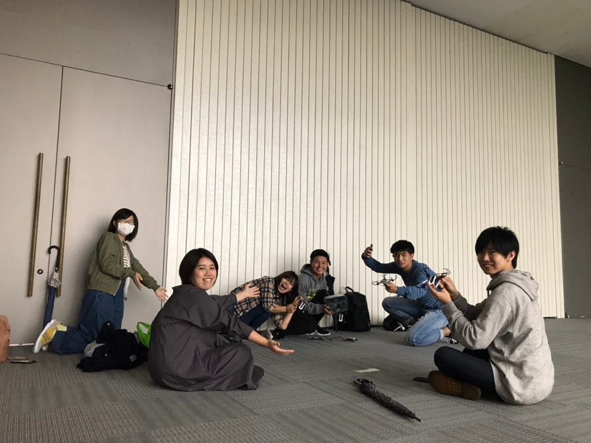

### **ドローン部週報：ドローン部始動開始！**

こんにちは！3年のこやももはです！

ドローン部今日から始動しました！

ドローンを操作するのは難しくて、なかなか自分の思った位置にドローンが動いてくれなかったです、、

良かった点

・リーダーが、事前に使うドローンのアプ リを教えてくれていたので、みんなスムーズに始めることができました！

改善点

ドローンのバッテリーが足りず、バッテリーをサークル始まる前に充電しておけばよかったと思いました！

今後の目標

1人でドローンを操縦することができるようになりたいです！そして、ドローン知らない人にドローンの楽しさを伝えられる人になりたいです！！

