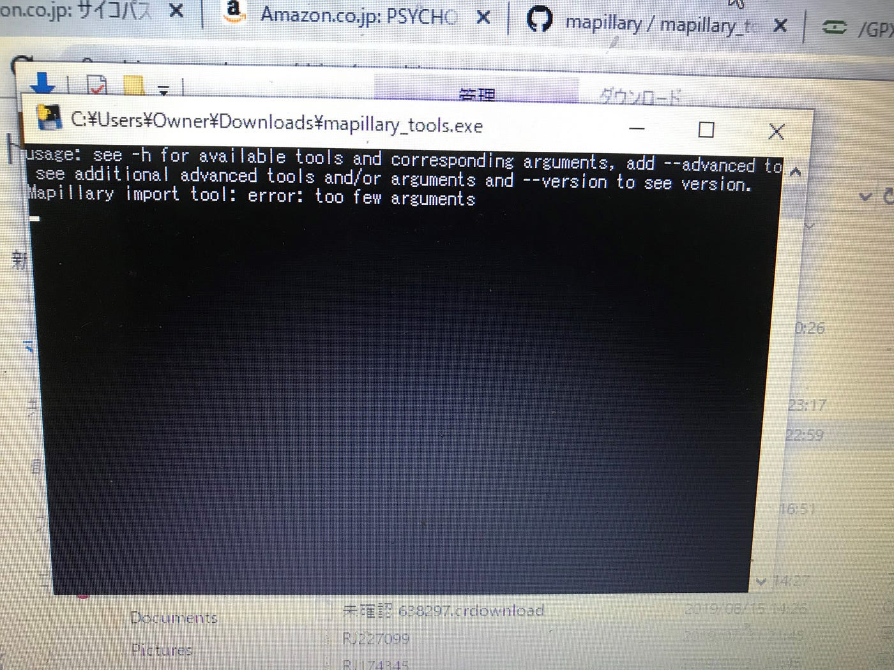

### ゼミ論進歩

Legacyを使ってのアップロードの件ですが何度調整しても調整前の状態で共有されてしまい、どうも仕様変更で出来なくなってたようです。

それでMapillary toolsを使おうという話になったのですがコマンドラインツール使ったと事がないのでかなり壁が高い上にアプリを立ち上げてから操作をすると即落ちてしまい全く作業できないのでGPXエディターを使いGPXデータを編集してアップロードし現状反映待ちです。

エラーとしては全画面にする、キーボードを打ち込むなど操作をすると数秒後この画面になりそのままアプリが終了するという形です。
