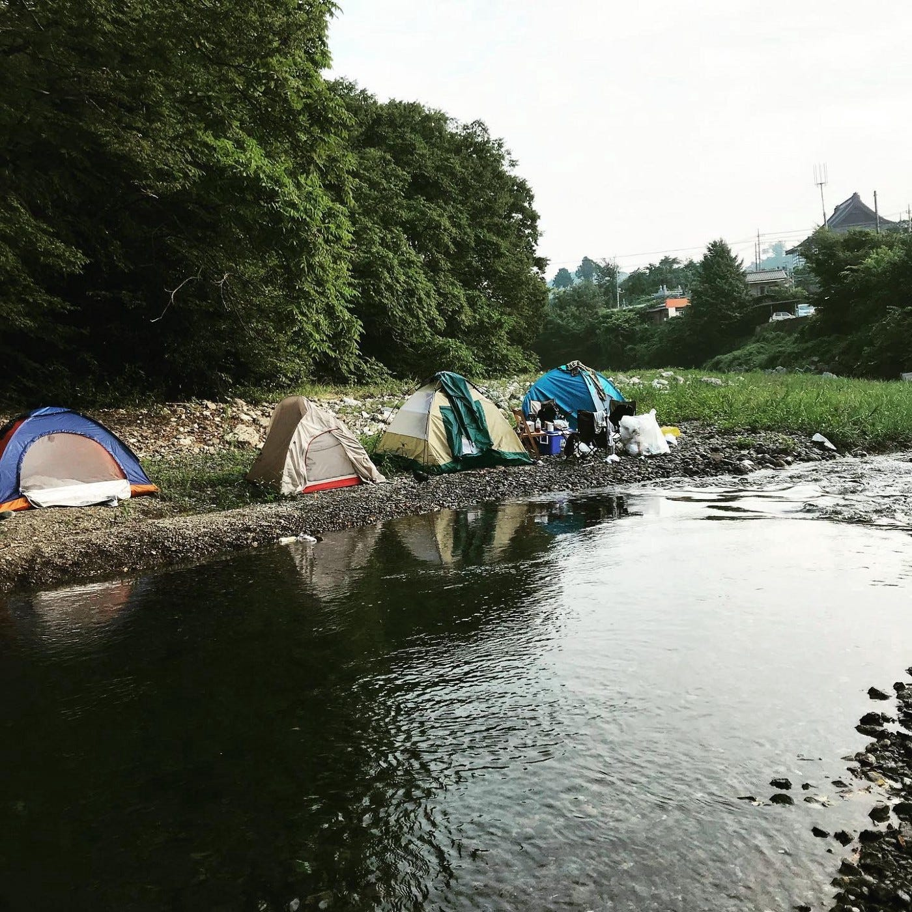

### 横瀬部週報：活動に向けて

古橋研究室3年の大庭啓太です。
私が今年度より立ち上げました「横瀬部」は、７名の部員と研究室内サークルの中では結構な大所帯になります。
そこで、まず先生のアドバイスの元以下のような体制で活動を進めて行くことにしました。

### 横瀬部運営体制

> _基本的に横瀬部は一つのゼミないサークルとして活動。_

> _しかし、リーダーのマネジメント負担を減らすために、サブリーダーを設置する。_

> _そして、各リーダーがその他メンバー２名をマネジメントする形でチームバランスを担保。_

今回は古橋先生の的確なアドバイスでチーム編成を以上のような形で決定しました。

→研究室FBグループに報告済み

### 今週までの流れ

皆さんご存知の通り、台風19号が12日に日本に上陸し、とても大きな被害が発生しました。

私横瀬部の部長ということもあり土曜日は横瀬に被害が出ていないか、インターネットやSNSで情報取集を行なっておりました。

そこでの気づきとして、「横瀬」という特定の地域の災害が起きている時のリアルタイム情報や被害状況を瞬時に把握することはとても難しいということです。

NHKやYahooニュースを見ていてもなかな「横瀬」に関する情報は流れてきません。

今回、私がいくつかの方法で情報収集を行ったので、その中でも災害時の情報収集に適したツールを紹介します。（横瀬の情報取集経験を元に）

> _・Twitter_

> _・ちちぶFM（アプリで聞くことが可能）_

Twitterでは、情報量は決して多くないものの災害の状況を把握することのできる投稿がいくつか見られました。

しかし、台風通過中や通過後の被害状況は、ちちぶFMという秩父地域の情報を配信するラジオがとても役に経ちました。

生放送で秩父の状況を配信してくれているので、横瀬部のメンバーや横瀬に関わりのある研究室生はいざという時のためにアプリのダウンロードをおすすめします。

### 横瀬部としての関わり方

台風19号では横瀬町には幸い人的被害はなかったということですが、「学生」として何かお手伝いできることがないかと考えています。

現在、古橋先生を介して役場の方にヒアリングをしている段階です。

現時点で挙げられている問題の一つとして

> _・町民間での迅速な情報共有が課題_

これは位置情報や空間情報を学ぶ古橋研究室の学生として何かできるのではないでしょうか？

そんなことも含めてメンバーとアイデア出しをしながら、今後のフローを決めていきたいと思います！！

### 最後に

横瀬部はたくさんのメンバーが在籍してくれているので、みんなの個性を活かしながら活動をしていきたいと考えています。

皆さんも是非メンバーが交代で投稿していくブログや活動報告をお楽しみに！
