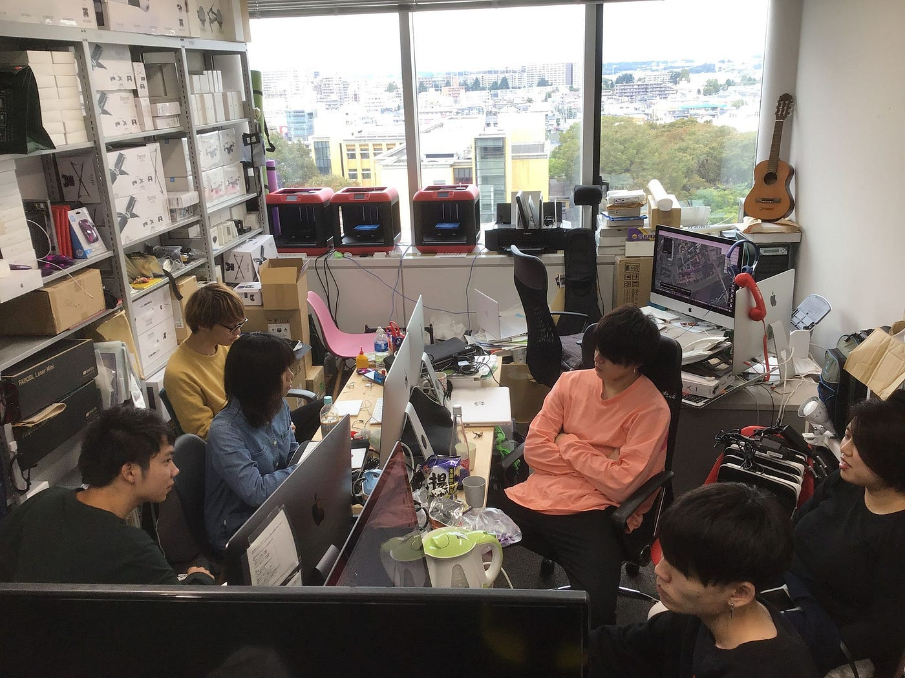
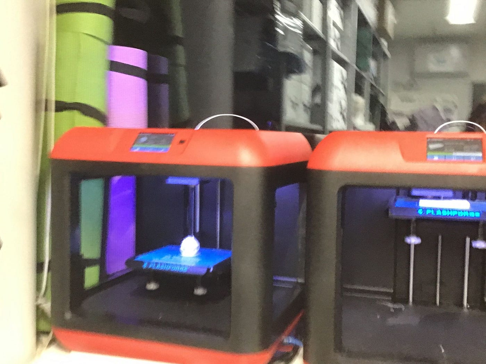
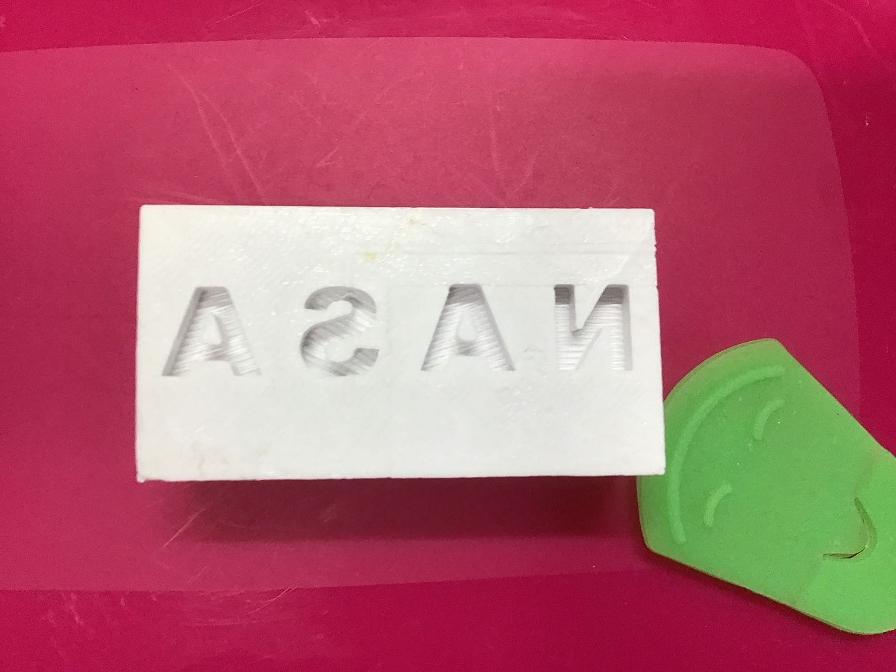
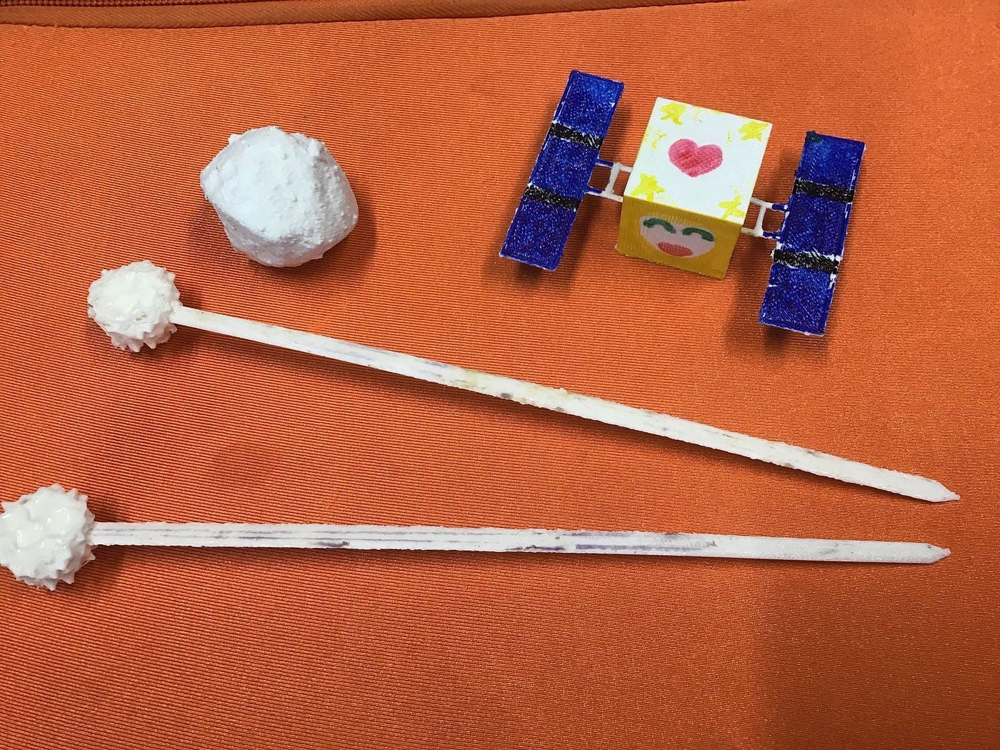

### まさかの参加！？NASA Space Apps Challenge (10/20)

### 初めに

こんにちは。古橋ゼミ3年の佐藤遼です！

今回は[NASA Space Apps Challenge](https://www.spaceappschallenge.org/)での出来事を話していきます。そもそも10/20は町田での防災訓練に参加する予定だったのですが、台風の影響で中止になってしまい、急遽この企画に参加することになりました！笑（名前だけみるとすごいハードル高そう、、）

### 企画の考案

NASAに提出する課題として、宇宙に関連するものを3Dプリンターで作ろうということになりました。最終的に3つの案が出て、自分は宇宙の箸を作ることにしました！（3Dプリンターはこんな感じ）

ただ、当然3Dプリンターなんて今までに使ったことがないので扱いが難しい、、。板垣さんに教えてもらいながらなんとか作業を進めます。 （試作品で初めて作った作品がこちら）

NASAのハンコのようなものを作りました。ここから本格的に箸作りに入ります！

### 箸との闘い

ハンコを完成させ、意気揚々と箸を作ろうとしたら難しいのなんの、、笑3Dプリンターで作れるものには大きさに限界があるため、箸と装飾で使う小惑星を別々で作り、後からそれを合体させることにしました！ （3Dプリンター初心者には難易度高すぎですこれ、、）ただ、やるしかないので箸と格闘しながらもなんとか完成

### 最後に

今回は先輩や古橋先生のおかけでグローバルに進出することが出来ました！！まだ自分にも残された仕事があるので最後までやり切りたいです！！！
