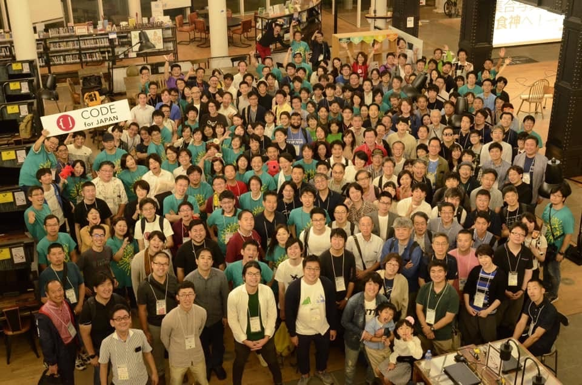
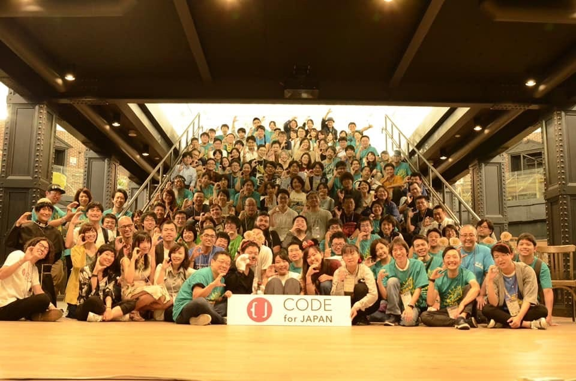
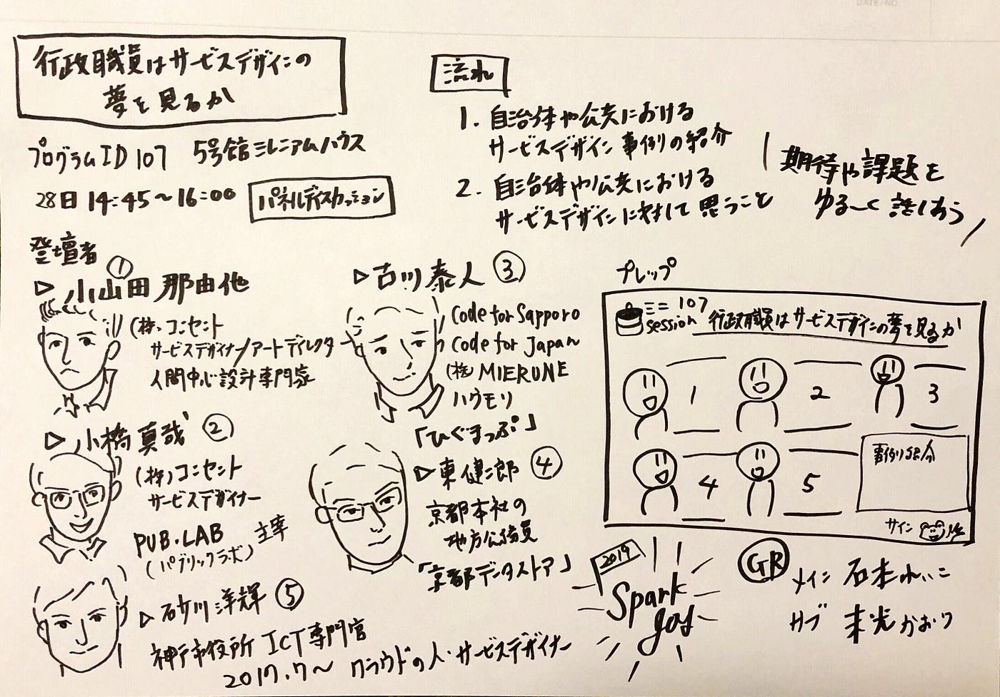
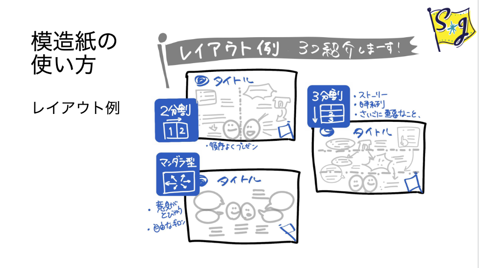
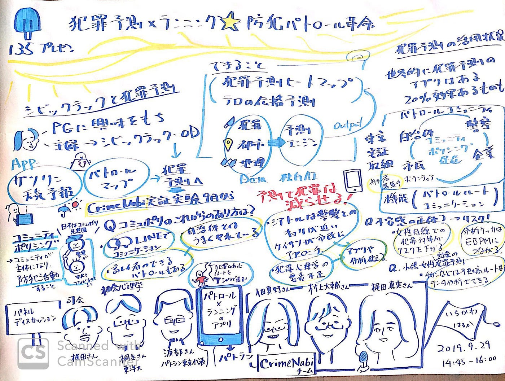
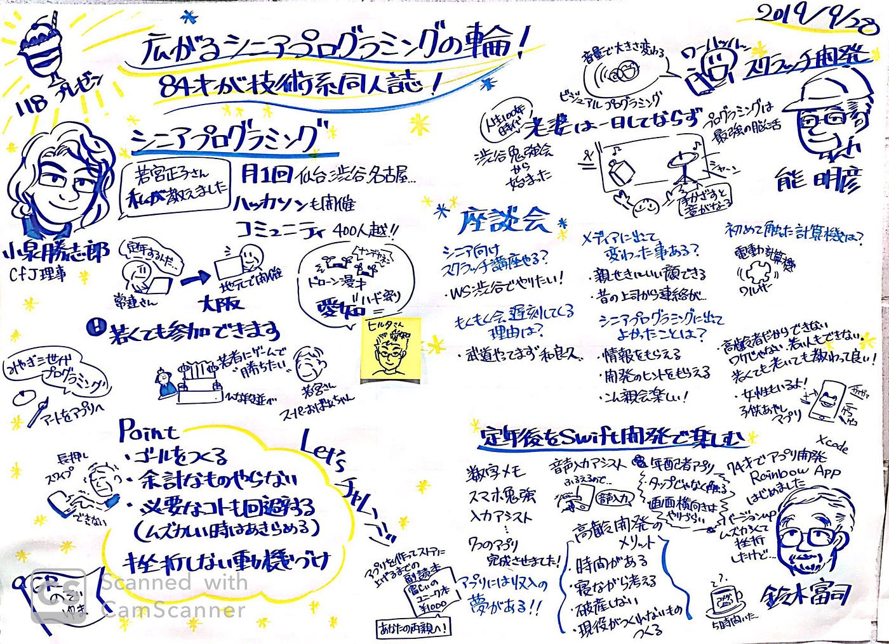
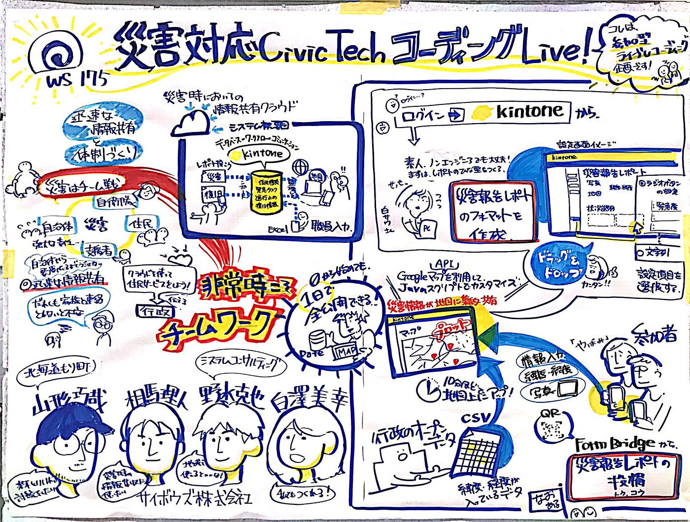
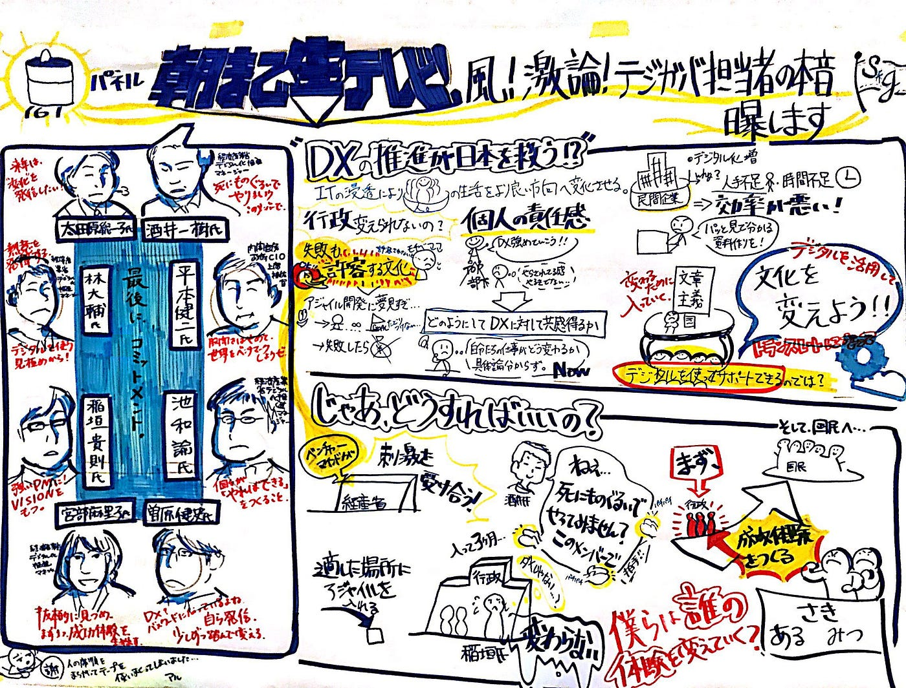
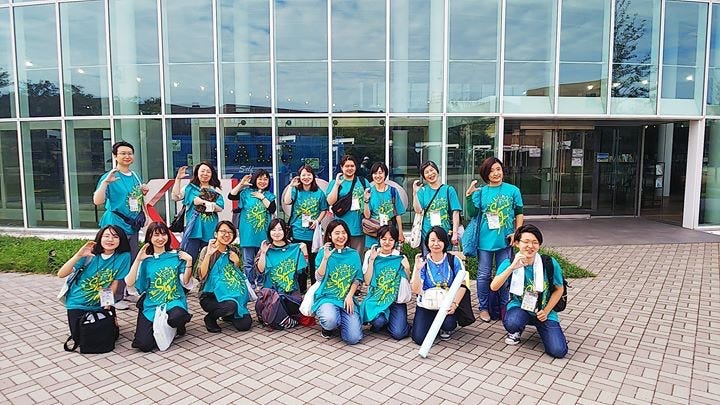

### グラレコ部週報：2019年10月第3週目

遅くなりましたが、9/28,29に神田外国語大学で行われたCode for Japan Summit in 千葉にグラフィックレコーダーとして参加してきました。

Code for Japan Summitは市民自身がテクノロジーを使って社会課題解決をおこなうシビックテックの国内最大のカンファレンスです。
90人のスタッフ、130人の登壇者、そして、約1,000人の参加者が「ともに考え、ともにつくる」テーマに炸裂した議論をグラレコしてきました。

今回はいくつかのグラレコとcfjグラフィックレコーダーののぞみさんに教わったテンプレや上手く描く方法をいくつか紹介します。

### 準備

cfjのような専門用語が飛び交う議論はレコーダー自身も内容がわからないため事前にセッション内容やその分野の知識を事前に学習しておくことが大切です。

そしてどのようなレイアウト・似顔絵で描くのかを決めてプレップを用意しておくと、本番で描き始めに悩まず内容をしっかり聴きながら進めることができます。

1. **セッションタイトル**

1. **セッションスタイル**（・パネルトーク：1人or1人ずつ話す・ライトニングトーク：1人が短い時間で話す・パネルディスカッション：複数人が話す・ワークショップ：作業しながら話す）

1. **登壇者の顔/名前/会社名や役職名**

1. **大体のセッション内容**

1. **登壇人数**

は事前に確認しておくと◎

### レイアウト

レイアウトは出したらキリがないですが、自分のやりやすい・トークにあった構成を作り出すのが重要だなと感じました。

実際のグラレコがこちら↓

### 最後に

私は2日間とも参加しました。朝から夜まで本当にたくさんのセッションがありました。疲労困憊。長岡造形大学からきた学生もいました。2日間でこんなに内容の濃いグラレコをさせてくれたcfjありがとうございました！

今回多くのレコーダーがいると同時に多くの描き方を間近で見ることができ学びが多かったです。またいつかの週報で紹介します。
