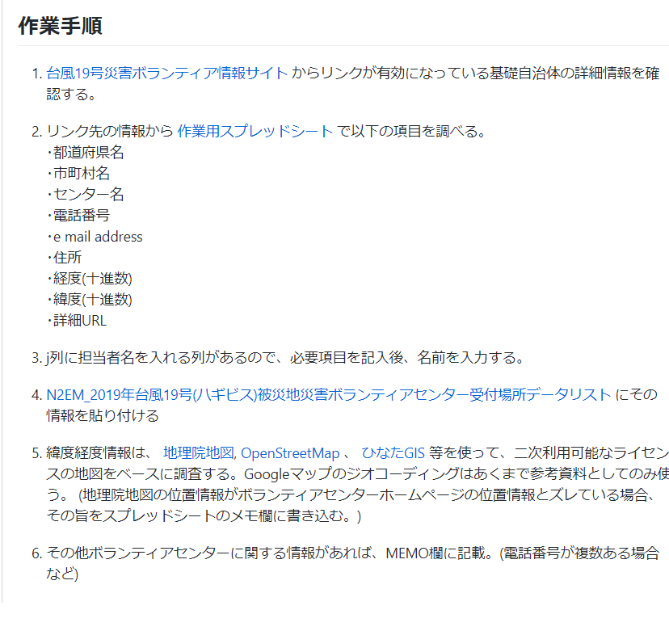

### ゼミ論進捗報告

お久しぶりです。ゼミ論進捗報告滞っておりました中西敦子です。

10月に入る直前、やっとやっと第一志望の企業から内定をいただけました…およそ一年半の就職活動でしたが地元のテレビ局に決まり嬉しいです。あとは卒業できるように気を抜かず頑張ります(;^ω^)

### ゼミ論進捗

私は卒論ではなくゼミ論を選択し、テーマを新たに設定し直しました。以下に報告いたします。

先日東日本を中心に、日本各地で台風19号の被害に見舞われました。

そして今、各地でボランティアセンターが開設されています。

しかし当初はどこにVC受付場所があるのか網羅されていない状況であったため、古橋先生にN２EMのメンバーにご招待頂き、受付場所を可視化する作業を行いました。

手順は古橋先生とGithubにまとめました。

[N2EM 災害ボランティアセンターマッピング 2019/10/12 台風19号 · Issue #42 · furuhashilab/mapping
作業の簡易マニュアルをここに整備します 作業手順 台風19号災害ボランティア情報サイト からリンクが有効になっている基礎自治体の詳細情報を確認する。 リンク先の情報から 作業用スプレッドシート で以下の項目を調べる。 ･都道府県名…github.com](https://github.com/furuhashilab/mapping/issues/42?fbclid=IwAR1iHsUXTbpA4Hrf6Bl7obnjxHXWb2qhE1brSxu-hU3gjurlLyrC_b-bwDk)

この手順でspreadsheetにひたすらデータ入力を行いました。

最初45か所ほどのVCセンターがあり、到底終わらない作業を一人で行っていました。

しかし古橋先生に「周りに協力してもらい作業を進めるように」とのアドバイスをいただき、古橋ゼミグループライン、facebookで呼びかけをさせていただきました。

その結果、ゼミ生だけでなく、酪農学園大学の方やN２EMのメンバーの方々が入力作業に協力してくださり、予定通り作業を完了させることができました。

協力してくださった方々、本当にありがとうございました。

さて、今回の入力作業をする中で疑問点やミスが多く発生しました。

そのため、ゼミ論として「VCのPOIデータ入力作業」をマニュアルとしてまとめることに致しました。

今後ブログで、作業を進めるうえで困ったことを共有します。

正直、古橋先生にPOIデータ入力作業のまとめ役を任された際「そんな大役私がやって大丈夫なのかな…」不安でいっぱいでした。

ですが、他大の方を含め多くの方が協力してくださったことで、責任感をもって作業に取り組もうと意識が変わりました。

そして、実際入力した情報が地図上のデータになった瞬間、自分の作業が被災された方の役に少しでも立っていることを実感できました。

ゼミ論で作成するマニュアルでは、今後災害が起こった際に多くの方の役に立つものになるよう、尽力します！
