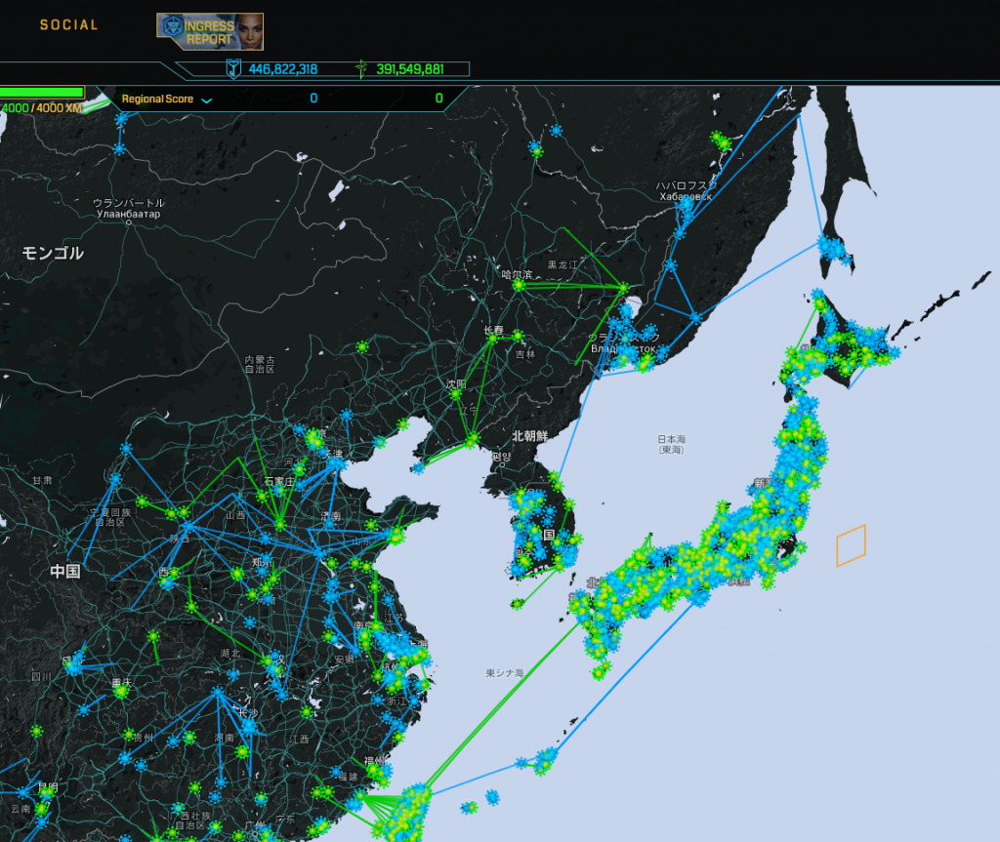

### 位置ゲー部週報：個人の目標決め

古橋ゼミ3年の佐藤遼です！

二回目の活動としては個人の目標と部の目標の候補を決めました。

### 個人の目標

依田：ingressと地域活性を目的に、三鷹市で行われている三鷹太陽系ウォークというスタンプラリーとingressを結び付けられるかどうか

安田：個人の目標は周りにいるポケゴーかIngressのユーザーを3人増やす（自分が理解して楽しさなど語れるようになる）

佐藤：ポケモンGOで伝説のポケモン50体以上集める

他：未定

### 部の目標の候補

・位置情報ゲームを日常での活用方法を考える

・ゲームとしての楽しさ以上の有効な活用法を模索する

・近年は学校で行われる体力測定の結果が下がってきてるから位置ゲーを通してなにかできるか

### 終わりに

個人としても部としても方向性が決まってきたので次の集まりでまとめていきたい
