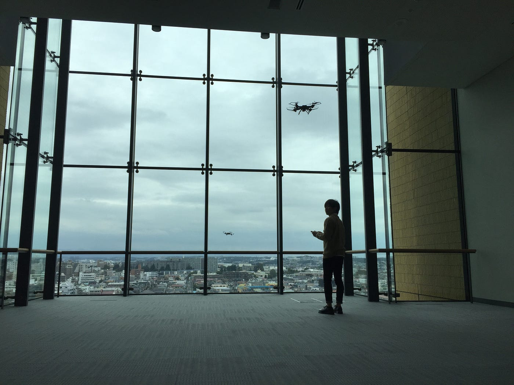
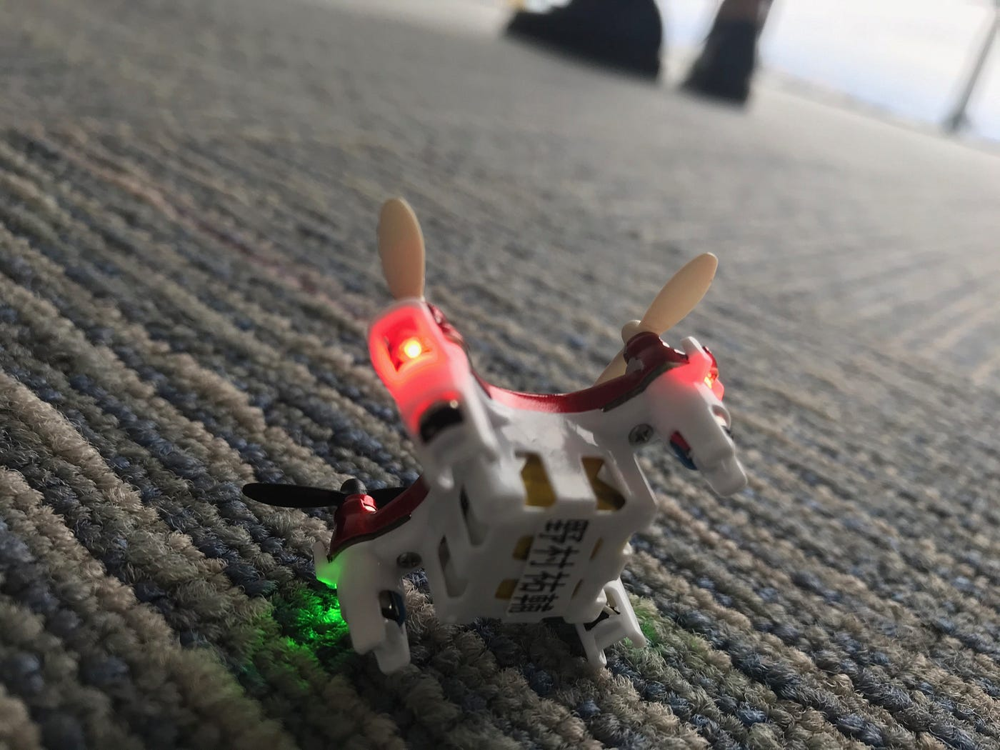
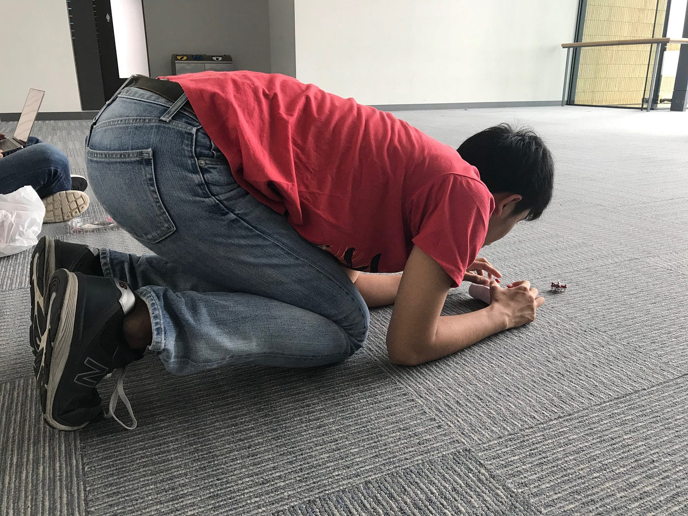

### ドローン部週報：第二回練習会

こんにちは！三年の上田泰三です。

本日2回目の練習会を行いました〜〜

今後ドローン部ではドローンの操作方法と土地勘（風向き・地形・天候）を意識しながら練習していきます。

前回の練習ではあまり上手に操作できなかったため、今回は一人一人様々なドローンの操作になれるよう心がけました！！

また来週も練習して、操縦上手くなれるようにしていきたいです！！
