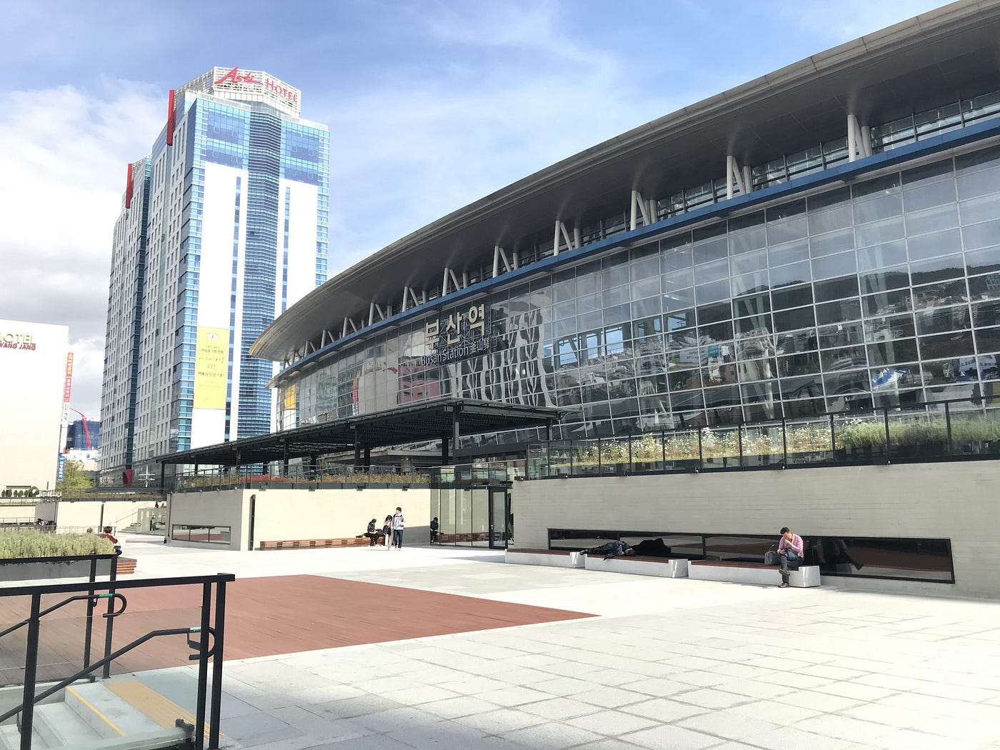
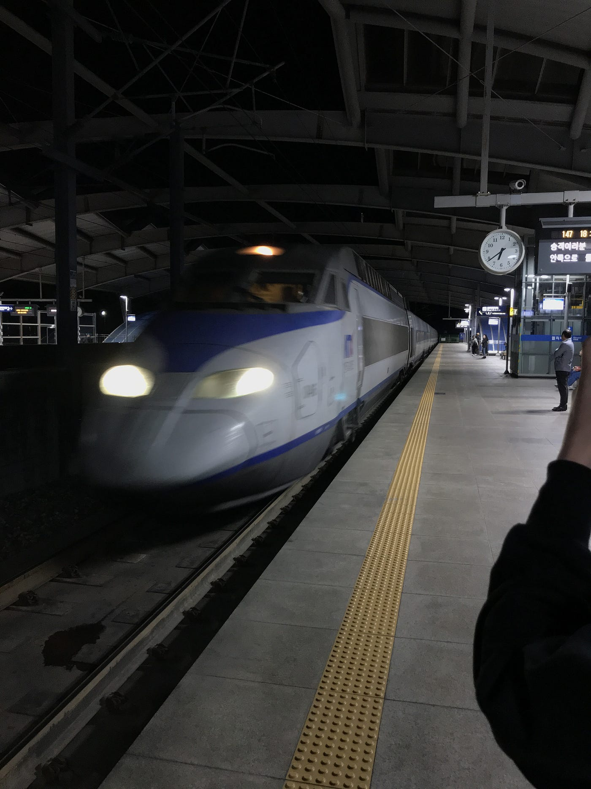
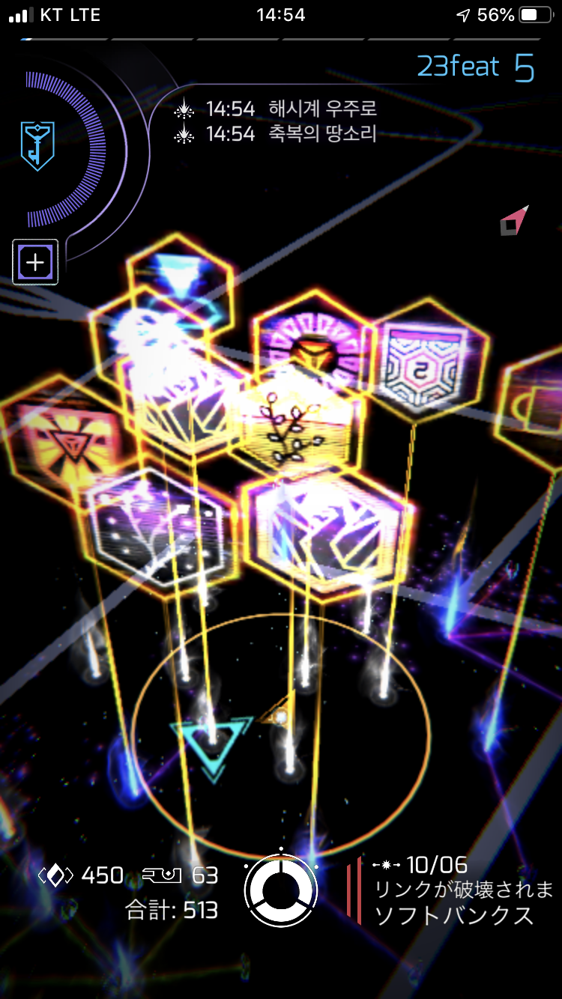
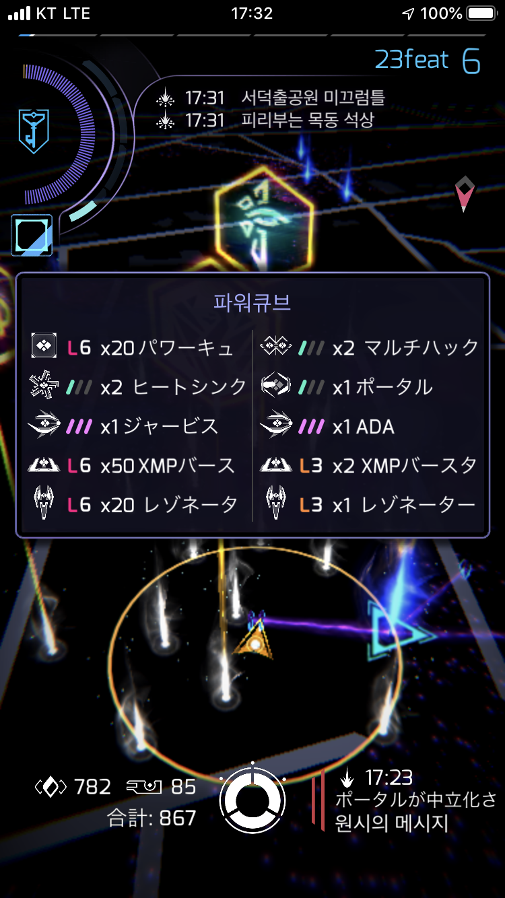
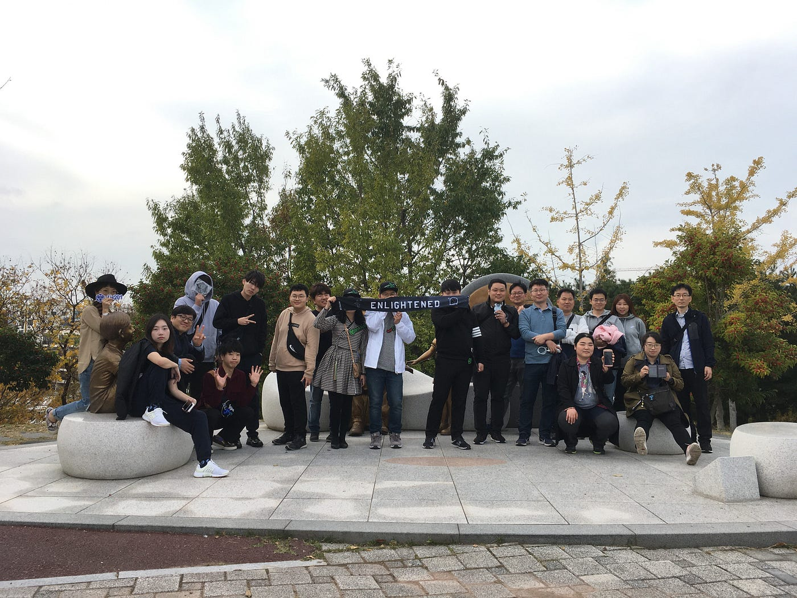

### Ingress FS in Ulsan, South Korea

こんにちは３年の浜田皐太です。古橋ゼミは3月末までに最低でも１回、国際会議に参加することが必須でありその中で海外での[Ingress](https://ingress.com)のイベントも国際会議扱いということだったので１１月２日に韓国の蔚山で行われる[Ingress FS](https://ingress.com/ja/events/)に参加しました。

Ingressのイベントは直前に告知されることが多いのでイベントがあるかわかる前に釜山行きの航空券を取りました。

**ここが大きなミスだった。。。**

イベント直前になっても一向に釜山でのIngress FS の開催はなくいちばん近くても釜山から片道電車で２時間のところしかありませんでした。韓国第２の都市、釜山でイベントが行われないとは意外。しかし出発予定日の五日前に釜山から電車で２０分のUlsanにてFSが開催されることが告知されました。

**助かったー！！！**

ということでいざ韓国へ。成田からLCCで約２時間で金海空港に着きそこからバスで３０分ほどで釜山に着きました。

夜に着いたのでこの日はホテルに直行し翌日のイベントに控えることに。

翌日１１月２日、釜山駅から高速鉄道KTXを使いUlsan駅に到着しました。

２０分ほどで着いたのであっという間でした。そこから会場までバスで約１時間だったのですがここでも思わぬトラブル。

**バスが来ねえ。。。**

Google Mapではバス停まで指定され無事に会場まで行けるように指示されていたにも関わらず肝心のバスが来ないので会場にいくことができずすぐに向かわないともう間に合わない時間だったので友人と話し合い諦めムードに。タクシーの値段も日本と同じくらいとネットにあったので打つ手なし。諦め半分でタクシーの運ちゃんに会場までの運賃を聞いてみると２万ウォンとのこと。日本円で２千円ほどだったので安すぎて逆に怪しくなったのですがもうこれにかけるしかないと思いタクシーに乗りました。思いの外、ちゃんと会場方向へ急いでくれてFS集合時間の１０分前に奇跡的に着くことができました！！！！

会場にはすでに多くの韓国人Ingress Agent が集まっており日本語を話せる方がいたのでスムーズにチェックインすることができFSが始まりました！

FSが始まると見たことのないフラッグが立っていて僕たちアマチュアがすることはポータルにレゾネーターを打ちポイントを稼ぐだけでした。そのあとすぐAgentがポータルをneutralの白い状態にしそして僕らがまたレゾネーターを打ち込みポイントを稼ぐという繰り返しでした。Ingressのイベントということだったのでもっと歩き回るのかと思っていたのですがそんなことは全くなくベンチに座って繰り返し作業をするのみでした笑

本当に韓国の皆さんは優しくIngress のやり方を丁寧に教えてくれて今回のイベントでIngress についてとても詳しくなることができました。

最終的にレベル５からレベル６まであげることができ、さらにイベント終了後に青い三角マークが出現したくさんのアイテムをゲットすることができました！

最後蔚山駅にもどるためタクシーを捕まえたかったのですがどうしたらいいかわからず困っていたところIngress Agent の人たちが大通りまで連れてってくれてタクシーを呼び行き場所まで伝えてくれて僕たちは乗り込むだけでした笑

### **最後に**

トラブル続きでしたがイベントを終えることができホテルにもどることができました。今回無事にことが終わったのは間違いなく韓国の人たちの協力でした。韓国に行く前は政治的に日韓関係が不安定だったので心配していましたが韓国の人はみんな優しく困っていたらすぐに助けてくれました。今回の国際会議を通してIngressについて詳しくなったことはもちろん、韓国と韓国の人を好きになりぜひ彼らとまたIgressを一緒にしたいです！！

[午後のウォーキング - 皐太 浜田's 1.4 mi walk
皐太 浜. completed 1.4 mi on Nov 2, 2019.www.strava.com](https://www.strava.com/activities/2834544020)
