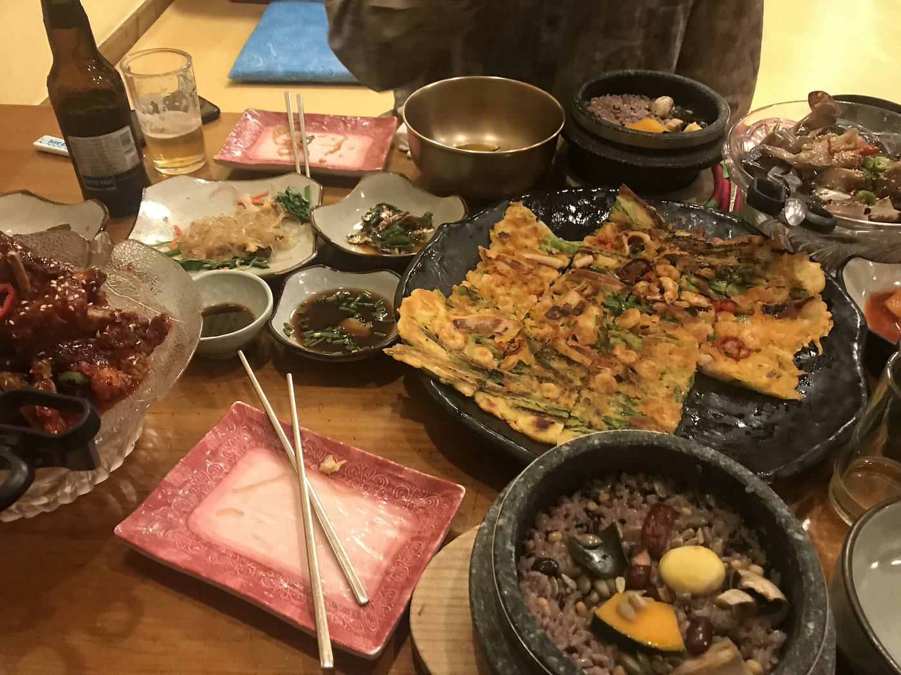
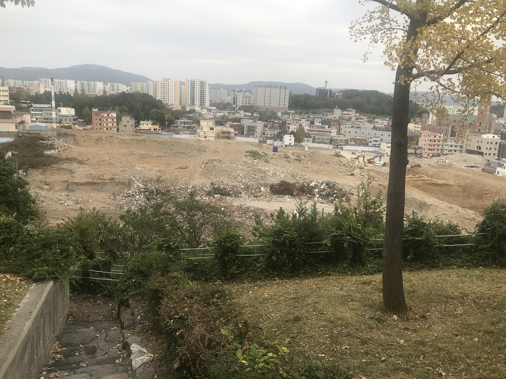
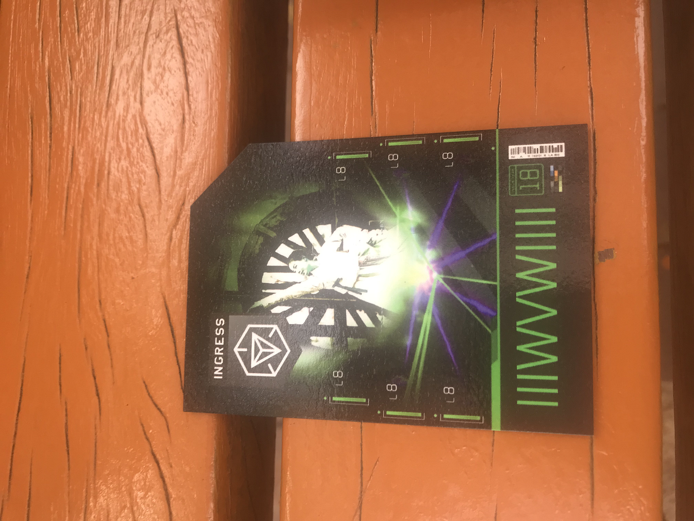
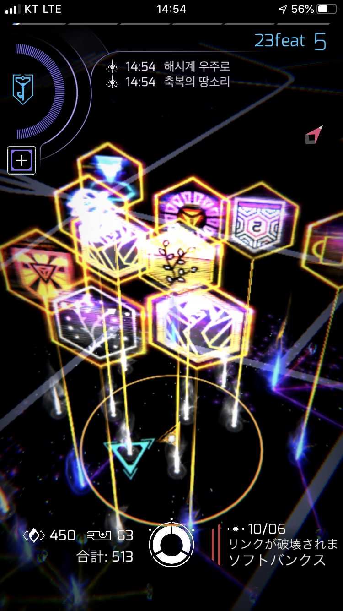
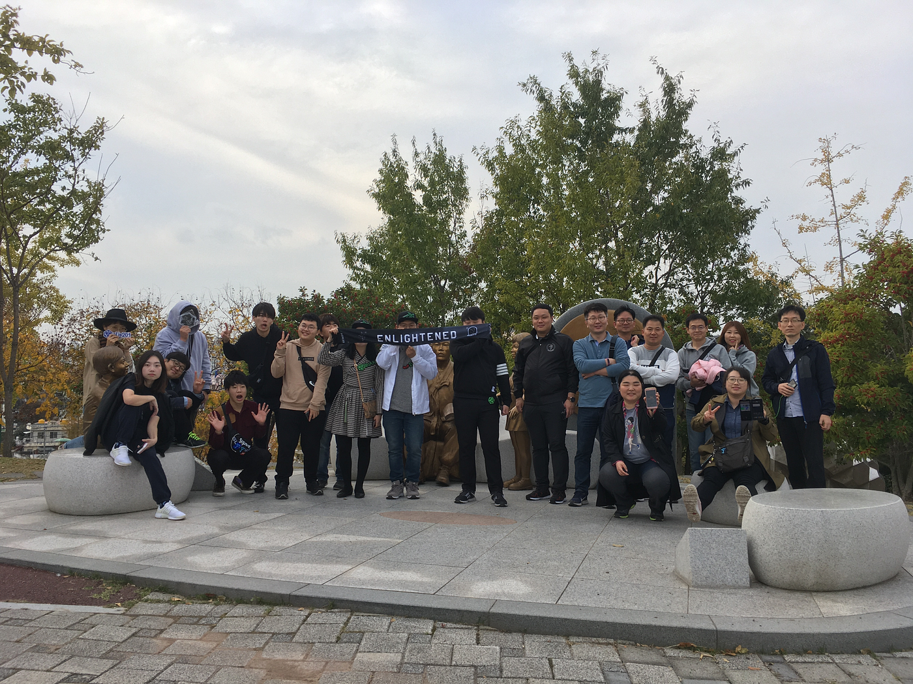

### Ingress FS in Ulsan ～韓国人の優しさに触れて～

こんにちは３年の佐藤遼です！ゼミの課題である国際会議のため、ingressをやりに韓国まで行ってきました！つらかったような、、、楽しかったような、、、笑 そんな韓国の旅（観光は全くできなかった）をお届けしたいと思います！

### 韓国前日の夜～絶望からの学習編～

あれ、おかしいな、、、

_**パスポートがない！！！！_**

３日間の旅だったので荷物はそんなにないだろうと余裕をぶっこいていた自分を殴りたくなりました。夜中にゴソゴソしていたので母親（不機嫌）も起きてきて、叱られながら一緒に大捜索が始まりました。1時間弱探して諦めそうになっているとき、なんと普段使わないノートに挟まっていたのです！

なんでそんなとこにあるの～～～

定位置管理は大切ですね、本当に、はい。

### 韓国到着一日目～暴走バス事件編～

パスポートを手に入れた喜びで意気揚々と韓国に到着した自分に待っていたのは、恐怖のバスでした。空港からホテルまで行くには電車とバスを乗り継がないといけなかったため、バスを調べているとこんな文字が、、、

_**「韓国のバスは運転が少し荒いです」_**

まぁ、タイのバイクとタクシーを乗りこなしたんだからこれまた余裕だろと思っていたのが間違いでした。

_**「あ、これつり革つかまってないと死ぬわ」_**

運転が荒いの激しいのなんの、、

運賃をバックから出そうにもそんな余裕はありません。手を離したらそこには死が待っています。定着所から発車するスピードは運賃を出させまいという運転手の強い意志が感じられる程でした。そっちがその気ならキセル乗車をかましてやろうかと思いましたが、韓国着いて初手犯罪はさすがにやばいと定着所に停まるたび徐々にお金を出し、なんとか下車に成功。

皆さんも韓国行くときはバスに気をつけてください

なんだかんだでそんな一日目の夕食はこちら

チヂミとヤンニョムケジャンを食べました。伝わらないかもしれないですが、チヂミがかなり大きくてとても食べ応えがありました。

とりあえず言いたいことは韓国の飯は美味いということです。

### 韓国到着二日目～運転手Aとゆかいな仲間たち編～

この日がingressのイベントの日だったので前日に調べた会場までの交通機関を何度も確認。この完璧なプランに穴はない、、

電車と高速鉄道までは予定通りにだったのですが、またもここで事件が、

_**「バスがこないぞ、、、」_**

またお前かバスよ。いい加減にしてくれ。

タクシー乗り場も近くにあったので、運転手（Aとしよう）に行ってくれるか聞いてみたが、遠いからなんだ（たぶんそんなニュアンス）で断られ絶望へと落とされました。もういっそ諦めて観光してやるかと思いましたが、最後のあがきでもう一度別のタクシー運転手に行ってくれるかと聞いてみるとAが謎に接近してきました。たぶん私は面倒くさいからお前が行けと言ったような気がします。

_**「お前はなんなんだ、初めから乗せてくれ、、」_**

そんな言葉を抑えながら無事に目的地に到着しました。

チェックインを済ませイベントが始まりました。思ったよりもフランクな人が多く、名刺のようなものやお菓子などを貰いました。

イベントでは強い人がたくさんいたので置いたポータルをすぐに壊してくれて無限にデプロイしていました。

（画像をスクショし忘れたので友達の画像を拝借）

このイベントでレベル5からレベル6になりました！FSサイコーですね。毎日でもやってほしいくらいです。

3日目は帰るだけだったので割愛させていただきます。

### 終わりに

今回韓国のFSに参加してみての感想としてはゲーム全般（位置情報ゲームも含め）人種はあまり関係ないということです。あれだけ日韓の中が悪いと報道されていても、実際行ってみると親切な人ばかりでした。位置情報ゲームを通してこれを学べたことはとても大きなことだと思いますし、なによりさらなる可能性が見えた気がします。まだまだ奥が深い位置情報ゲームをこれからも続けていく良い活力になった旅でした！

[午後のウォーキング - 佐藤 遼's 0.8 mi walk
佐藤 遼. completed 0.8 mi on Nov 2, 2019.www.strava.com](https://www.strava.com/activities/2834544201/overview)
