### SotM Asia 2019 Bangladeshは凄かったぜ

みなさんお元気に過ごされていますでしょうか。古橋研究室2期生の武末です。

この度OSM Bangladesh Foundation様の奨学金制度を受けることが出来まして、11月1～2日に開催されました、State of the Map Asia 2019へ参加させて頂きました！

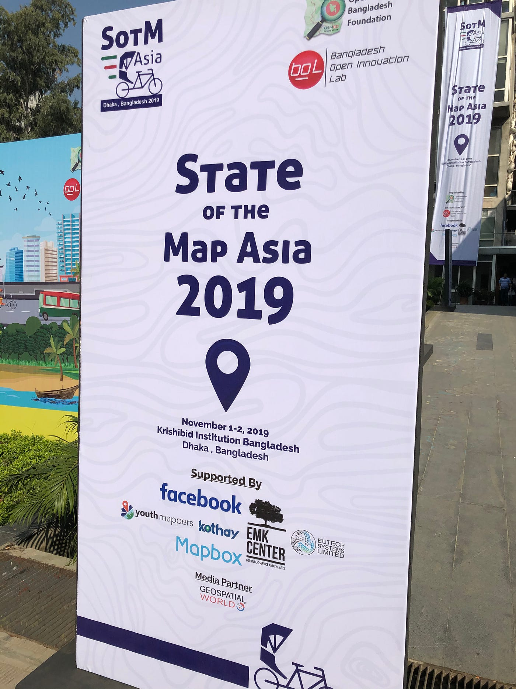

まずは、この場ではありますが、Bangladesh Foundation様に再度、感謝申し上げます。

[State of the Map Asia 2019
Last year, we were in Bangalore, India. Members of the OpenStreetMap community met to learn the significance of mapping…stateofthemap.asia](https://stateofthemap.asia)

兼ねてからずっとOSMの国際会議には参加したいと考えていて、色々な奨学金に申請を行っていたのですが叶わず…。そんな時に今回奇跡的に機会を頂けて、とても嬉しかったです！

今回の開催地はバングラデシュというのも面白いポイントでした。南アジアというとインドとかスリランカとかが有名ですが、なかなか行く機会が無いもの。しかし留学でタイへ半年行った私としては、そういう場所だからこそ行きたい！と思っていたので選ばれた時は本当か？？と何度もメールを読み返してしまいました。

実際行ってみて、まずご用意いただけたホテルがとても綺麗で驚きました！Ambrosia Guest Houseというホテルだったのですが、空港からタクシーで40分くらいと近く、庭や部屋も綺麗、朝食も美味しいと素敵な3日間を過ごすことが出来ました。

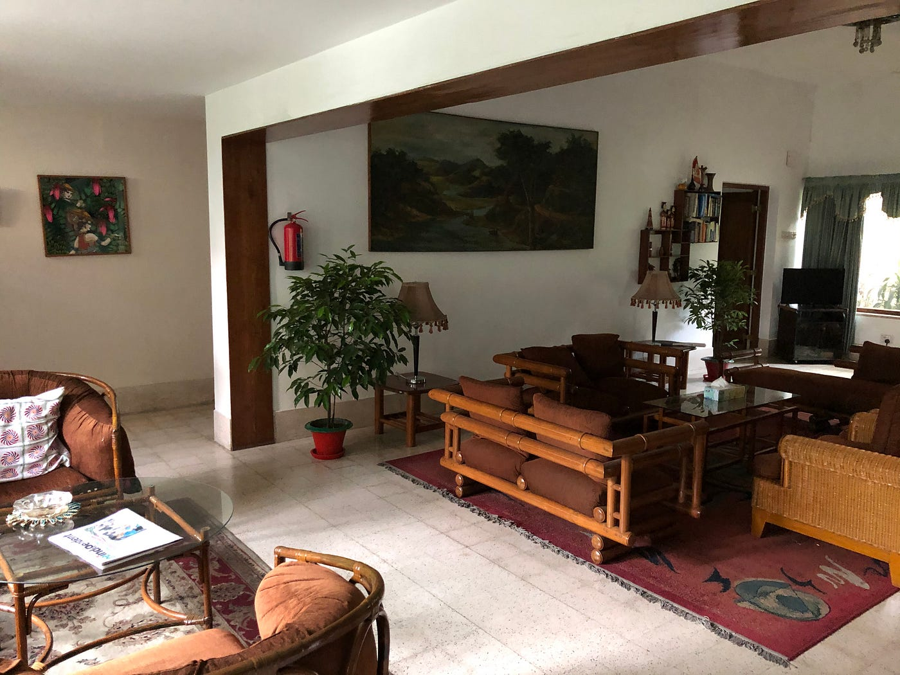

[এ্যামব্রোসিয়া গেষ্ট হাউজ
Guest House in Dhanmondi ধানমন্ডি Great service and very good place. One of my visitor was there for five days and he is…guest-house-483.business.site](http://guest-house-483.business.site/)

1日当日は朝からレジストレーションを済ませ11時にスタート！

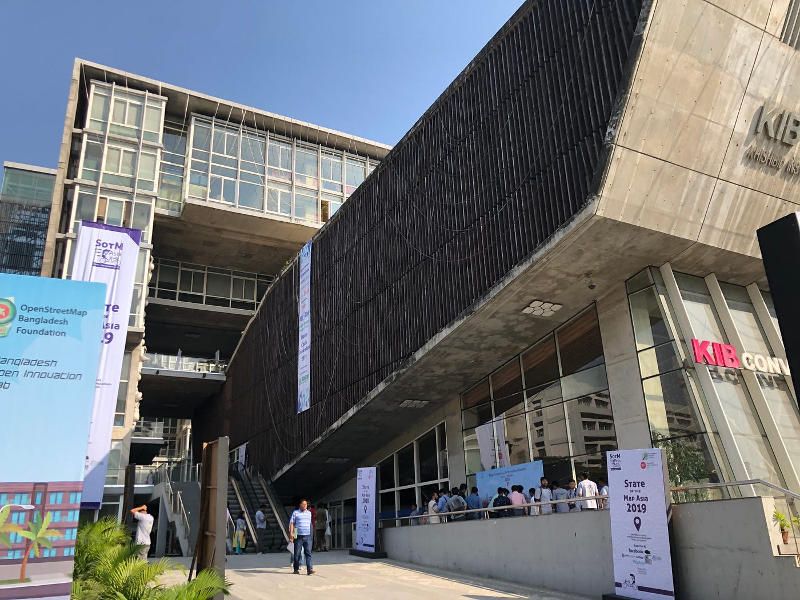

途中ご支援者トークで古橋先生が壇上にあがられたり…。

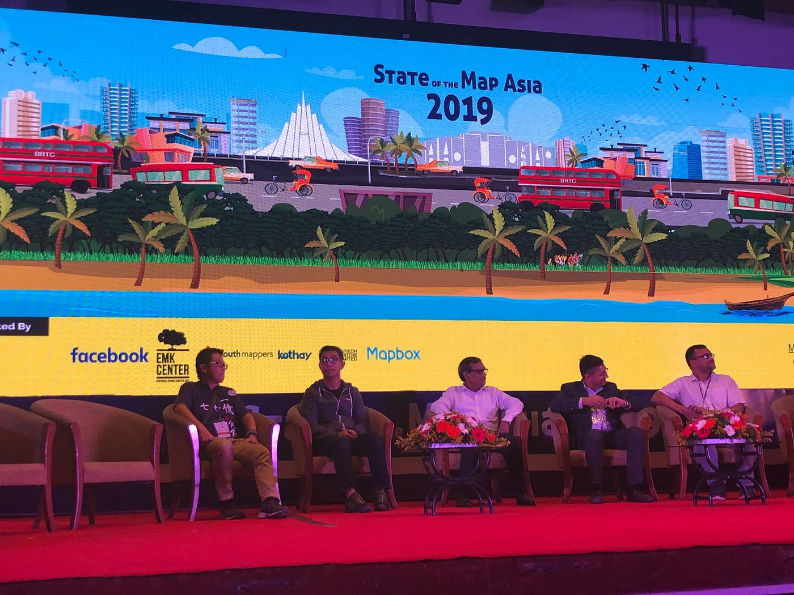

1日目の発表では、OSM Bangladeshチームのスライドがあり、ここ6年でのOSM地図の更新状況などをご説明されていました。

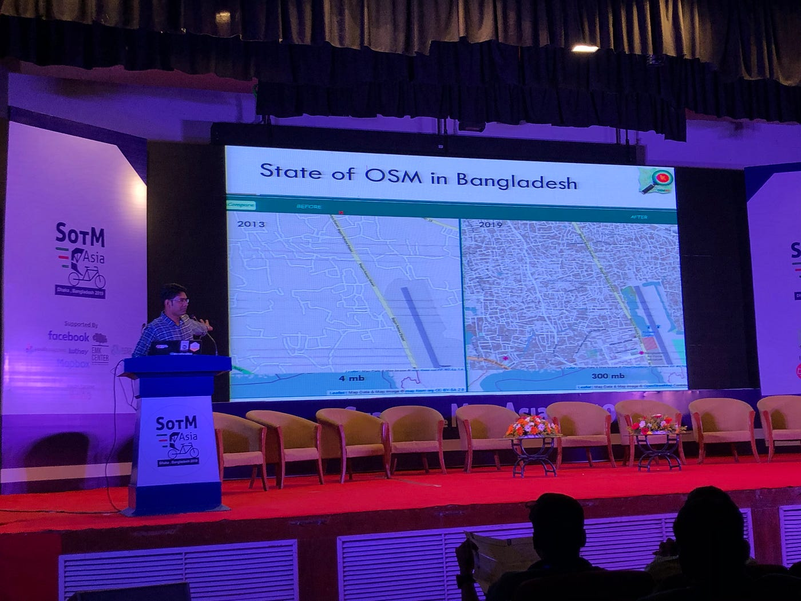

これは2日目にあったyouth mappersチームでの発表でも同じようなご説明があり、

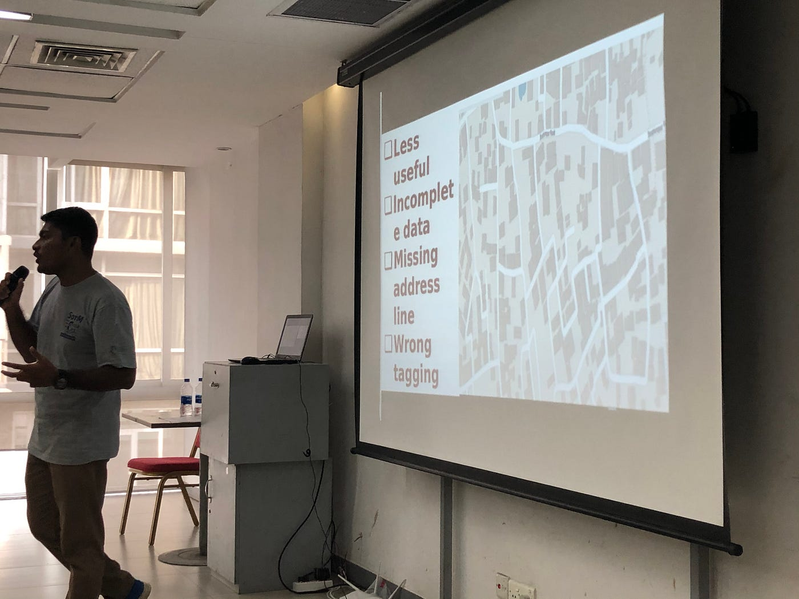

バングラデシュで既にあった政府作成の地図は、道が繋がっていなかったり、情報が未完で使い辛いといった様々な問題を抱えていたそうです。

だったらフリーで使えるOpenStreetMapを使って、自分たちでより良い地図を作ろう！という考えが、彼らyouth mappersの始まりであったと。

今回の地図の更新も、Mapillaryを使ったストリート写真の撮影など、草の根活動の成果の賜物であると知り、感動でした。

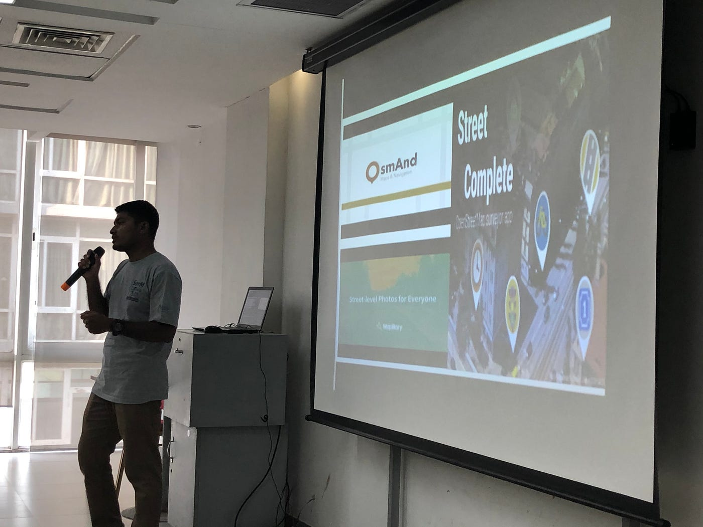

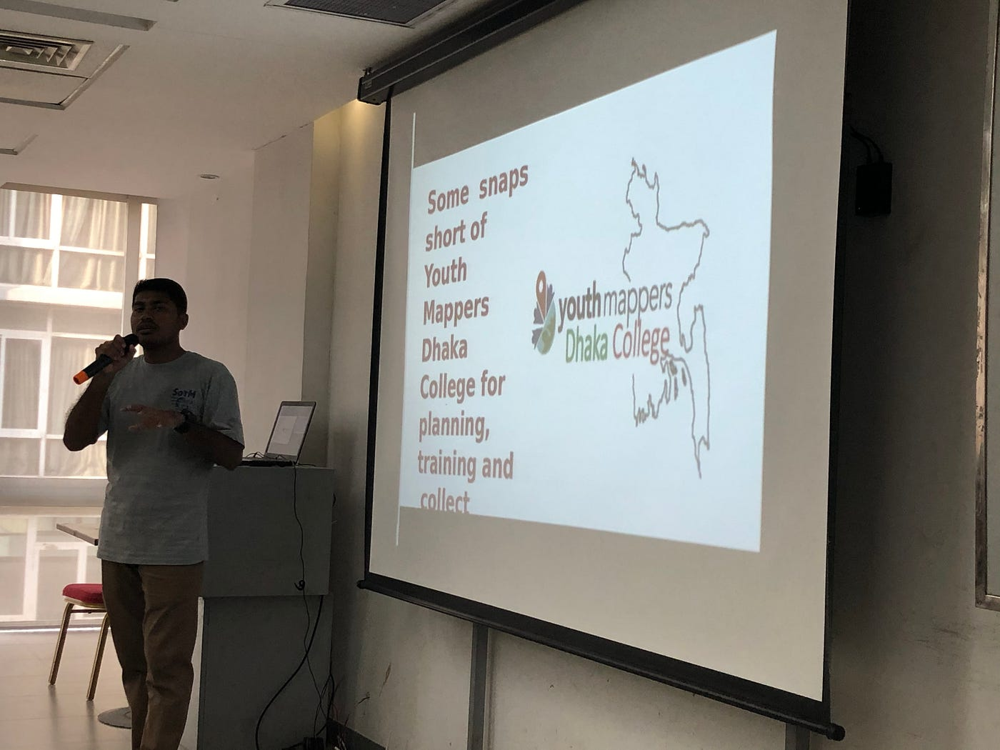

他にはFBチームのAIによる地図編集の発表が印象的でしたね。

以下に労力をかけずに品質のいい地図を作り出すか？というテーマを常に追求されており、RapiDによるAIによる地図作成を目指されているとご説明されていました。

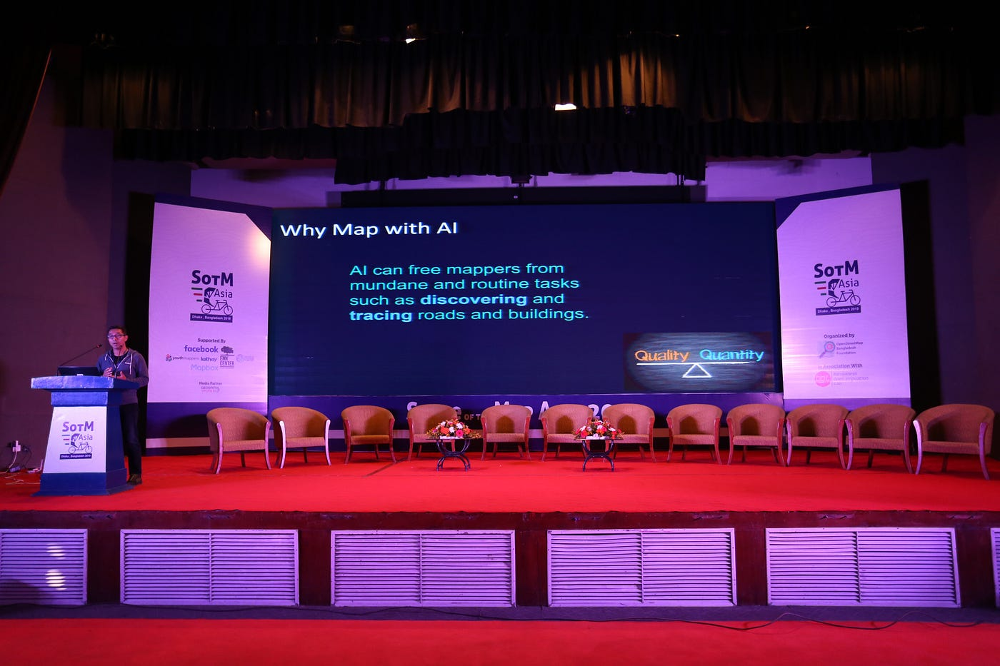

[mapwith.ai
Splash page for Facebook's new Map With AI service. This page and the RapiD editor are created by the World.AI team.mapwith.ai](https://mapwith.ai/#14/36.70335/67.07788)

2日目にはこの度日本人学生が僕だけというのもあり、特別にトークセッションの枠を頂くことが出来ました！

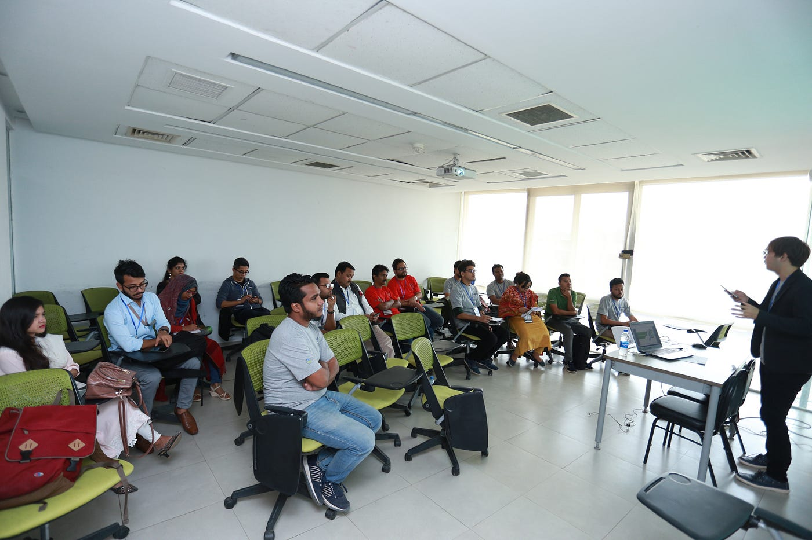

ゼミ論であるOSM Update Checkerについてのお話をさせて頂きました。海外のマッパーに向けて直接自分の成果物を発表できる機会などそうそうないので、本当に貴重な経験を得ることができたな、と嬉しく思います。

ICC2019に続き国際会議に参加するのはこれが2度目、海外でのカンファレンスとなるとこれが初の参加でしたが、とても良い経験となりました。

国籍の違う方々と同じ場所に立って発表を聞いたり、したりすることで文字やイラストからだけでは汲み取れないようなコンテンツの意図を少しでも掴むことができたのではないかな、と思います。

さっきまで壇上に上がって発表されていた方々と握手したり、お菓子をつまみながら軽くトークしたり出来るのは、まさに現地参加ならではの経験ではないでしょうか。（めちゃくちゃ緊張しますが）

今回の参加者でも、日本人は青学メンバーだけだったので来年以降日本の参加者が増えて欲しいなというのが正直な感想ですね。

色々な人に会えて、刺激になりますし普段行かないような国に行ける良い機会となりますので、ぜひみなさんも参加してみてください！

ちなみに来年のSotM Asiaはスリランカでの開催となるそうです。恐らく今年と同じく奨学金申請が始まると思うので、興味のある方はSotM Asiaのアカウントをフォローしておくと良いかもです！

[SotM Asia
The latest Tweets from SotM Asia (@SotmAsia). State of the Map Asia 2019 is happening in Dhaka, Bangladesh. Look up this…twitter.com](https://twitter.com/SotmAsia)

ありがとうございました！

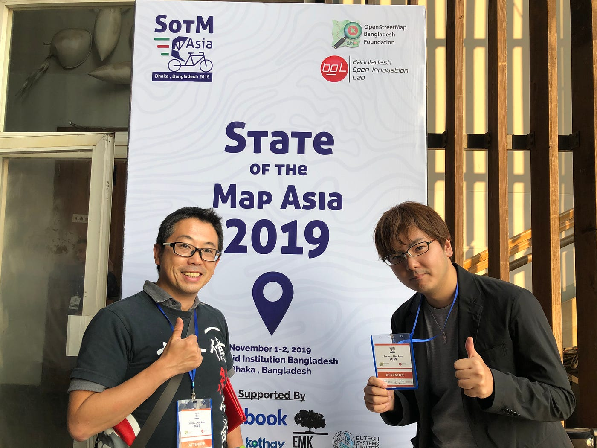

> Some picture was taken by State of the Map Asia team. licensed by CC BY-NC-SA2.0

[State of the Map Asia
Explore State of the Map Asia's 732 photos on Flickr!www.flickr.com](https://www.flickr.com/photos/185386731@N07)
