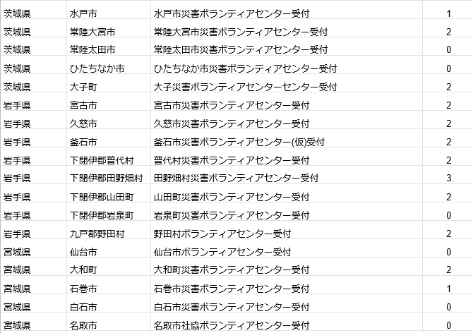

### ゼミ論進捗報告

中西です。１１月に入ってから体調を崩している方が多いみたいですが、私もその人です(´;ω;｀)

胃腸炎はやっているようなので皆さん気を付けましょう。。。

私が取り組んているvcのpoiデータ作成作業ですが、先日Facebookでメンションされていることに気が付かず、頂いた連絡を放置してしまうというミスをしてしまいました。

N2EMの方々や古橋教授にご迷惑をおかけしてしまいました。

今後は自分の投稿へのコメントをこまめにチェックする作業を怠らないよう改善していきます。

ボランティア募集が落ち着いた場所もあれば、まだ人手が足りていない場所もあり、データが散らかった状態であったため、作業を古橋先生が一度立て直してくださりました。

VCの活動状況をコード化してスプレッドシートに入力する作業に取り組みました。

0: 災害ボランティアセンター活動終了

1: 災害ボランティアセンター活動中(原則毎日活動、天候条件により中止含む)

2: 限定活動中(市内在住者、事前予約者のみ、活動日限定など特定条件)

3: 活動中止中

△実際のスプレッドシートです。

私がコードを全角数字で入力してしまっていたため、古橋教授に修正していただきました。反省点続きで本当に申し訳ございません。

この数日間多くのミスをしてしまいました。

反省点と改善点を以下にまとめます。

・Facebookのメンションを見逃していた→N2EMの投稿、コメントはこまめにチェックする

・スプレッドシートに全角で入力していた→必ずコード値は半角入力になっているかチェックをする

この二つを今後は特に意識して取り組もうと思います。
