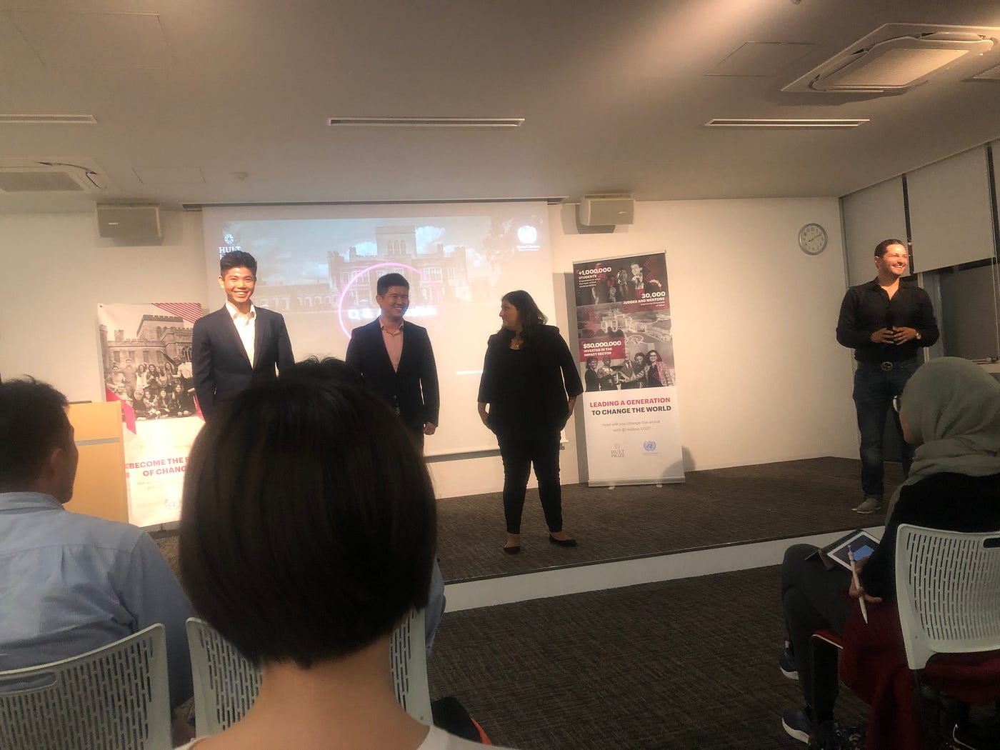
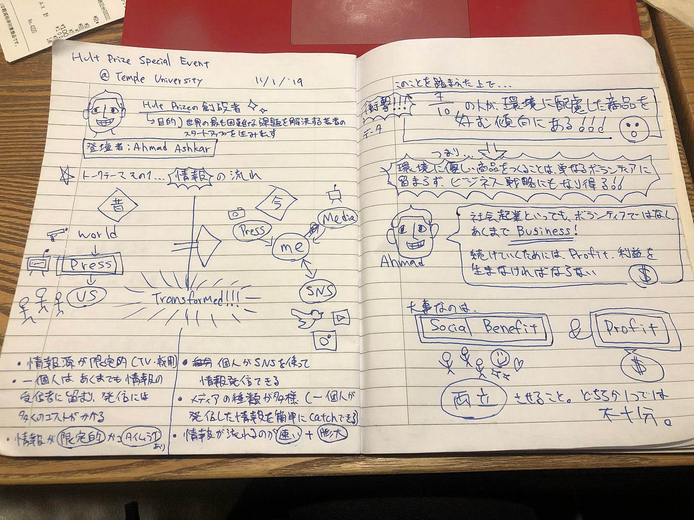
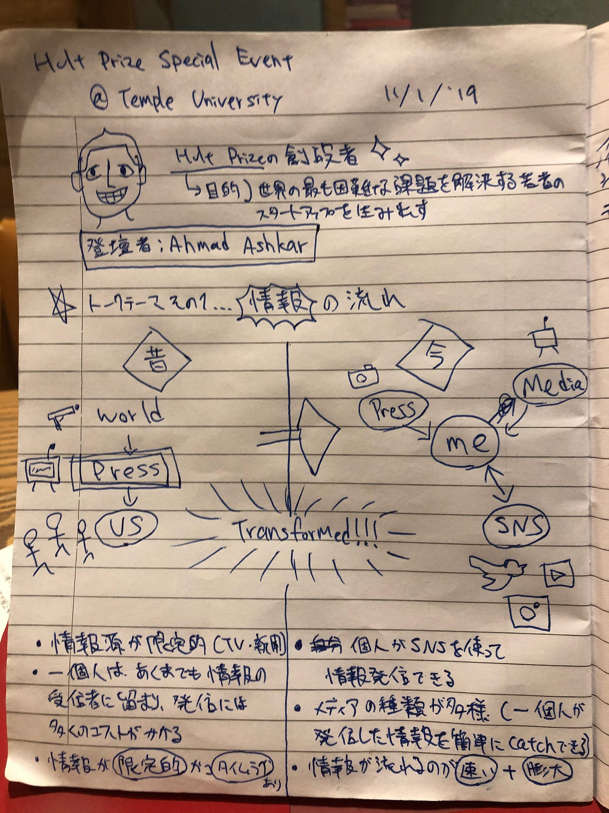
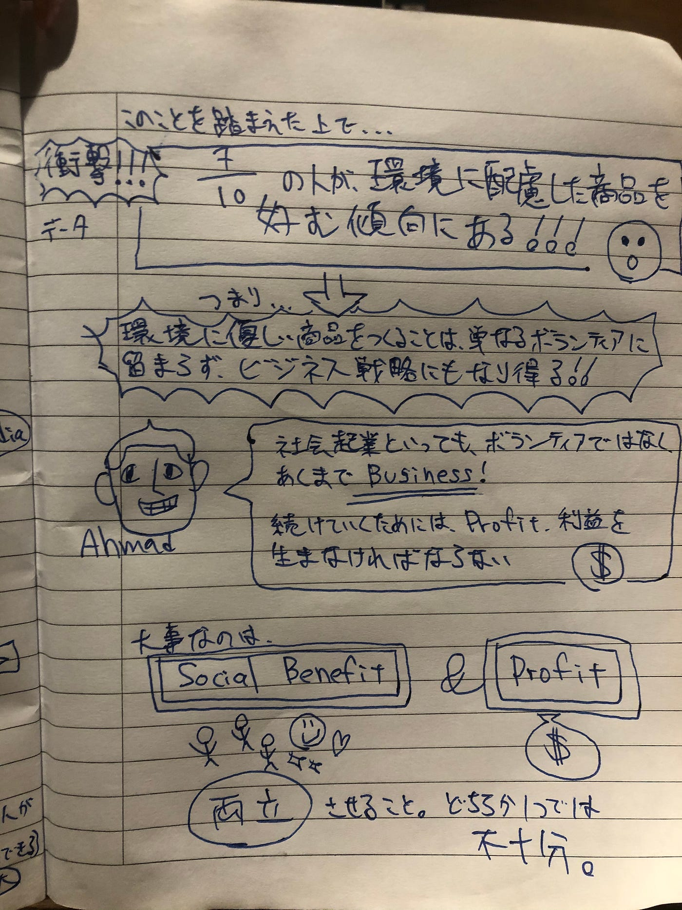

### Hult Prize Special Event @ Temple University

こんにちは、3年の松本瑞季です！

今回は、ゼミの課題である国際会議の一つとして、Temple大学で行われたHult Prize Special Eventに参加してきました。

Hult Prizeとは・・・？という方も多いと思うので、まずはこのHult Prizeが何なのかを説明していきます。

### Hult Prizeとは

[Hult Prize](http://www.hultprize.org)とは、世界最大の学生向け社会起業家向けプラットフォームで、世界の最も困難な社会問題を解決する若者のスタートアップを生み出すというアイデアから始まりました。

ハルトプライズは学生のノーベル賞と称されており、株式会社ファストの世界の最もイノベーティブな会社にランクインし、タイム誌で世界を変える５つのアイデアのうちの１つとして特集されました。

毎年のテーマはSDGs（持続可能な開発目標）に基づき、人類が抱える社会問題（人権・教育・飢餓など）を学生にビジネスを通して解決してもらいます。今年のテーマは、「すべての売り上げが地球に良い影響を与えるスタートアップを立ち上げる」です。

### イベント当日の模様

今回のイベントはこのHult Prizeの創設者であるAhmed Ashkarが登壇するセッションということで、教室いっぱいに様々な国の学生が溢れていました。

もちろん、講義もディスカッションもすべて英語で行われ、教室内は本当に日本かなという感じで圧倒されました。

イベントのトピックは（もちろん）社会起業で、情報の流れが今と昔でどう違うのか、今の時代にビジネスを続けていくためには何が必要か、ということを学びました。内容については、グラレコで詳しくまとめたのでそちらをご覧ください

### グラレコ

### 参加してみての感想

このイベントでは、Ahmed Ashkarさんが一方的に話すだけでなく、近くの学生とディスカッションして発表する時間もあり、アクティブラーニングという感じでした。私はたまたま早めに会場についてしまったため、前のほうの席で意識高めな外国人と帰国子女に囲まれるという状況で割とハードでしたが、普段青学に通っていてこのような機会はめったにないのでそれもよかったです。

世界中の同世代のうちの、志が高い人々と話すことができたのも、今回の大きな収穫でした。

### 当日のマッピング
