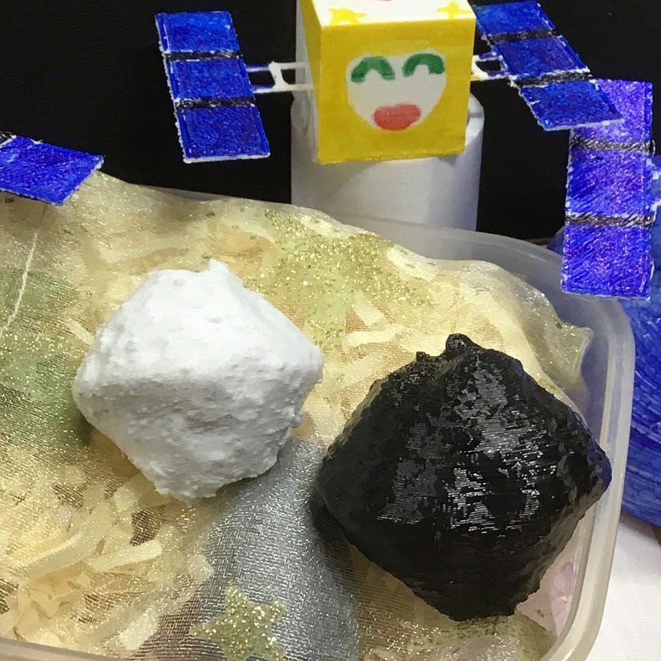
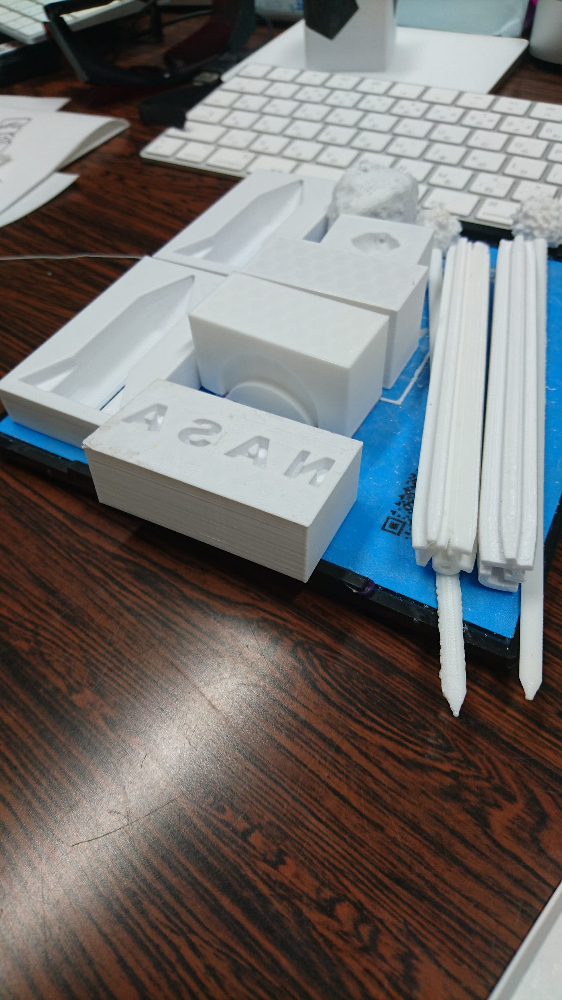

### **NASA Space Apps Challengeに参加してみた！**

こんにちは、3年の吉田です！

本来ならば私は町田市の防災訓練にいく予定だったのですが、台風19号の影響により中止となり、急遽 **NASA Space Apps Challenge **に参加することになりました。

今回はそこでの成果報告をしたいと思います！

### 内容

このイベントは与えられた４つのカテゴリー・２５のテーマから自分たちが興味ある分野を選択し、宇宙・地球環境・衛星関連のデータを使ったアプリを開発するハッカソンイベントです。

今回私達が選んだ項目は、、、

### Living In Our Life/ Smash your SDGs!

> 地球観測を使用して、国連の持続可能な開発目標に取り組み、世界中で持続可能な開発を促進する創造的なソリューションを開発してください。 NASA、その他の地球観測衛星データ、クラウドソーシング、現地での測定によって生成された情報を使用して、 水、健康、食料安全保障、土地利用の分野にわたる環境・社会政策をサポートする実用的なアプリケーションを作成してください。([NASA Space Apps Challenge Yokohama 2019](https://spaceapps.quiz.yokohama/2019_global_01.html)より)

古橋先生から**宇宙キャラ弁**というヒント、また折角なら3Dプリンターを使いたいという意見、スペースシャトル型のちらし寿司の例や、前日に3Dプルインターで出力したものなどを参考にしながらそれに沿ってアイデア出しをしていきました。

しかし、キャラ弁で何か創造的なものとはなんだろうと悩み、その結果、一度私たちはキャラ弁から離れて違うテーマで考えるのはどうかとなり

#### キャラ弁組・スマホケース組・ボードゲーム組

の３チームに分かれました。

私はボードゲーム組になり、教育的なボードゲームを考えはじめました。大まかなコンセプトなど思い浮かぶものの、残り時間が少なかったためアイデアを詰めれず敢え無く断念、、、

スマホケース組も気づけば流れており、結局キャラ弁組が作っていた**お箸**と**箸置き**、そして**ロケット型の型抜き**などを提出しようとなりました。

ギリギリまでデザインを考えて最終成果物として出来上がったのはこちら

写真に写っているのは「なさ」の形をしたお箸、小惑星が飾りになっているお箸、三日月・リュウグウ・ロケット型の型抜きです。この他にもイトカワの形をした箸置きもあります。

紹介動画の方も製作しました。

ISAC2019Sagamihara

### 振り返り

正直な感想としてはすごく疲れました。このイベントに参加するのもその３日前などに決まったことだったので何もイメージがないまま合流してしまい、役立たずなのではないかと感じることもありました。なので、もし来年以降このハッカソンイベントに参加したい人はあらかじめリサーチをして臨んだ方が絶対に効率的です！オススメというか、してください！！

また、3Dプリンターを操作したのが今回が初めてで、自分がデザインしたものが出力される時は少し感動しながらも、自分の力不足・技術不足を実感した初ハッカソンでした、、笑
