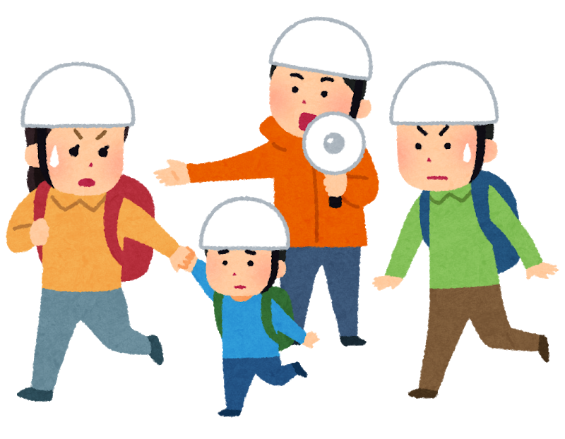

### ゼミ論週報

さてさて、また中西です。おそらく連投になります。

古橋先生から｢来週の週報ブログでN2EMの総会についてまとめるように｣との課題をいただきましたので今週のブログではそちらを書きます！

余談ですがなぜか先週はヘルニアが痛くて痛くて。。。立ってても座ってても寝てても目眩がする、冷や汗をかくほどの痛み(;。;) 靴下も履けず、朝顔を洗うために腰を曲げることもできず、、、そして何より辛いのが家事！掃除洗濯なんか出来るはずがなく(;。;)散らかり放題の部屋で、腰が痛くない人生ってどんな感じだったけ？とぼんやりと考えていました(;。;)

以上、中西の腰の愚痴でした、、、とほほ。

はい、気を取り直して！

おそらく古橋ゼミの多くの方々は｢N2EMって何？｣ってなることかと思います。私も、最初古橋先生にN2EMのメンバーとなって作業に取り組んでもらいます！といわれたとき、何だろうと思いました。なので以下に説明を。

【National Network for Emergency Mapping(N²EM、呼称「ネム」)は災害時における被災地への情報支援を目的として2019年5月24日に結成されたボランティア組織です。

オンライン上で災害対応に必要な地理空間情報作成と活用のための情報支援活動を行うことにより、災害に強い社会を構築することを目指します。

また、N²EMは災害対応に必要な情報を収集・集約し、広域的かつ統一的なオープンデータの作成を行います】

[N²EM Website
オンライン上で N²EMはボランティアの力を結集し以下の作業を行います。 災害対応に必要な地理空間情報作成と活用のための情報支援活動を行うことにより、災害に強い社会を構築することを目指します。…www.n2em.jp](https://www.n2em.jp/)

空間情報学で災害支援を行うボランティア組織です。

### では、N2EMって普段何をしているの？

次に気になる部分だと思います。この点についてはN2EM総会で説明があったので、まとめます。

**①指定避難所情報の収集**

**②オープンデータの公表**

**③取材対応等**

以上が平常時の活動になります。

①②災害が起きた際に避難所に避難するというのは当たり前のことと思われますが、皆さん家の近くの避難所がどこにあるかご存じですか？

たとえぼんやりと○○小学校！と覚えていても、正確な住所、位置、経路が分からないとたどり着けませんよね。

N2EMでは、そういった**災害時に必要になる情報**を収集し、ジオコーディング、地図化する作業に取り組んでいます。

避難所情報は、茨城、佐賀、鹿児島の3県において100%収集完了しています。そして16県が部分的に着手、31都道府県において作業未着手といのが現在の状態です。

今年度中に20県の情報収集を完了させることを目標に作業に取り組んでいます。

③また、N2EMは取材対応も行っています。

・つくば経済新聞 (遊佐)
N2EMの活動説明とPR

・毎日新聞 新潟版 (坂井副会長)
GISによる災害対応の説明内で言及

・東京新聞 (取出事務局長)
N2EMによる災害対応とVCの地図化

以上になります。記事の内容も紹介したいのですが、有料会員しか見られないことになっており....。また、現段階で茨城新聞への掲載も予定されております。

さて、普段のN2EMが何をしているか把握したところで

### じゃあN2EMは肝心の災害時、何をしているの？

という点について述べたいと思います。

これまでN2EMでは主に以下の災害に対応してきた実績があります。

①九州南部豪雨 (7/1~7/10)
・指定避難所情報の収集

②九州北部豪雨 (8/28~9/3)
・指定避難所情報の収集
・断水地域、給水拠点情報の収集

③台風15号 (9/10~)
・住宅被害報情報の収集
・断水地域、給水拠点情報の収集

④台風19号 (10/12~)
・災害ボランティアセンター情報の収集(古橋研究室)
・住宅被害報情報の収集

夏に起きた九州での豪雨や、つい先日の台風19号まで。

N2EMの活動により、数々の成果もありました。

**【成果①:指定避難所情報の提供による災害対応関係機関の作業迅速化】**

九州北部豪雨災害対応において防災科研にデータを提供したことにより、従来より早く、災害対応関連情報が作成されました。

**【成果②:発災時における給水断水情報の整備・提供による情報拡散】**
台風15号、19号災害対応において、防災科研にデータを提供したことにより、防災科研クライシスレスポンスサイトにて地図化が行われました。
その情報が、一般人を含む多くの方々に活用して頂けました。

**【成果③:被害情報のデータ化による活用可能性の底上げ】**
台風15号災害対応において、千葉県公開の被害報をデータ化。地図化されたデータが県庁における会議にて意思決定の材料となったとのことです。

また、N2EMのデータが**災害対策本部でも使用**されたりと、成果は多岐にわたります。"データ"という揺るぎない資料であるため、信頼性もあり今後多くの場面において活用されていくでしょう。

それでは、成果だけでなく、具体的な活動についても紹介いたします。

### ▼台風15号

台風15号の際、N2EMは千葉県内の住宅被害をオープンデータ化する作業に取り組みました。

[Box
Edit descriptionbosai1.app.box.com](https://bosai1.app.box.com/s/xukfh2f3npykpmspmq41ryeudoag4hlk)

これは実際のVCデータになります。

VCだけでなく、避難所データ、給水・断水データ、住宅被害のデータが公開されています。このオープンデータは、防災科研クライシスレスポンスサイトで地図化され、活用されました。

[クライシスレスポンスサイト
This story map requires JavaScript, but running JavaScript is not currently allowed by your web browser. If you wish to…crs.bosai.go.jp](https://crs.bosai.go.jp/DynamicCRS/index.html?appid=b5afe32d99ac4360b0668f2be570b4da)

### ▼台風19号

そして、私が現在参加させていただいている台風19号のVC POIデータ作成作業。

[N2EM 災害ボランティアセンターマッピング 2019/10/12 台風19号 · Issue #42 · furuhashilab/mapping
You can't perform that action at this time. You signed in with another tab or window. You signed out in another tab or…github.com](https://github.com/furuhashilab/mapping/issues/42?fbclid=IwAR1iHsUXTbpA4Hrf6Bl7obnjxHXWb2qhE1brSxu-hU3gjurlLyrC_b-bwDk&source=post_page-----5d1e0bc77832----------------------)

こちらの手順に従い、スプレッドシートに入力した内容を地図化することでVCの位置を可視化しています。Twitterではこのデータを使用してくださった方の声もありました。

台風19号の被害はまだ収束していないため、こちらは作業の途中となっています。

これらの作業を進めるにおいて、N2EMでの体制が整ってきました。

**・緊急依頼体制の構築**

Facebookやメールにて依頼を受け、その後コメントやMessengerにて細かなやり取りをすることでコミュニケーションを図ります。そのため、N2EMではFbの基礎知識が大変重要になります。

**・データ作成フローの基礎形成**

依頼 を受け、Googleスプレッドシートにて作業を進めることで、フローチャートの充実化、Q&Aによる疑問解決、解決済問題の履歴蓄積が実現されました。

**・参画団体(他機関)との協力体制構築**

親和性の高い作業内容であれば、団体同士の作業協力が行われることもあります。私も、スプレッドシートの入力作業が進まなかった際、酪農学園の方々や古橋先生の授業の学生の方に手助けをしていただきました。

このように、作業を進める中で体制強化が図られています。

### 課題

これまでの活動の中で多くの課題も見つかりました。

**・避難所情報整備の未達**

作業量に対し会員が不足していることがまず一つの課題です。先ほどの避難所データも、47都道府県中完全に作業が終了しているのは3件です。今後、避難所情報をより発達させていくことが課題となります。

**・災害対応における安定的作業体制構築の必要性**

災害対応時、N2EMでは給水・断水、VC、被害報等のデータを扱っています。そのため、_安定的に作業を継続して行える体制_を構築することが今後必要となります。

**・作業者スキルのもてあましの発生**

N2EMの中には高度なスキルを持っている方もいます。しかし今は全会員がそれらのスキルを最大限発揮できていないことが現状です。そのため、依頼体制を再構築することが求められます。

**・ジオコーディング精度検証の高負担**

現在、オートジオコーディングでは精度の担保が出来ず、精度検証に労力がかかっています。そのため、今後容易かつ高精度なジオコーディング法の検討が必要となります。

・**団体会員の作業体制が未構築である**

団体会員の方々に依頼するという体制が整っていないことが課題となっています。膨大な全国データを扱う際においては、依頼体制を整えることが今後不可欠になると考えます。

以上が総会のまとめとなります。

長くなりました。
