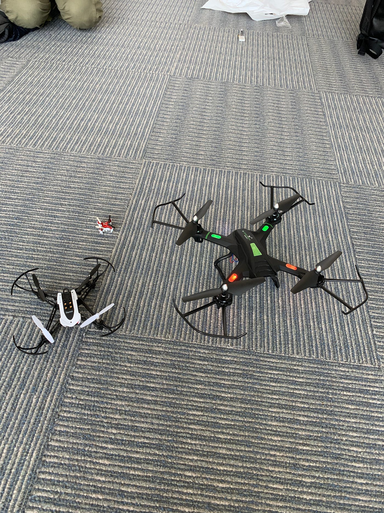
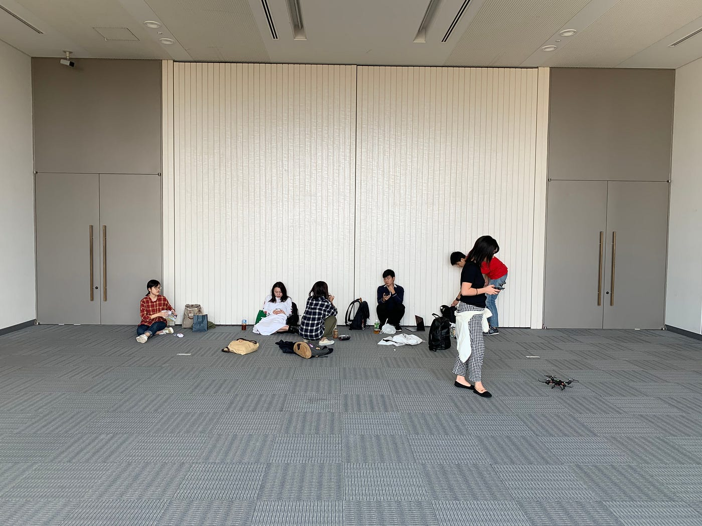

### ドローン部週報第３週目

こんにちは。ドローン部の佐野公紀です。今回の週報ではドローンの主な違いについて取り上げたいと思います。

ご覧の通り、一言でドローンと口にしても実際はこのように様々な種類があります。操作感も、全て全く異なります。リモコンのレバーを少し傾けただけですごく動く機敏なものや、指の動きと比例して動くものなど、本当に様々です。

この写真の中で、一番安定するのはやはり古橋研究室のお高いドローン（中間サイズの白いドローン）です。機体を上昇させた時の安定感がとにかく素晴らしいです。

逆に、あまり価格の高くないリーズナブルなドローンは全く安定しません。操作してない時でさえいろんな方向へ動きますし、ぶっちゃけひどいものです。このようなドローンでさえ完璧に操作できようになればいいのですが..。

完璧にドローンに精通するためにはまずその操作感を完璧に体に染み込ませなければお話になりません。これからも部員一丸となってドローン技術向上のために練習に励もうと思います。

少し余談ですが、最近出たてで何かと話題のDJI社のMavic Mini。お値段こそ少々高めですが是非とも操作してみたいという欲が出てきました。研究室のためにせめて一台、導入されないかな？（笑）
