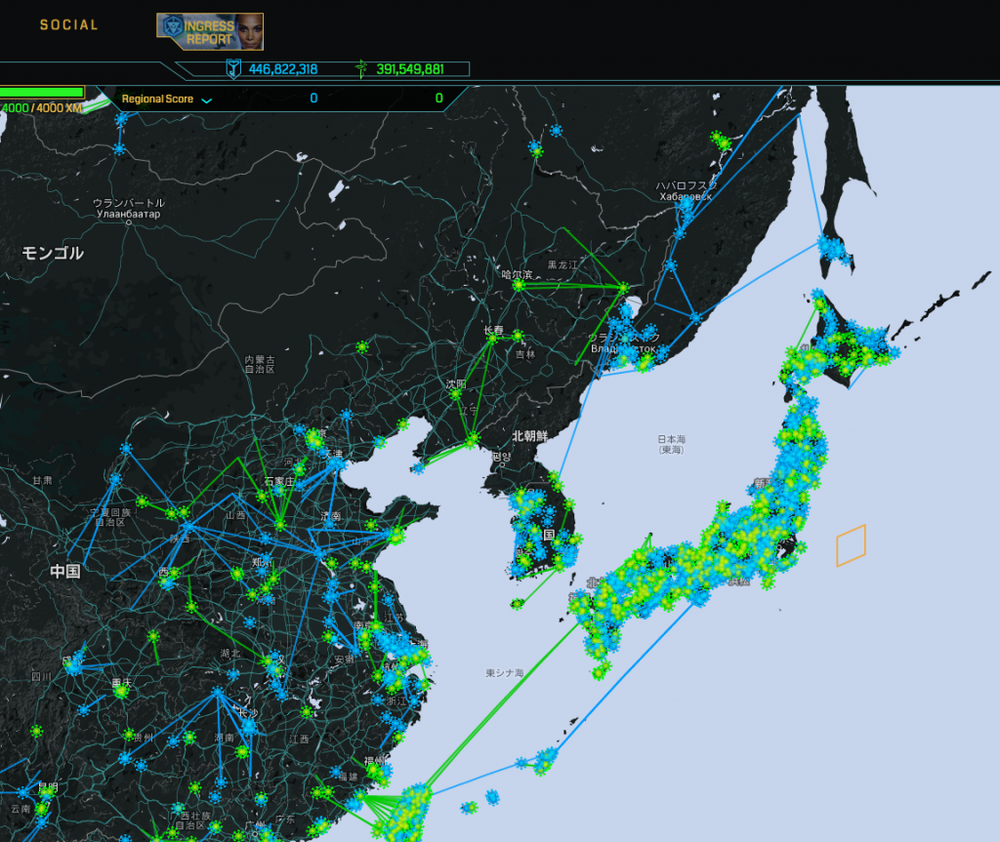

### 位置ゲー部週報：社会への影響

古橋ゼミ3年の松本です！

今週は、位置ゲーを利用して社会に役立てられていることがトピックとして挙げられました。

それについて、slack内チャットで古橋教授がこのようなツイートをシェアしてくれました。

『イングレスやってて思う事は日露戦争戦死者の慰霊碑が多い事。勿論、太平洋戦争の比ではないんだが何故か後者は少ない。こんなのイングレスやってないと分かんない』

確かに、イングレスをやっていると普段見過ごしてしまう町中にあるスポットを確認することができます。

散歩などで街を歩くとき、ただ歩くよりもイングレスなど位置ゲーをやりながら歩くと、新たな視点で街を見ることができるという発見がありました。

位置ゲーは、観光産業や交通産業への経済効果、健康（医療費削減）、新しい出会い（結婚につながり少子化対策）など、社会へ様々な良い影響を与えることができます。

来週はサークル活動としてスーパーノヴァを張ります。

