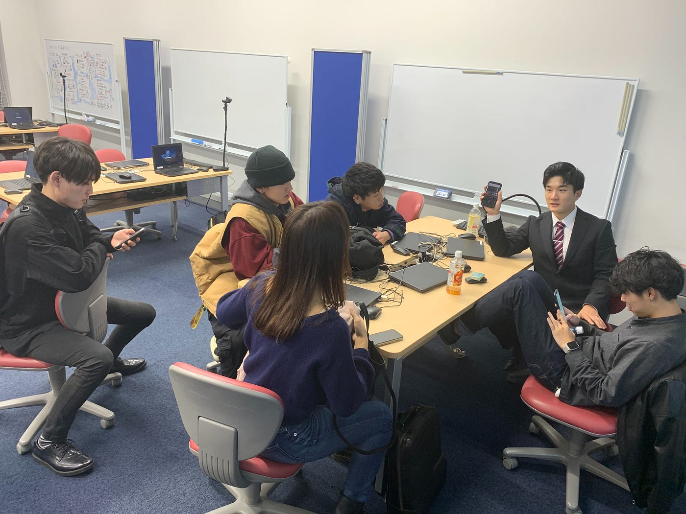

### 横瀬部第４回目週報

こんにちは！古橋研究室3年イジユルです。

今回行った第４目のミーティングの内容を掲載します。

### 第３回の課題、先行事例調査

部員が調査してきた動画を基に先に行った事例があるか調べた結果、現在では横瀬部で撮ろうとしている動画はなかったという事が判明されました。部員が探してきた事例動画の中で横瀬町を紹介する動画で一番近い動画二個載せておきます。横瀬を紹介するという点では脈が一致しているが、動画の性格が違うため、新規性あるものと判断し、進んでいくことを確定しました。

一番目は横瀬の春祭りの動画で、横瀬PRよりは単なる祭り姿を見せる動画でした。

二番目の動画は古橋研究室所属だった、一回は目にした事がる横瀬Creative class動画です。プロが撮ったので、高いクオリティやストリラインがしっかりでしたが、横瀬部で撮ろうとする動画とは性格が違いました。

三番目は説明いらないと思いますが,BOBBYのバラエティ番組です。確かしに面白いですが、これもまた性格が違かったです。

### 横瀬部の制作動画コンセップ

横瀬部では『私たち大学生という利点を生かして動画に差別さをつける』大学生ならではの若さ、ドキドキ＆ワクワク感、烈熱を旅行動画に入れ込んで、動画を見た人に”お！ここどこ？行きたい！！”と思わせる旅行動画を作ることを決定しました。

そのような動画を作るためにはどんなものが必要か？どんな技術が必要なのかについて話し合った結果、

まず、

①ドーロンを飛ばせるという横瀬のメリットを生かしてドーロン撮影方法

②ワクワク感を与えるためのスピード感ある動画撮影、編集方法

③横瀬の観光スポット調査、或は新たな魅力発掘

という話になったので、次回の課題としてこれらの情報を調べてくることにしました。

そして、最後に結果物を想像しやすくするために使った、横瀬部が撮ろうとする動画と性格が少し似ているという動画を三つ紹介します。

撮影方法やストリラインの構想は次回のミーティングで行うことにしたので、次の週報お待ちしてください！

それでは今までリーでした
