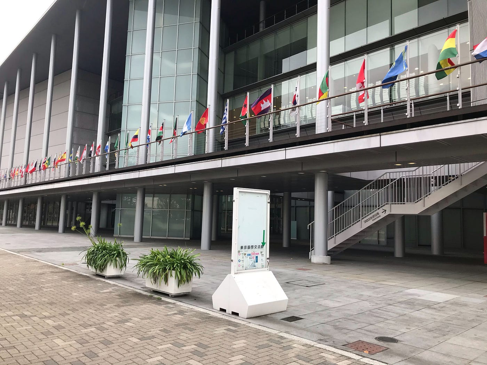
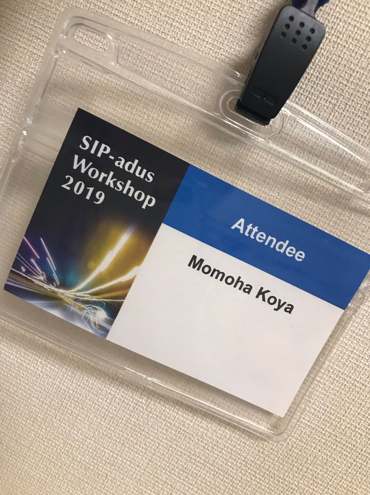
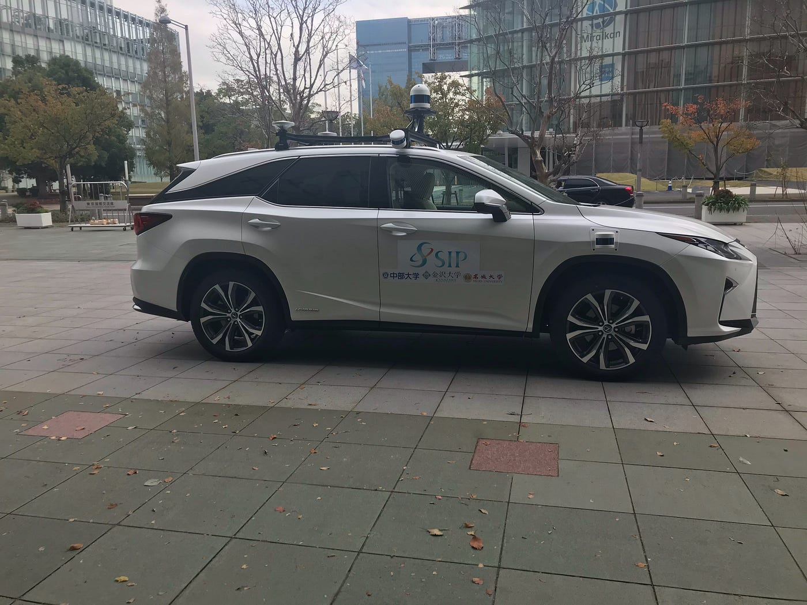
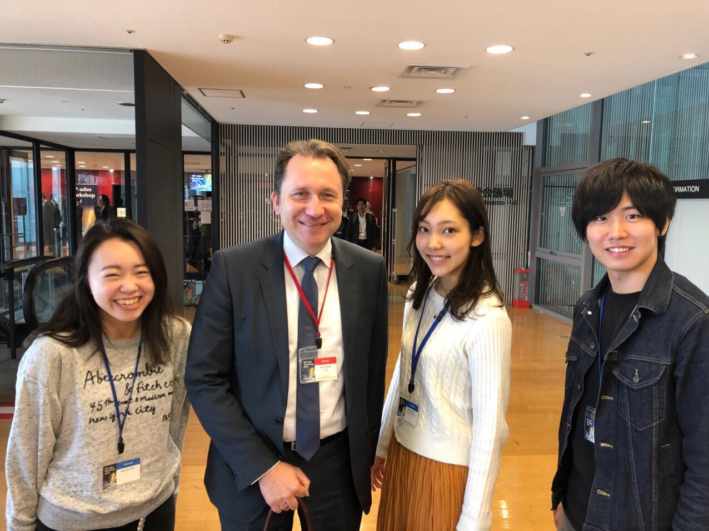
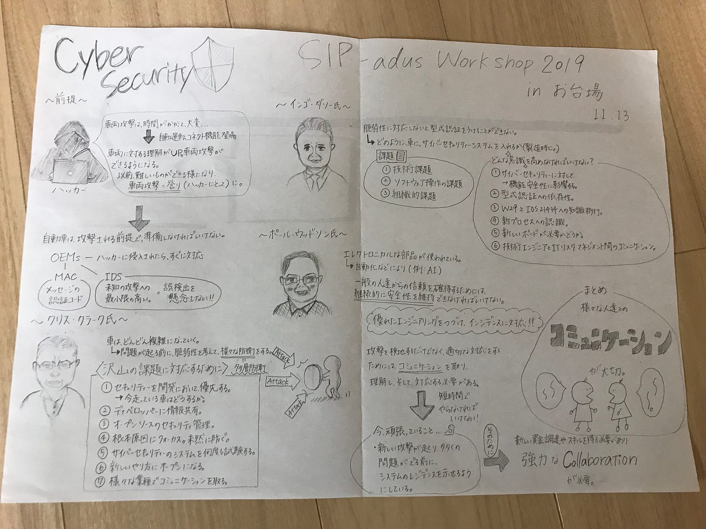
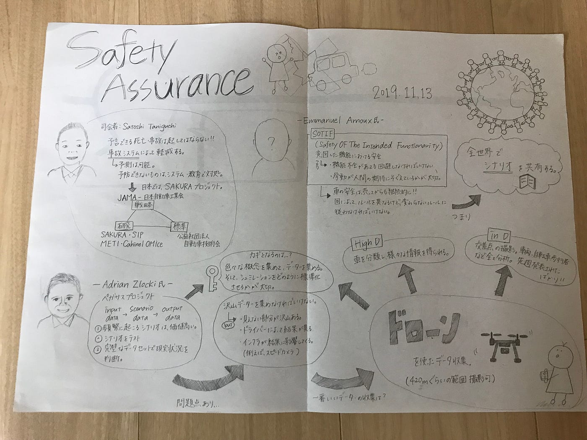
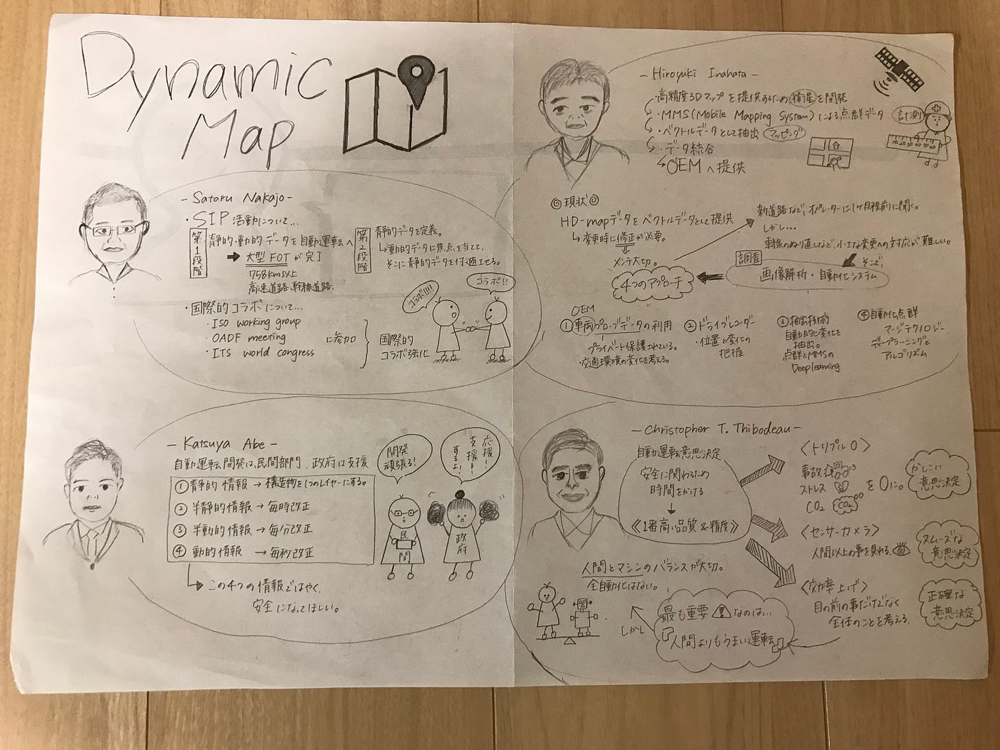

### Sip-adus Workshop 2019

こんにちは！3年の古屋百々葉です。

11月13日にお台場で開かれた国際会議に参加してきました。

駅からは近くすぐたどり着くことが出来ました！受付でQRコードをかざし、入館証？の様なものをいただきました！

会議場では、沢山の大人の方たちがいらっしゃり私服で行ってしまったのもあり場違い感がすごかったです、、

今回の会議は、Cybersecurity, Safety Assurance, Dynamic Map, Connected Vehicleなど自動車に関するテーマでした。

私は、車に対しての知識も、自動運転に対しての知識も何も持っていないので、会議の内容を理解するのが大変でした。

反省点として、会議に参加する前に、少し自動運転についての知識を入れといたほうが話が理解できたのかなと思いました。

今回の国際会議では、自動運転のためのデーターを集める方法としてドローンが出てきたり、測定車？

などもあり、こういった形でのコラボレーションがあることが学べました！

ストラバです！

[https://strava.app.link/lhGO43zlL1](https://strava.app.link/lhGO43zlL1)

そして、今回のグラレコです。

