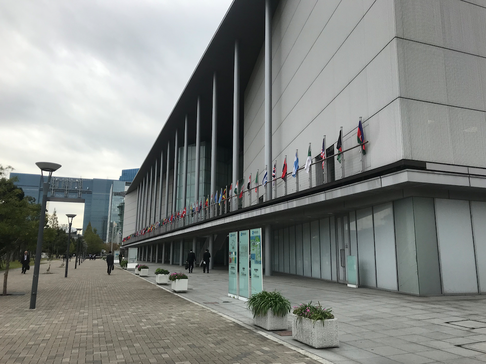
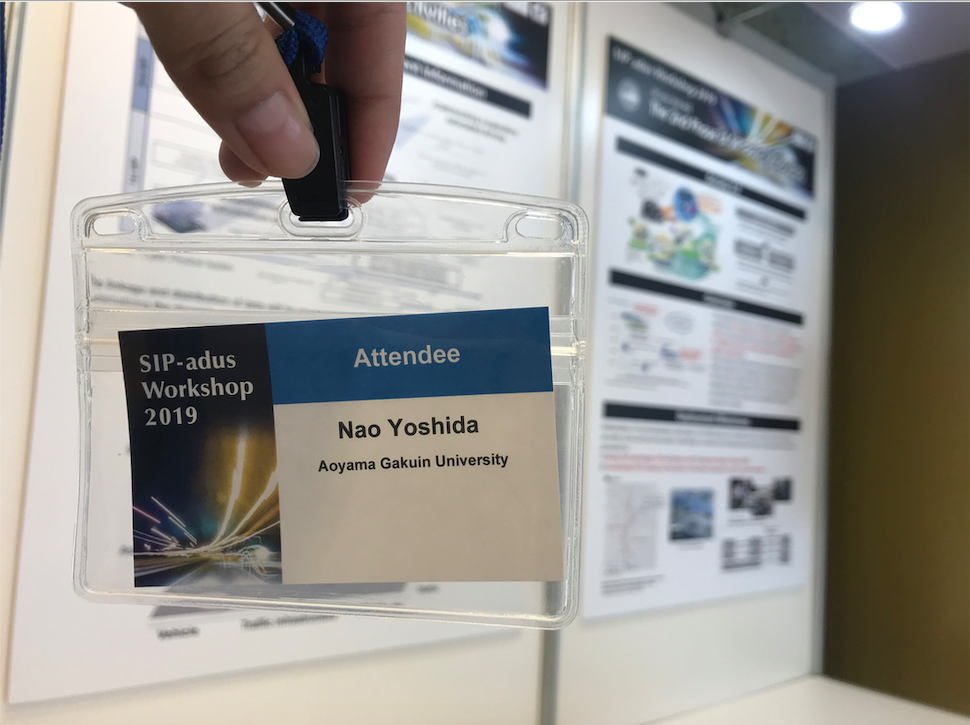
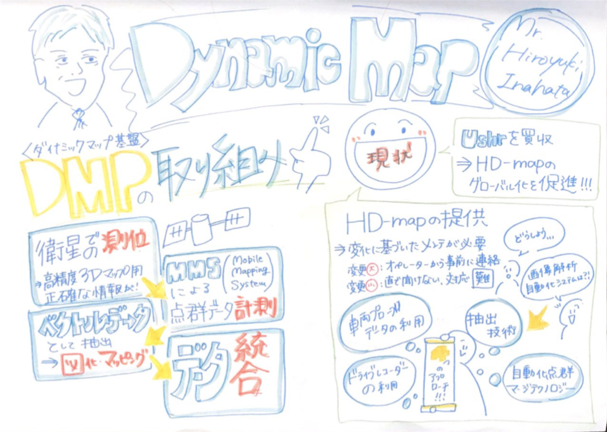
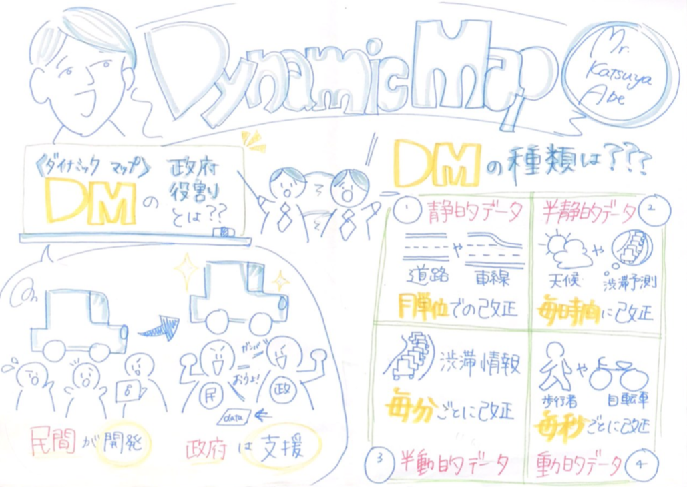
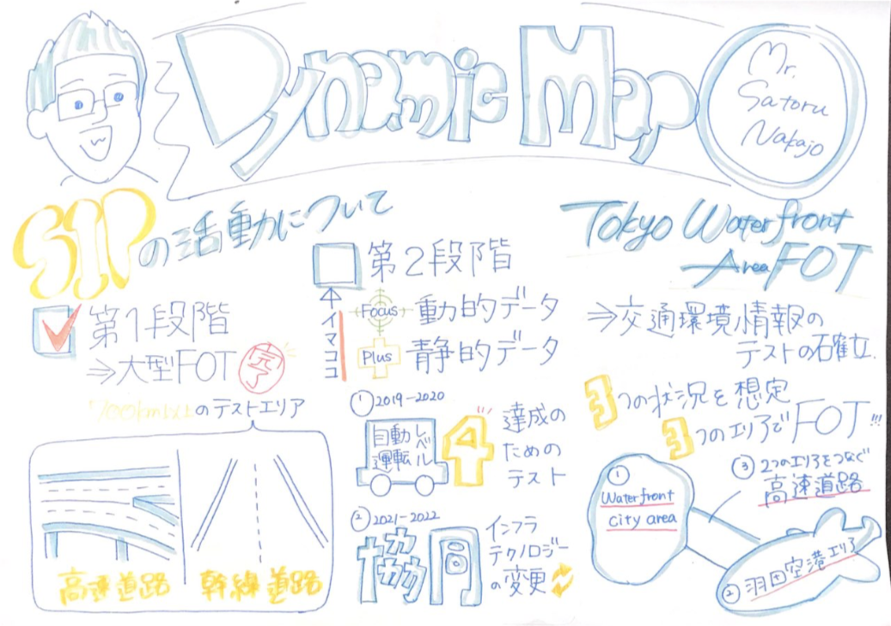
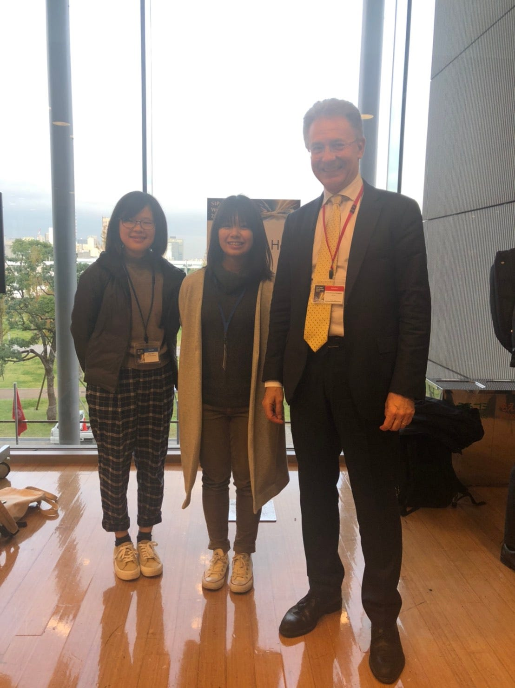

### SIP-adus Workshop 2019 に行ってきた！

こんにちは、３年の吉田です。

今回は11月12日〜11月14日に東京国際交流館で開催された **[SIP-adus Workshop 2019](http://www.sip-adus.go.jp/evt/workshop2019/) **に参加したので、その報告をしていきたいと思います。

### 初めに

報告をする前に、イベントタイトルにもある「**SIP-adus**」とは何なのか。

まず、「**SIP」**というのは科学技術の司令塔機能をもつ内閣府総合科学技術・イノベーション会議が、府省庁の枠や旧来の分野を超えたマネジメントにより科学技術イノベーションを実現するために創設した国家プロジェクトで、そのプロジェクトにおける自動運転への取組のことを、「**SIP-adus」**といいます。

そして今回のこのWorkshopは自動運転を実現するために、欧・米・アジアパシフィック地域の専門家とともに課題の共有と解決に向けた取り組みを議論する場となっています。

今回のテーマとしては以下の７つです。

- Regional Activities

- FOTs and Next Generation Transport

- Human Factors

- Cybersecurity

- Safety Assurance

- Dynamic Map

- Connected Vehicle

今回は 11月13日に講演されたテーマである **Dynamic Map **を拝聴しました。

### 会場にて

1階で受付をすると、名札がもらえるのでそれを首から下げ、会場がある3階へと上がります。やはり社会人でスーツ姿の方が多く、私たち私服学生組は正直ガクブル状態でした、、、

会場には講演が行われるホールと各テーマごとの展示ポスターブースがありました。ポスターはすべて英語でしたが、ポスターの側に立って日本語や英語で説明されている方がいたので、それを盗み聞きしながら理解を深めていきました。

講演に関しては、まずは理解できるかという不安との戦いがありました。しかし、自分が多少なりとも学んでいる分野だからか理解できる内容が多々あり、私自身とても興味が湧いた講演でした。

今回のグラレコです。

講演終了後、ADASISとSENSORISというインターフェース仕様について講演されていたベルギー・ERTICOのJean-Charles Pandazis氏と写真を撮りました。

### まとめ

今回の講演の中で一番興味が湧いたは「地図の性格」の差です。

私たち研究室生は、主にクライシスマッピングで地図に触れることが多く、OSMでマッピングする際は衛星写真の画質やマッパーの熟練度によってその品質が違い、多少のズレが起こることもあります。しかし、この自動運転という分野においては、少しのズレが人の命に関わるということで、どこよりも高品質、精密、最新でなければなりません。グラレコ内でも紹介したように、毎秒レベルでの更新が必要となるのです。

最新のもである重要性の方向も違えば、誤差に関しての認識も違う。関わる分野によって知らない地図の世界が広がっていることが何より新鮮な感覚で、これからもまだまだ学ぶことがあるのだなと改めて感じることができました。

今回のSTRAVAログです。

[https://www.strava.com/activities/2861379689/embed/eaebc9b02ffb000ad4c6292f37934b97e0c6ec54](https://www.strava.com/activities/2861379689/embed/eaebc9b02ffb000ad4c6292f37934b97e0c6ec54)
