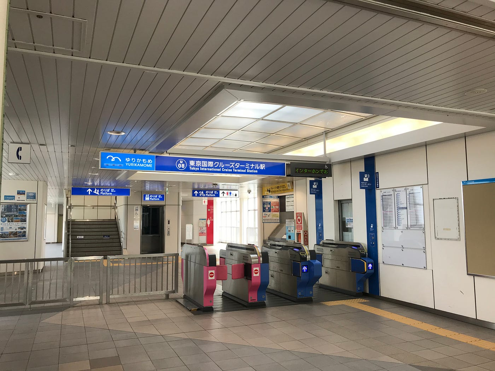
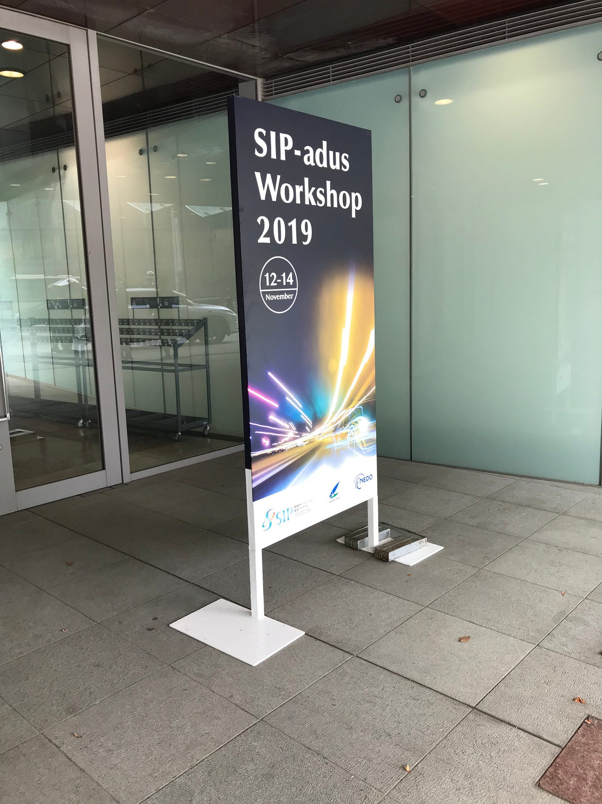
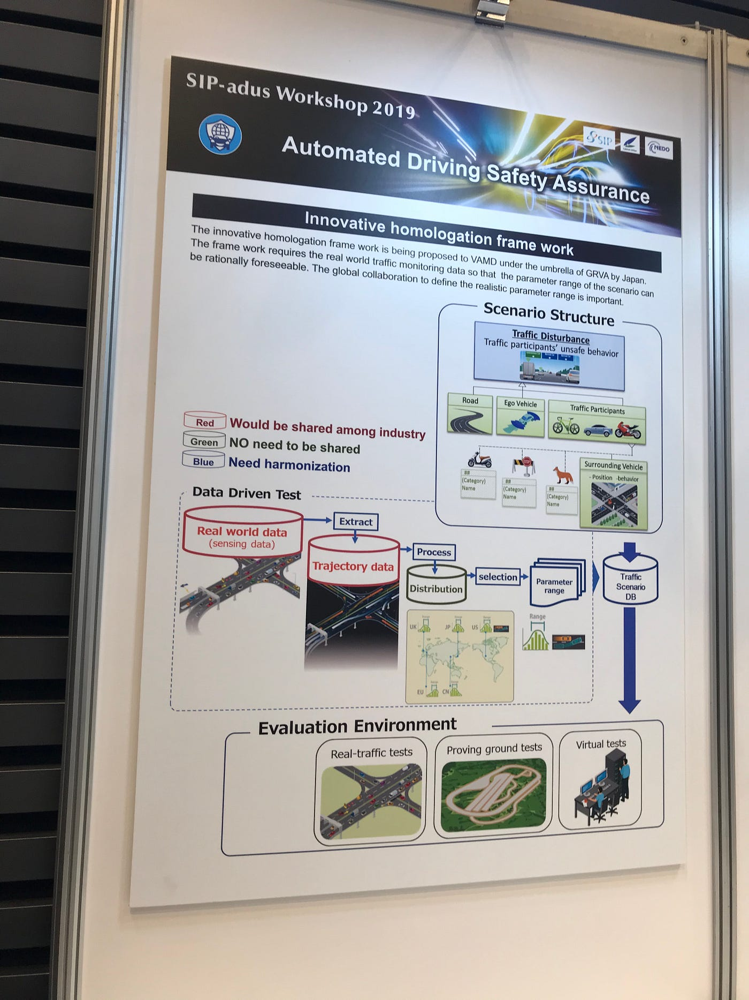
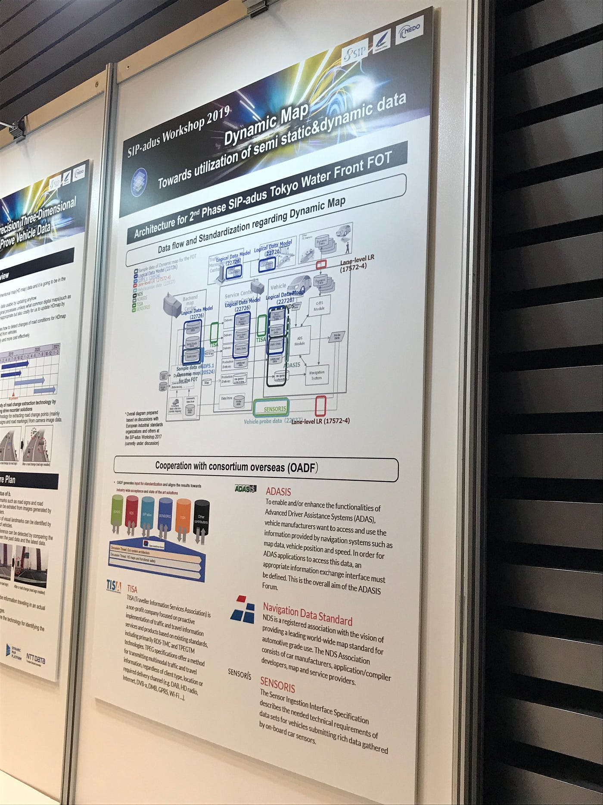
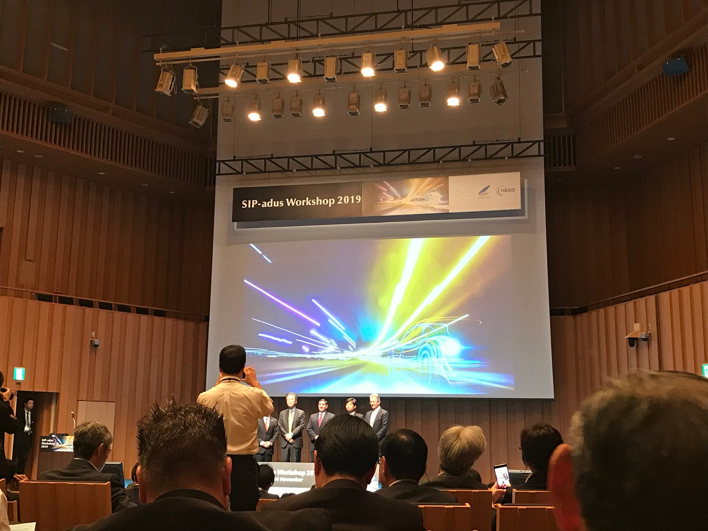
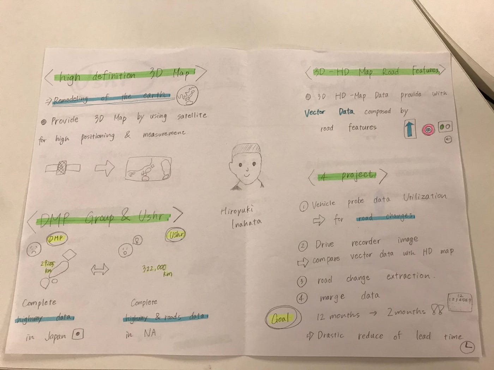
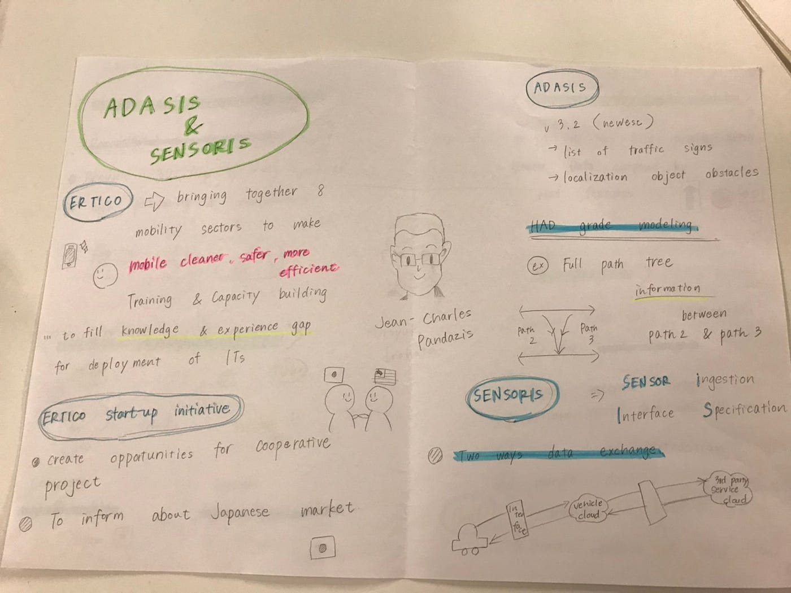
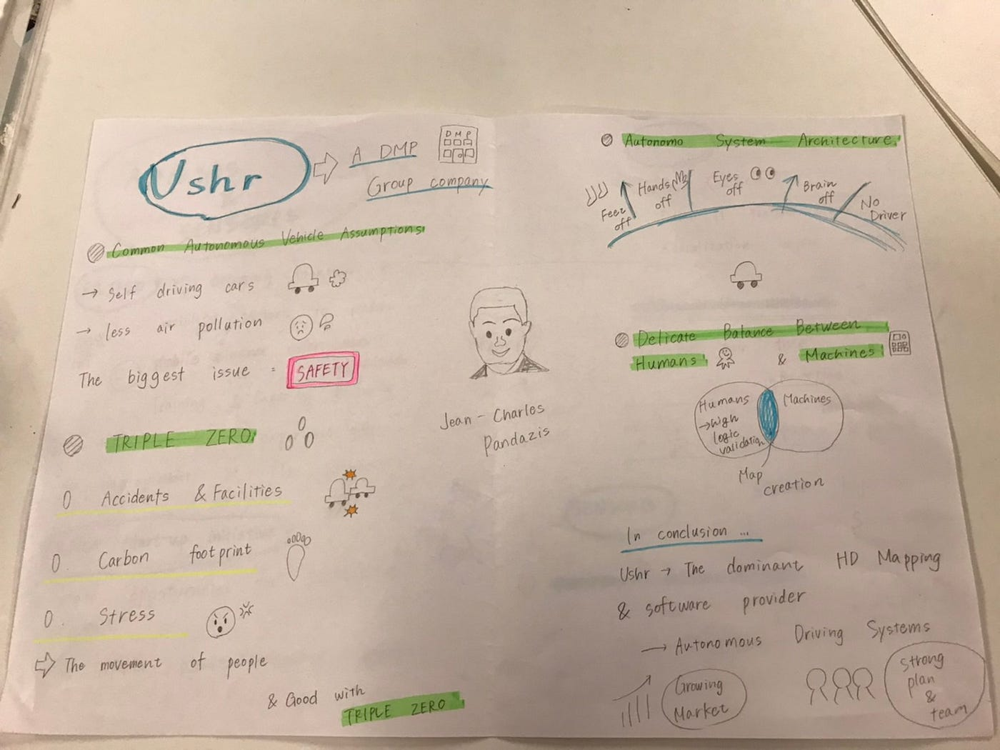
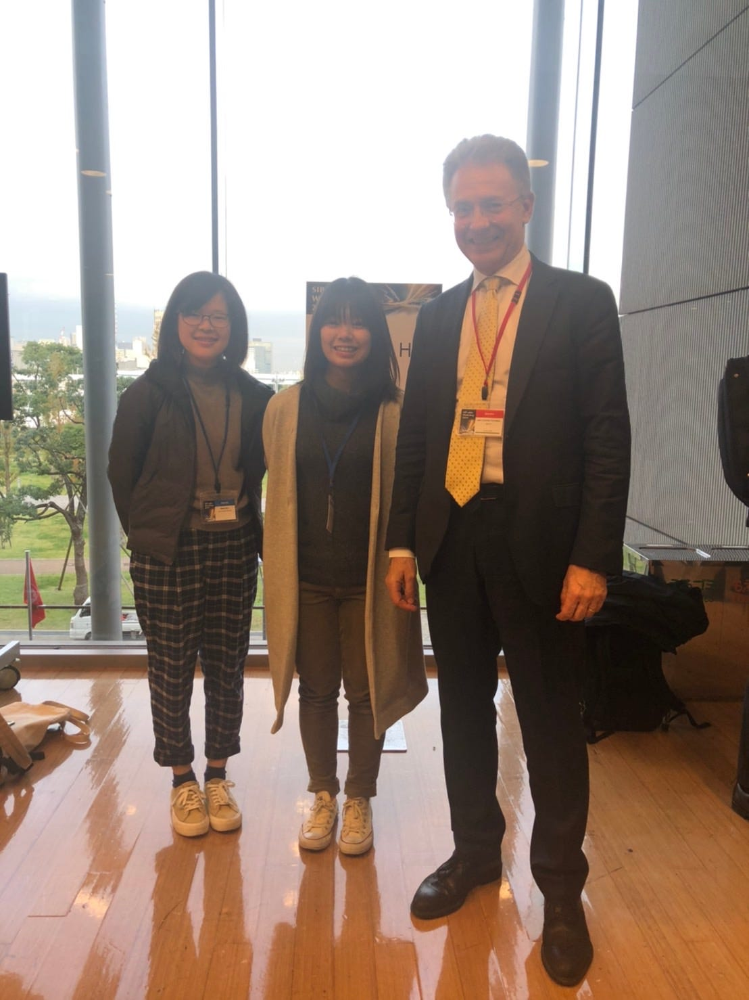

### SIP-adus Workshop 2019

こんにちは。古橋ゼミ3年の森玲子です。

11月13日に、お台場で開催された国際会議の「SIP-adus Workshop 2019 」に参加しました。

最寄り駅は、東京国際クルーズターミナル、という降りたこともない駅でした。

そんなことはさておき、徒歩2分ほどで会場に到着しました。

会場の入り口にこのような大きな看板があり、受付にて本人確認を済ませて早速中へと入りました。この段階ですでに多くの外国人の方々を目にしたので、国際会議という臨場感を味わいました。

会場内でまずはポスターセッションを見に行きました。

ポスターセッションでは、多種多様なジャンルのポスターが掲示されていましたが、中でも私が関心を持ったのは「Automated Driving Safety Assurance」といって自動運転の安全性について書かれているものや、「Dynamic Map」というデータの流れについて説明されていたものでした。

ポスターセッションを見た後は、公演の行われるホールへ入りました。発表が近くなるにつれて席がどんどん埋まっていったのですが、ほとんどが大人のサラリーマンの方々そして外国人で驚きました。

講演開始の時間となり、登壇者の方々がステージに並びました。この並びを見るだけでも多国籍の人々が揃っているなと実感しました。

「Dynamic Map」というテーマのもと、5人の講演を聞きました。今までの授業で地図データの扱い方法や地図の作成法などは学んでいましたが、車の運転や交通と関連した地図の役割については初めて学んだため、まだまだ知識が足りないと思い、より知識を深めていかなければならないなと痛感しました。

講演のグラレコです。

講演終了後、入り口に近くにいた登壇者の方に声をかけ、一緒に写真を撮ってもらいました。

今回の国際会議で得たものは多かったです、地図と車関連の知識不足、英語力リスニング能力の低下、周囲のサラリーマンの方々への臆病さなどなど、、、まだまだ足りない部分ばかりですので、これから向上させていきたいと思います。

当日のStrava記録です。

[https://strava.app.link/KiWVhtnEM1](https://strava.app.link/KiWVhtnEM1)

では！
