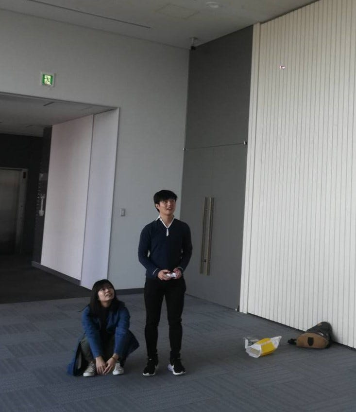
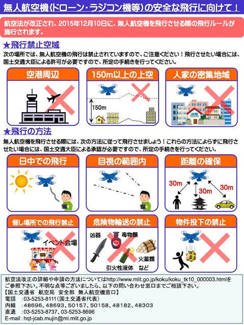
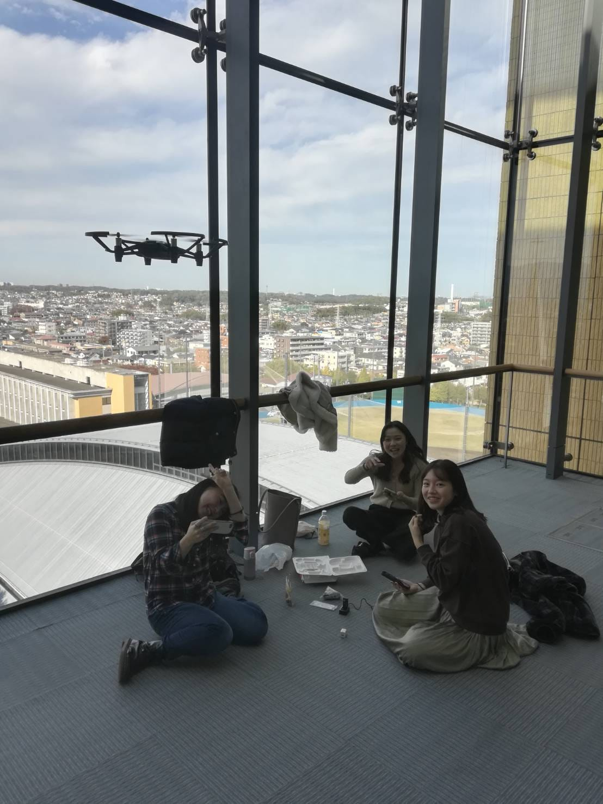

### ドローン部 週報 第４週目

今回の週報では、ドローンを操る者として最低限知っていないといけない「航空法」について紹介しようと思います。もう既に知っていないとおかしいレベルの話かもしれませんが、確認の意味も込めて取り上げたいと思います。

「え、ドローンを操縦している人なら知っているんじゃない？」と普通は思いますが、知らずに[航空法違反で処罰を受けるケース](https://paripassunote.com/ito_191025/)はよくあるそうです。

・[https://paripassunote.com/ito_191025/](https://paripassunote.com/ito_191025/)

ドローンに関わる法律で最も重要な航空法。最近[DJI Mavic Mini](https://www.dji.com/jp/mavic-mini) が発売され、航空法の”200g未満”という部分が注目されました。このようにドローンに関わる法律のひとつである航空法には様々な決まりが定められています。

航空法をサラッとわかりやすく理解するのにオススメのサイトがあります。航空法を管轄する国土交通省が公開している「[改正航空法](https://ja.wikipedia.org/wiki/%E8%88%AA%E7%A9%BA%E6%B3%95)概要ポスター」です。

改正航空法概要ポスター<pdf> [https://www.mlit.go.jp/common/001110369.pdf](https://www.mlit.go.jp/common/001110369.pdf)

このポスターを見れば一目瞭然。

上の三つの場面で飛ばしたい場合は原則ドローンの飛行は禁止で、国土交通省への手続きをしなければなりません。

例えば、150m以上の高さまでドローンを飛ばしたかったら国交省の許可を取らないといけないのです。

また、空港周辺と人家密集地域（DID）に該当するかどうかの確認方法は様々あります。例えば、国土地理院が提供している[地図](https://www.gsi.go.jp/chizujoho/h27did.html)で確認できます。

飛行の方法という項目には”日中の飛行”というのがあります。すなわち、夜にドローンを飛ばしたい場合は必ず国土交通省へ手続きを行い、承認を受ける必要があります。

そして、冒頭で紹介した「伊東市の防災訓練事案」は、飛行の方法の、”催し場所での飛行禁止”に該当するものでした。航空法を甘く見ていると、痛い目にあってしまうのです。

そして、今紹介した「航空法」の対象外になる機体というのが、200g未満（機体本体とバッテリーの重量合計）のドローンなのです。（もう皆さんはご存知ですよね♪）

仮に航空法に違反した場合、五十万円以下の罰金に処するとされています。過去には航空法違反で逮捕されたケースもありました。ルールをしっかり学び、理解し、ドローンを飛行させる際はきちんとルールを守って飛ばしましょう。マナーを守ることも忘れないように。

ありがとうございました。

以上
