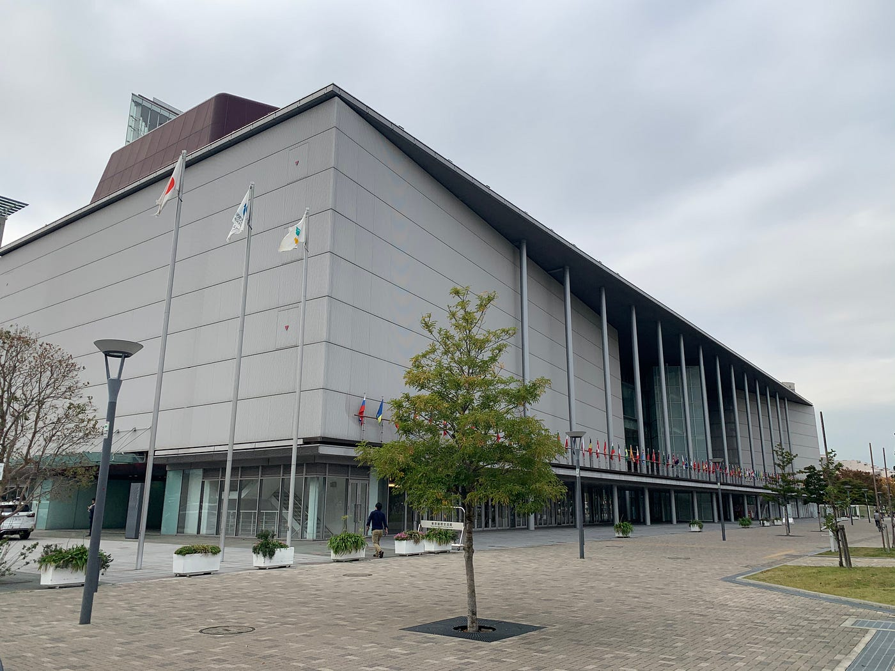
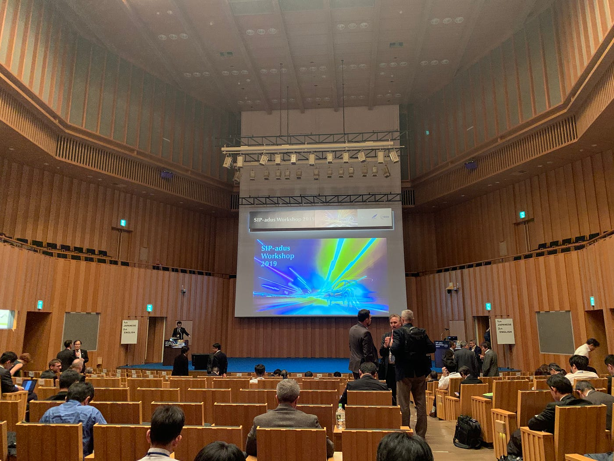
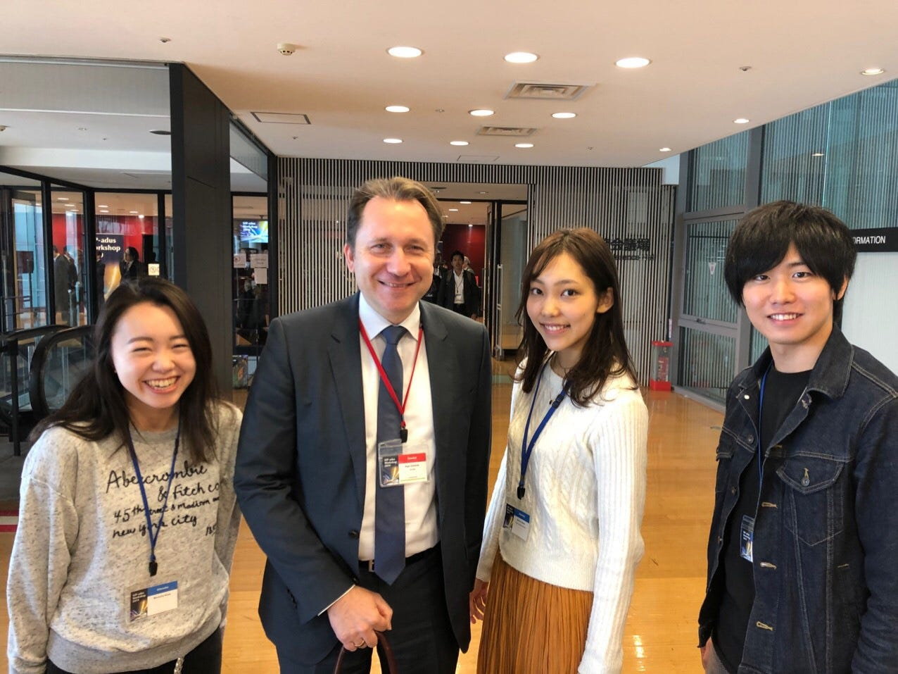
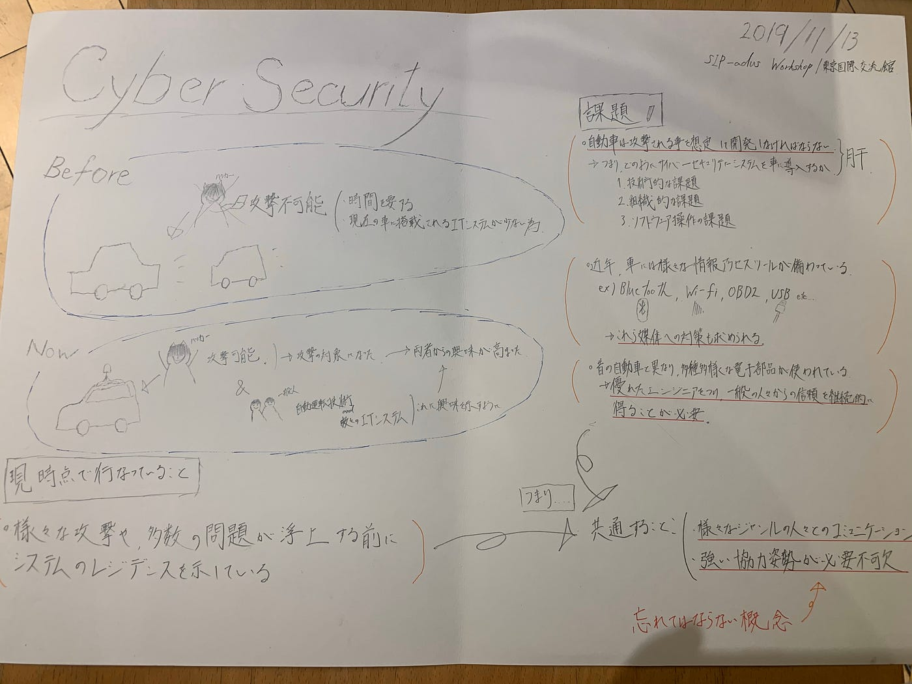
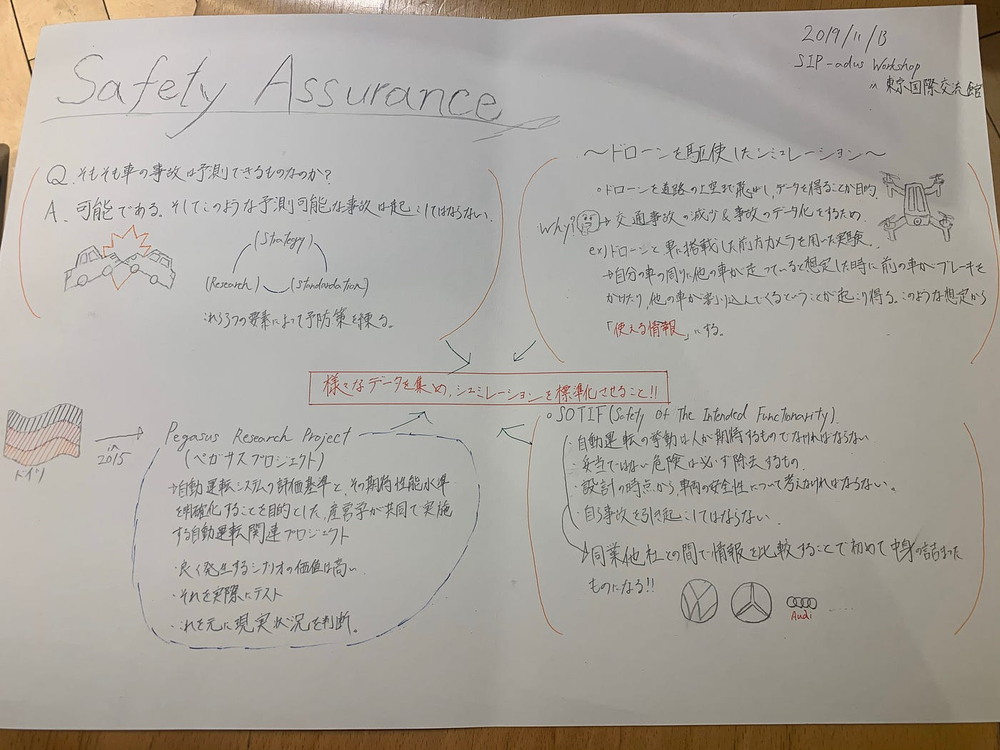
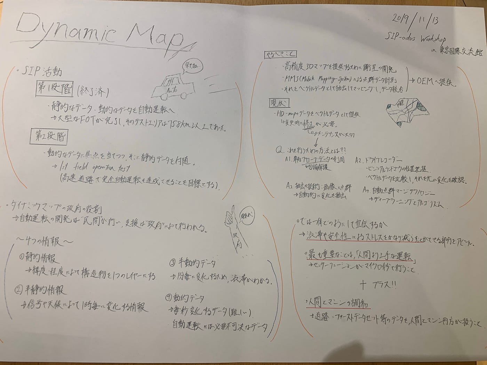

### SIP-adus Workshop 参加記録(2019/11/13)

こんにちは。3年の佐野公紀です。

11月13日に国際会議参加の一環として[[SIP-adus Workshop](http://en.sip-adus.go.jp/evt/workshop2019/)]というの会議に参加してきました！

会場はお台場にある東京国際交流館という場所でした。近くにダイバーシティや大江戸温泉物語などがあります。遊ぶための施設が多いイメージが強いお台場にこのような厳粛な場所があると知らなかったため大変驚きました。

さて、入場するや否や私はまず一つ大きな違和感を抱きました。それは服装です。他の方々は全員スーツであったのにも関わらず私は私服だったため側から見ればただのKYだったので居心地は正直悪かったです(笑)

会議が行われた場所は本当にいかにもって感じのところでした。天井の高いホール、それなりに広い壇上、その両脇にあるマイクスタンドがいかにここが厳粛な場所かを自分に間接的に訴えかけてきました。

会議云々の前にこの時点で2つの気づきを得ることができました。以下の通りです。

- 会議という名の集まりはスーツが当たり前。

- しっかりとした覚悟を持って臨むこと。(国際会議に来たというだけの事実にうぬぼれてはならない。)

私がまた何かの機会で国際会議に出席する機会があれば必ずこれを死守しようと強く感じました。

さて、本題の会議ですがこれがまたびっくりするものだらけでした。それは話される英語が難しいことや、専門的な話が多くそれについていけなかったりです。いかに自分の英語力&自動運転関連の知識が低いかを思い知らされました。とりあえずメモを取らねば来た意味が無いと思い手を動かすも、やはり自分が理解できる範囲が狭すぎて自動的に取れるメモも少なかった事が本当に悔しかったです。

しかし、同時に自分に現実を突きつけてくれたこの国際会議や登壇者の皆様には大変感謝しております。現実を直視することはかなり辛いことですがそこから跳ね上がることの重要性も間接的に今回の参加から学ばせて頂きました。

最後になりますが、これはデトロイト社のIngo Dassow氏との記念写真です。

今回の参加より、自動運転には具体的に何が必要で、それを得るには人々は何をすればいいのかということに関して多くのヒントを得る事ができました。この経験から、自分だったらこれをどう現実化するかということを模索したいと思っています。

グラレコです。

ストラバです。

[自動運転　国際会議 - Koki Sano's 0.0 km bike ride
Koki S. rode 0.0 km on Nov 13, 2019.www.strava.com](https://www.strava.com/activities/2861187448)
