### グラレコ初心者の感じる障害

こんにちは、古橋ゼミ3年グラレコ部の安田です。古橋ゼミには4年生のための卒論、3年生のための卒論準備としてのゼミ論というものがあります。

そのゼミ論の中で、私は「グラレコ初心者が実践時に感じるハードル」に関して研究しています。というのも、グラレコは現在求められている場が多くなってきてはいますが、まだまだ実際に描くことのできるグラフィッカーは多くありません。

グラレコできる人とできない人との間にはどんな差があるのかを詳しく言語化し、本当に誰でもできるグラレコの方法を言語化したいと考えています。

### **HOW**

具体的には「グラレコ実践したい初心者」に対して、実践とフィードバックを通してできるようになるまでのプロセスを記録してきます。

グラフィッカーの卵である小林君に協力いただきます。

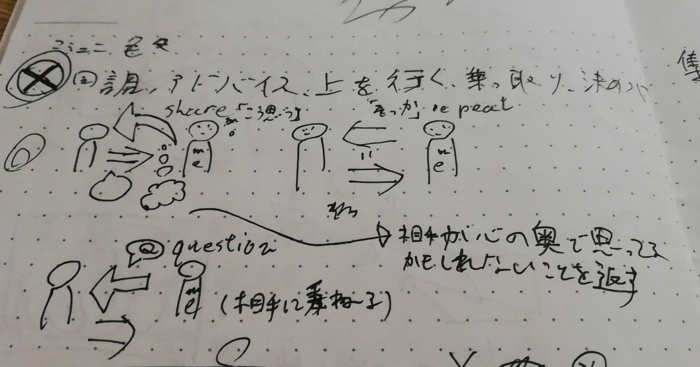

**状態**

・グラレコ経験は数回

・グラレコを見た経験は10回程度

・ワークショップなどに関心があり、ファシリテーションにかかわることをできるようになりたいため、グラレコもできるようになりたい

・道具も持っていない

・清水淳子さんの[Graphic Recodingの教科書](https://www.amazon.co.jp/dp/B01N5XFF4O/ref=dp-kindle-redirect?_encoding=UTF8&btkr=1)は持っている

この状態からまずはヒアリングを行いました。

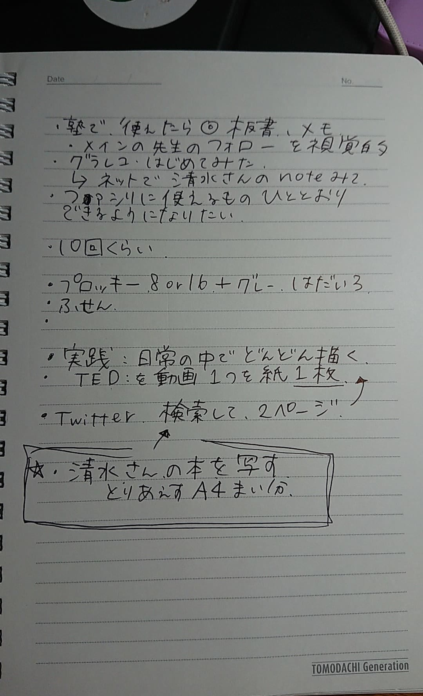

Qどういったところでグラレコのスキルを活かしたいか

A バイトしている塾の板書やメモ、メインの先生のサブとして視覚的にフォローできるようになりたい。

どういうグラレコを目指す、といったイメージがまだないようだったのでインプットとアウトプットをする課題を設定しました。

> １．まずは清水さんの本を見ながら、A4枚分出てくるアイコンや絵を映してみる

> ２．余力があれば「グラフィックレコーディング」と検索し、結果を2ページ分見る

> ３．それでも時間があれば、TEDを見てA4用紙1枚にまとめる、日常の中で実践の機会を探してひたすら書く

上記の3つを優先順位をつけて提示しました。

それから、プロッキーの8本セットを買うように伝えました。

### 課題の実施

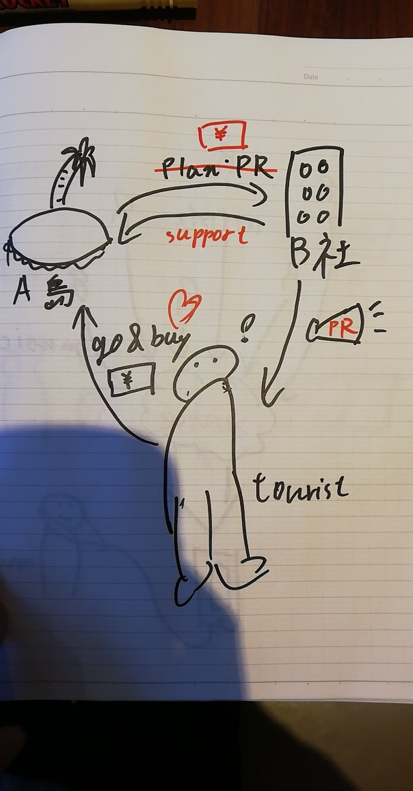

プロッキーを使っているのが見てわかります。線も太くなりよく見えるようになりました。

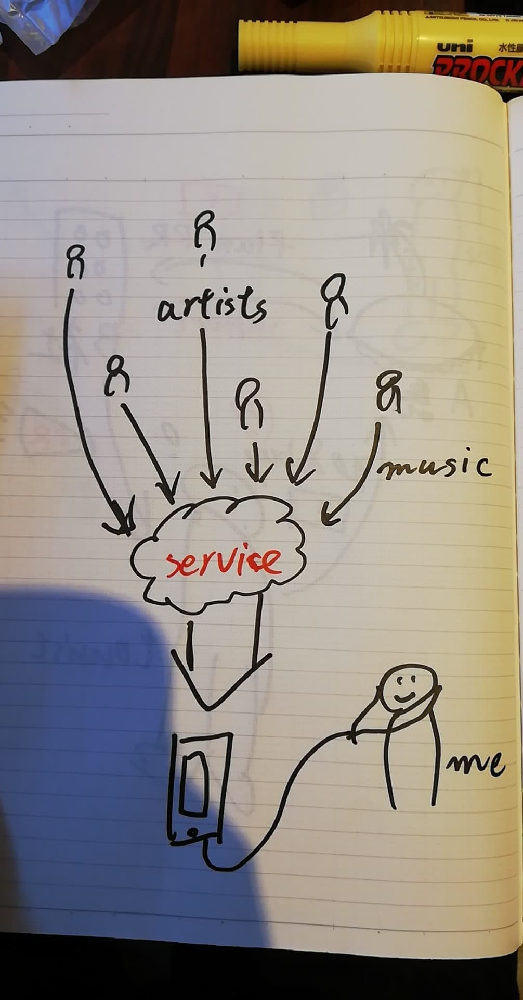

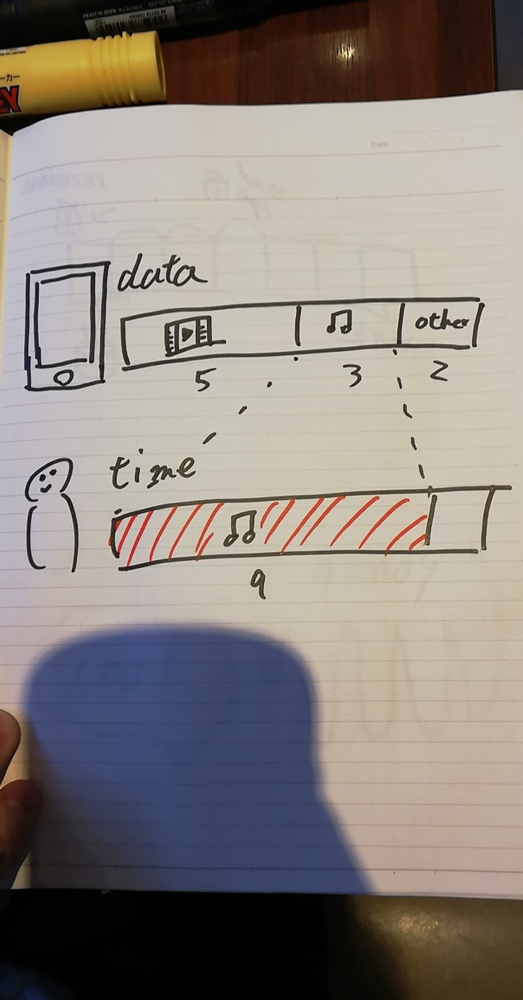

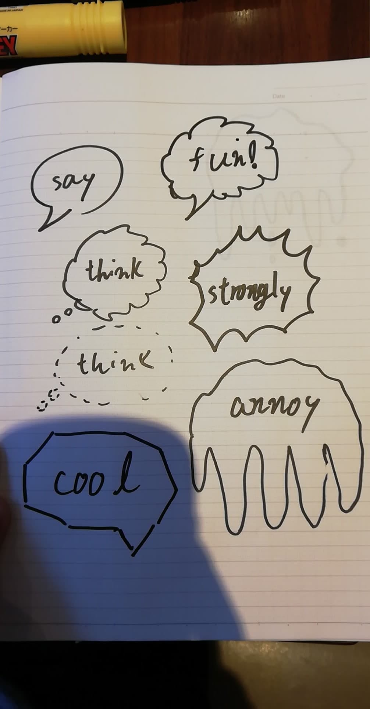

### 課題に対するフィードバック

・視認率が前の送ってもらったより上がりました！しっかりかけるようになってます！

・ フィードバックとしては線をしっかりかけると良いです、例えば丸だったら始まりと終わりを繋ぐことなど、意識してみてください！

以下の画僧を添えて送りました。

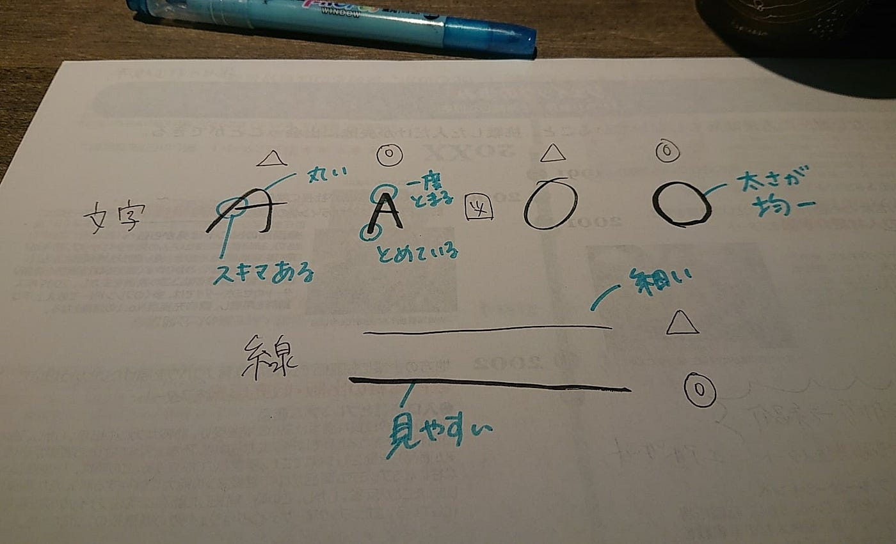

### 第一回実践

私がグラレコで関わっている学問ファシリテーター育成講座にて、隔週木曜日で描いているのでその現場に小林君も来ていただき、実践してもらうことにしました。

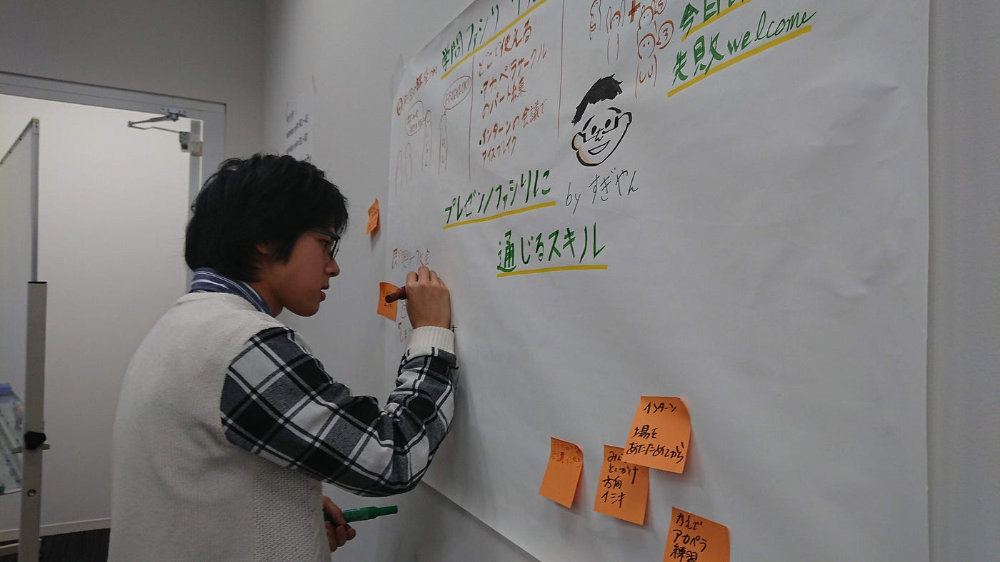

#### 事前準備

**・目的の設定**

何のための場なのか、どうしてグラレコを行うのかの2点を確認する必要があります。

**・レイアウトアイデア**

目的を果たすために効果的な書き方とは何か

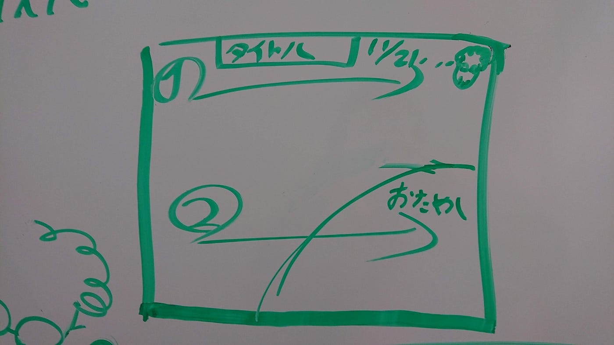

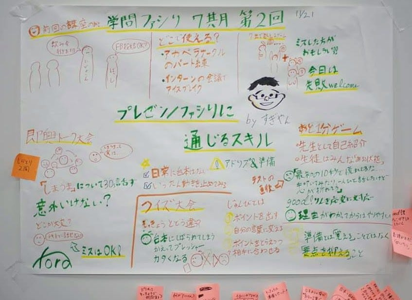

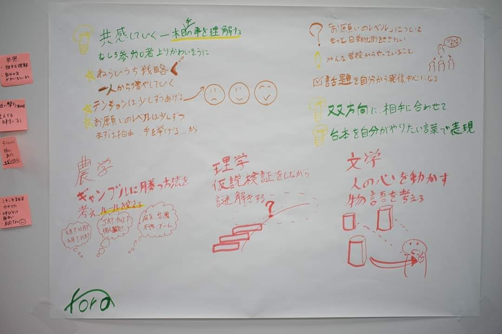

#### フィードバックの内容・グラレコの思考プロセス

紙に書くまでのプロセスは、いくつかの段階に分かれていることがわかりました。

> **１．目的に合わせた情報の取捨選択を行う必要がある。**

> すべて描くことはできないので、目的を達成するために必要な情報を選んでいきます。

> **２．選んだ情報の重要度を紙に反映させる必要がある。**

> 選んだ情報の中にも優先順位や重要度があるため、それをサイズや位置を考えて紙の上に表現する。

> **３．表現の仕方を精査する。**

> 情報を伝えるために最低限の文章情報を要約し、できるだけ少ないタッチで描けるグラフィックを考える。ここでスピーディーに書くためにはある程度のインプットが必要。

> **1~3のプロセス→描く**

> そこに加えて気を付けるべきことも出てきました。

> **４．譲れないポイントを理解する**

> 決められた表現、自分なりの言いかえをしないことが重要

ここまでの分解ができたところで実践は一度終了し、次回以降また、実践とフィードバックを繰り返していきます。

### 次回までの課題

課題はインプットして、グラレコをたくさん見てマネしてくること、としました。何をしたらいいかわからない場合は、 [マッキンゼーの図解](https://www.amazon.co.jp/%E3%83%9E%E3%83%83%E3%82%AD%E3%83%B3%E3%82%BC%E3%83%BC%E6%B5%81%E5%9B%B3%E8%A7%A3%E3%81%AE%E6%8A%80%E8%A1%93-%E3%82%B8%E3%83%BC%E3%83%B3-%E3%82%BC%E3%83%A9%E3%82%BA%E3%83%8B%E3%83%BC/dp/4492555226/ref=sr_1_1?adgrpid=51988834303&gclid=Cj0KCQiAq97uBRCwARIsADTziya9IQr9IDcTC6ZWPmiyqvM-mTNIm0SS5wbaxgV9W07psS9oZd8YoVUaApwtEALw_wcB&hvadid=338585857649&hvdev=c&hvlocphy=1009344&hvnetw=g&hvpos=1t1&hvqmt=b&hvrand=7217371874077937526&hvtargid=aud-759242200006%3Akwd-326432075401&hydadcr=2754_11130001&jp-ad-ap=0&keywords=%E3%83%9E%E3%83%83%E3%82%AD%E3%83%B3%E3%82%BC%E3%83%BC%E6%B5%81%E5%9B%B3%E8%A7%A3%E3%81%AE%E6%8A%80%E8%A1%93&qid=1574413532&sr=8-1)の本を図書館などで借りてそれを一通り真似してきてください！としました。

小林君の今後に期待です。
