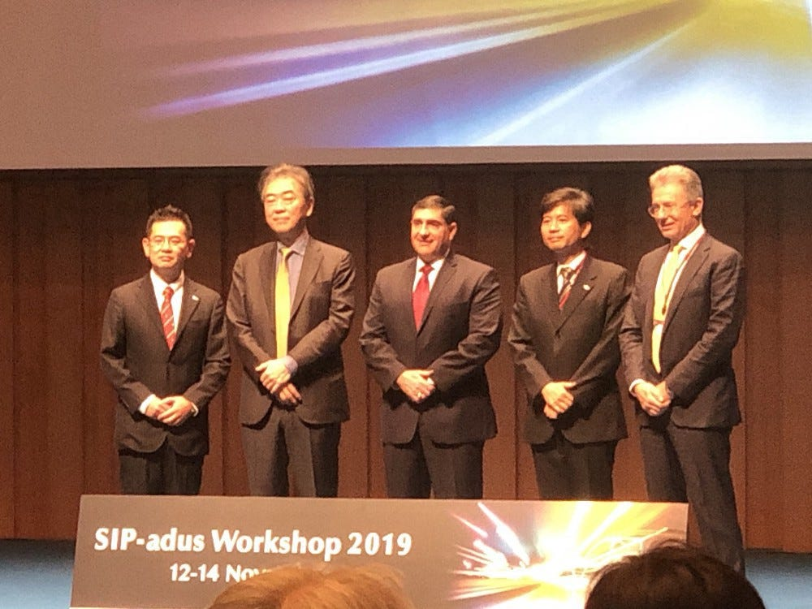
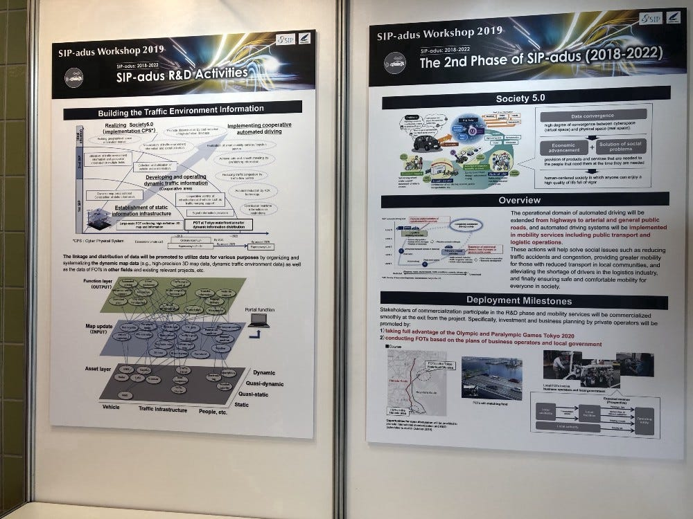
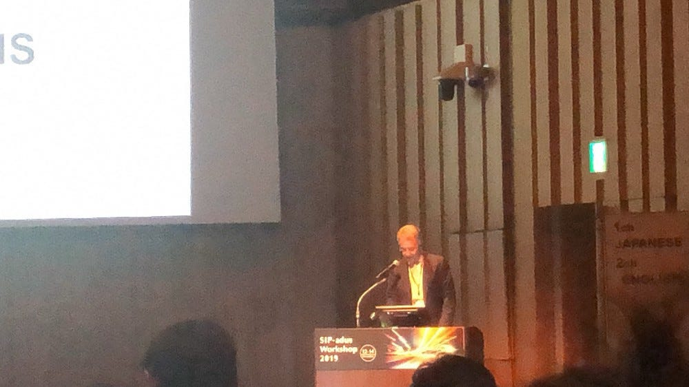
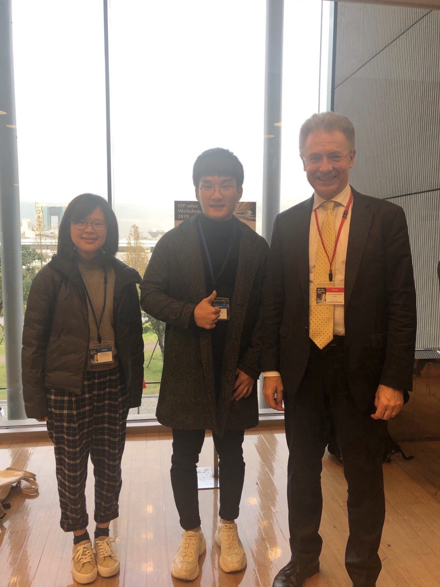
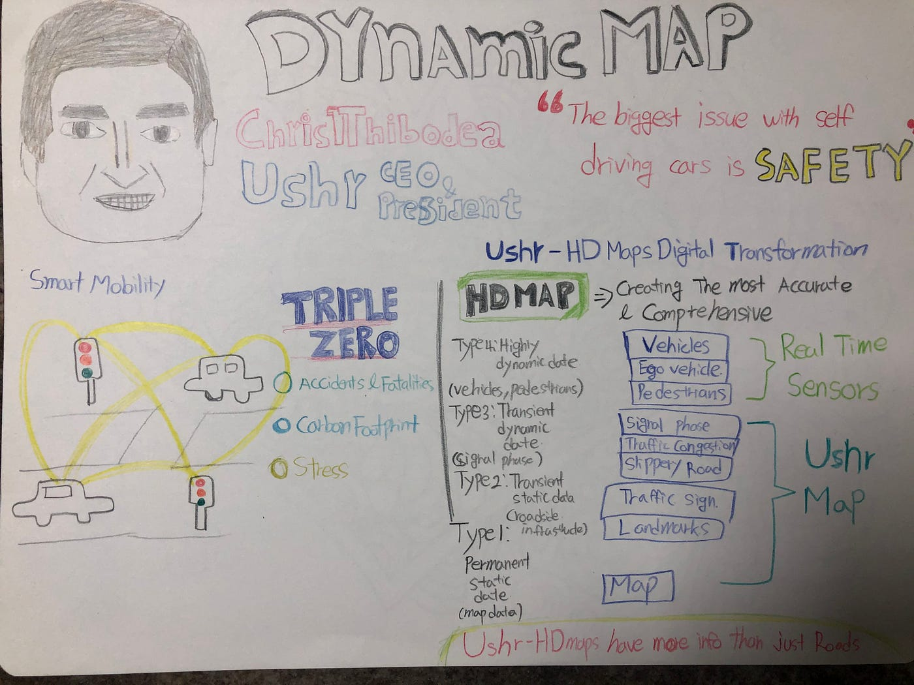
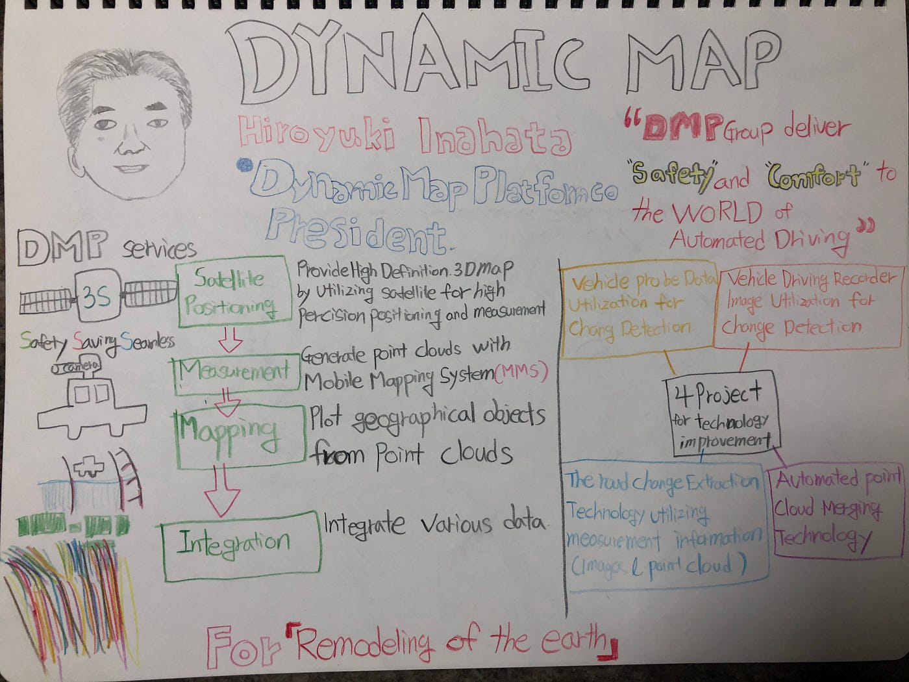
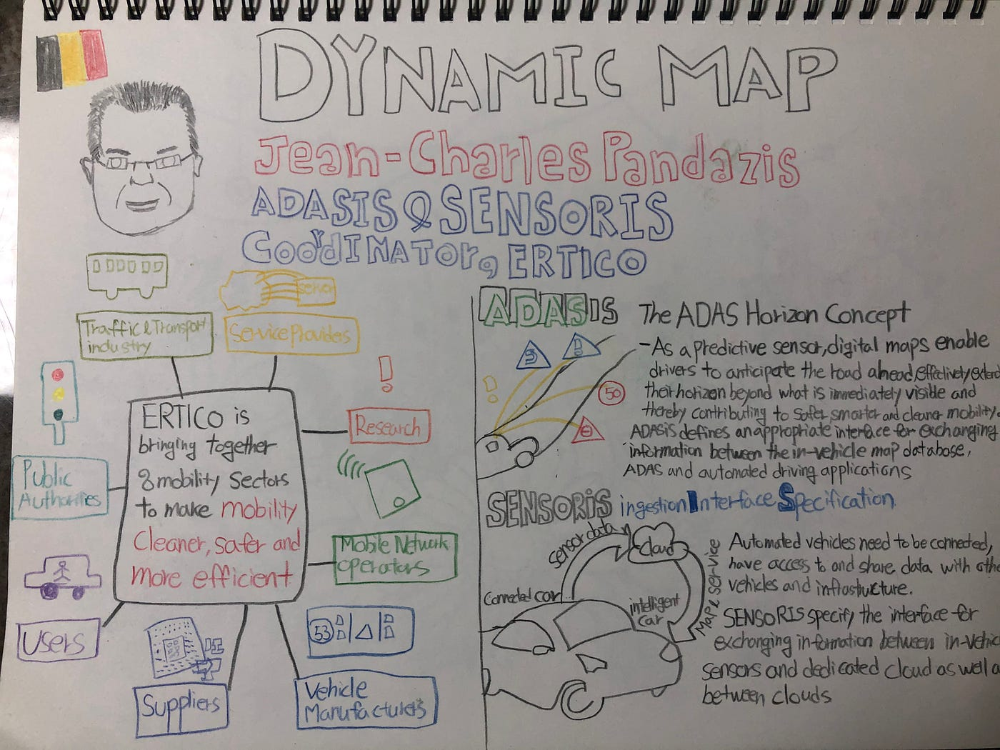

### SIP-adus workshop 2019 -Section Dynamic map

JIYUL LEE

Wednesday, November 13, 2019

I attended the SIP- adus Workshop 2019 in Odaiba International Exchange Center. it was conducted for discussing efforts to share and resolve issues with expert from Europe, the United States and Asia pacific region to achieve automatic driving.

There were many businessmen and expert who seemed to be professors. The atmosphere of the workshop was very heavy and the faces of many people were very serious. so i got a bit nervous. i though it was a workshop that i would attend. but i tried to understand about what they are discussing and are talking. honestly, i didn’t fully understand what they were discussing about. because my level of knowledge could not understand the jargon they discussed. but at least i tried.

First, i tried to understand today’s topic through participating in an exhibition they had prepared before speech.

The materials were all written in English and jargon, so i couldn’t fully understand that. but i could understand that they are discussing about how to actualize automatic operation and the technology is so hard. the automatic operation is very complex technology than i thought. it had to think about many factors for actualization the automatic operation such as Regional Activities, Human Factors, Cybersecurity, Safety Assurance, Map.

The workshop went off in a formal atmosphere. i felt that all of them took a very serious attitude to the workshop.

i decided to focus on Dynamic map section because the section was related my study. the presentation’ contents were about company introduction and technology their have, business model.

the presentation lasted for 180min. The time was hard fighting with jargon and scientific knowledge, English. after i try to learn, i could understand about the benefits of Automatic driving and could draw the future of Automatic driving. especially, christopher T. Thibodeau, who Ushr president& CEO, and Jean-Charles Pandazis, who ERTICO ADASIS & SENSORIS coordinator, helped me that drawing in future of Automatic operating.

In conclusion, the SPI adus workshop 2019 gave me a great inspiration so i recognized there were many outstanding people who lead the world and i thought that they’re changing the world more convenience. it was taken my motivation and mind to grow up.

after this workshop, i threw me the questions that what should i do for my productive life and what can i do for changing world. and i think i should try to find that whole my life.

[Spi danamic - Jiyul Lee's 1.7 mi walk
Jiyul L. completed 1.7 mi on Nov 13, 2019.www.strava.com](https://www.strava.com/activities/2861293247)

