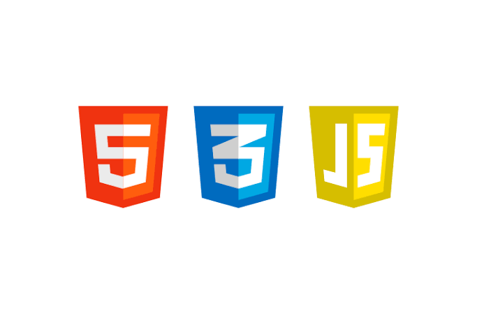

### ギットハ部週報：JavaScriptの勉強



### １．報告者名（外部の場合は所属まで）

### 北野恭一朗（二期生）

### ２．報告概要（簡単で良い）

JavaScriptの勉強(とその前段階としてHTMLとCSSの勉強)をはじめました。

### ３．報告内容（箇条書き・詳細記入可）

JavaScriptの勉強をする必要が出てきたのでとりあえず本屋で簡単そうなJavaScript入門書を購入してきました。

[知識ゼロからのJavaScript入門
はじめてでもわかる！ できる！…gihyo.jp](https://gihyo.jp/book/2018/978-4-7741-9939-9)

今回購入したのはこちらになります。自分でも理解できるぐらいには簡単なのですが注意書きもされてる通り、HTMLとCSSは基礎知識があること前提でそちらの解説はしてないのでそちらを先に勉強しておくことにしました。こちらはウェブサイトを利用してなので下の参照サイトの欄にリンクを貼っておきます。

現時点での成果をサイトの指示丸写しではありますが貼っておきます。最初はとりあえず書くことが重要だと思います。

file:///C:/Users/Owner/Documents/index2.html

今回でタグとタグで囲まれた要素によりウェブサイトの文字などが表示されるようになるということが分かった。

```
<html>はHTML文書であることを意味し、<body>だと文書の本体であることを示しているといった感じです。
```

CSSについては完全に知識が０でしたがスタイルシート言語の1つでウェブページのスタイルを指定するためのものだということが分かりました。ウェブページのスタイル指定とはスクリーンに表示される際の色やレイアウトやサイズなどを指定することでこれをHTMLと分けることで情報が無用に複雑になったりエラーが起きるといった事を防げるようです。

### ４．次回への目標・課題など

サイトを利用しHTMLとCSSへの理解を深め、JavaScriptの勉強を行う。

### ５．参照サイトなど（コードはQiitaで管理）

[ウェブ制作チュートリアル－HTMLクイックリファレンス
このチュートリアルでは、架空の企業サイトを制作しながら、HTMLとCSSの使い方を学習していきます。 手順通りに制作を進めていただければ、以下のサンプルサイトと同じものが完成します。…www.htmq.com](http://www.htmq.com/tutorial/)

ICS type template by Furuhashi(mapconcierge)Lab.

[Furuhashi(mapconcierge)Lab.
Furuhashi Laboratory, Aoyama Gakuin Univ. https://www.facebook.com/furuhashilab http://furuhashilab.com…medium.com](https://medium.com/furuhashilab)

<当テンプレートは古橋研究室ライセンス事項に乗っ取りCC by 4.0で公開されています。>
