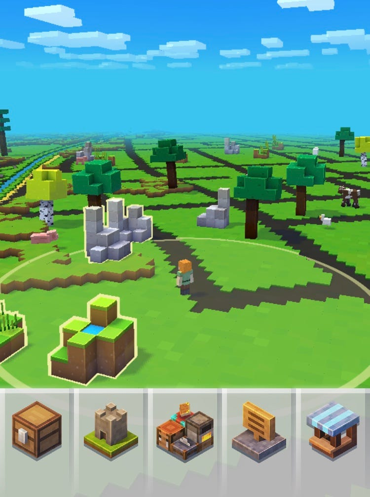

### 位置情報ゲーム部週報：MinecraftEarthについて

お疲れ様です。
位置情報ゲーム部今週の週報は11月20日にリリースされたMinecraftEarthについてまとめます。

> 全てがブロックでできた自由な世界

Minecraft通称『マイクラ』は、すべてがブロックでできた世界を自由に冒険できるゲームです。元々はPCのインディーゲームでしたが、今ではPCだけでなく、PS4やNintendo Switchなどのコンシューマから、スマートフォンのアプリまで幅広いハードで遊ぶことができます。

> ３つのプレイ体験

Minecraft Earthは3つのまったく異なるプレイ体験が用意されています。

まず一つ目に、マインクラフトの世界の基礎となる「ビルドプレート」です。ビルドプレートでは、現実世界を歩いて集めた素材を使って何かをを作ることができるだけでなく、素材を別の素材に変化させたりできるます。また、ほかのプレイヤーを招待することも可能で、ほかのプレイヤーたちが、自分の作品づくりに協力したりすることができます。

二つ目に、自分が作った建築を小さなテーブルサイズから実物大に拡大し、その中を実際に歩いたりすることも可能です。

三つ目は、複数プレイヤーで楽しむ「アドベンチャー」です。アドベンチャーは、公共スペースに突然登場するミニゲームで、戦闘型と探検型のふたつの体験が用意されています。これらのミニゲームは、「Pokémon GO」や「ハリー・ポッター：魔法同盟」といった先例を超える大がかりなAR技術によって支えられているそうです。

> 絶えず進化する機能

マイクラのクリエイティブディレクターは、「最初にお届けするゲームと、2年後にユーザーの手元にあるゲームは、同じものではありません。だからといって、いま届けるゲームが、われわれが本当に届けたいゲームではないというわけでもないのです」と、言っており、絶えずユーザーのニーズを超える新機能の導入も期待できると思います。

> 開発初期から重視してきた三つの要素

一つ目は、アドベンチャーです。Minecraft Earthは、アドベンチャーを通じ、ユーザーに「マインクラフトを現実世界のフルスケールで遊んでいる」という感覚を提供していることです。

二つ目は「モブ」（マインクラフトに登場する、プレーヤー以外のキャラクター）です。このモブには、通常のゲームの人格を越えたパーソナリティが備わっているそうです。

最後は、完全没入型のAR体験です。クリエイティブディレクターはこれを、「いままでなかったような」体験と呼んでいます。例えば、手前にあるはずの現実界のオブジェクトを、仮想オブジェクトが隠してしまう、オクルージョンが起こりにくくなっていることです。

これは、ゲームの仮想オブジェクトと位置情報を結びつけるために、マイクロソフトが「[Azure Spatial Anchors](https://www.slideshare.net/TakahiroMiyaura/azure-spatial-anchor)」というシステムを開発したことによって実現しました。

> 実際にプレイしてみて

全てがブロックでできている世界観が個人的に結構好みでした。また、鳥のさえずりや羊の鳴き声が聞こえるのも異世界にいるように感じます。

リリースして間もないこともあって、位置ゲー部のなかでゲームがすぐ落ちるという声が多くあったが、すぐに改善されることを期待してます。

子ども世代に人気のゲームであるとは知っていたましたが、その理由がわかった気がします。素材を集めて物作りをするゲームなので、ものづくり部と連携してできることがあるのではと期待です。

> 最後に

Youtubeでマイクラ関連の面白い動画があったので、マイクラを知りたい人は見てみるといいかも..
某サバイバル番組での、有野の創造力と濱口の狩猟採集能力がゲームにも反映されていて、個人的にツボです（笑）
