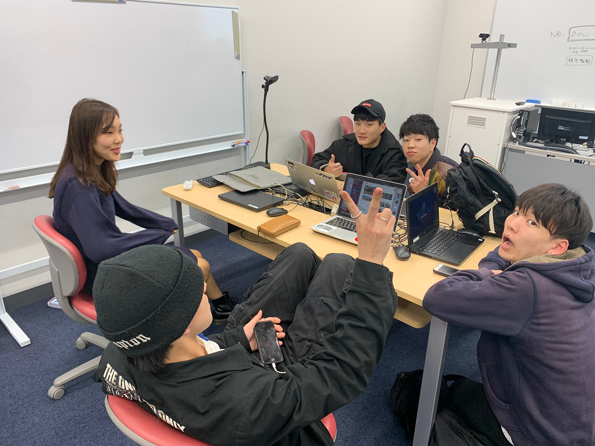
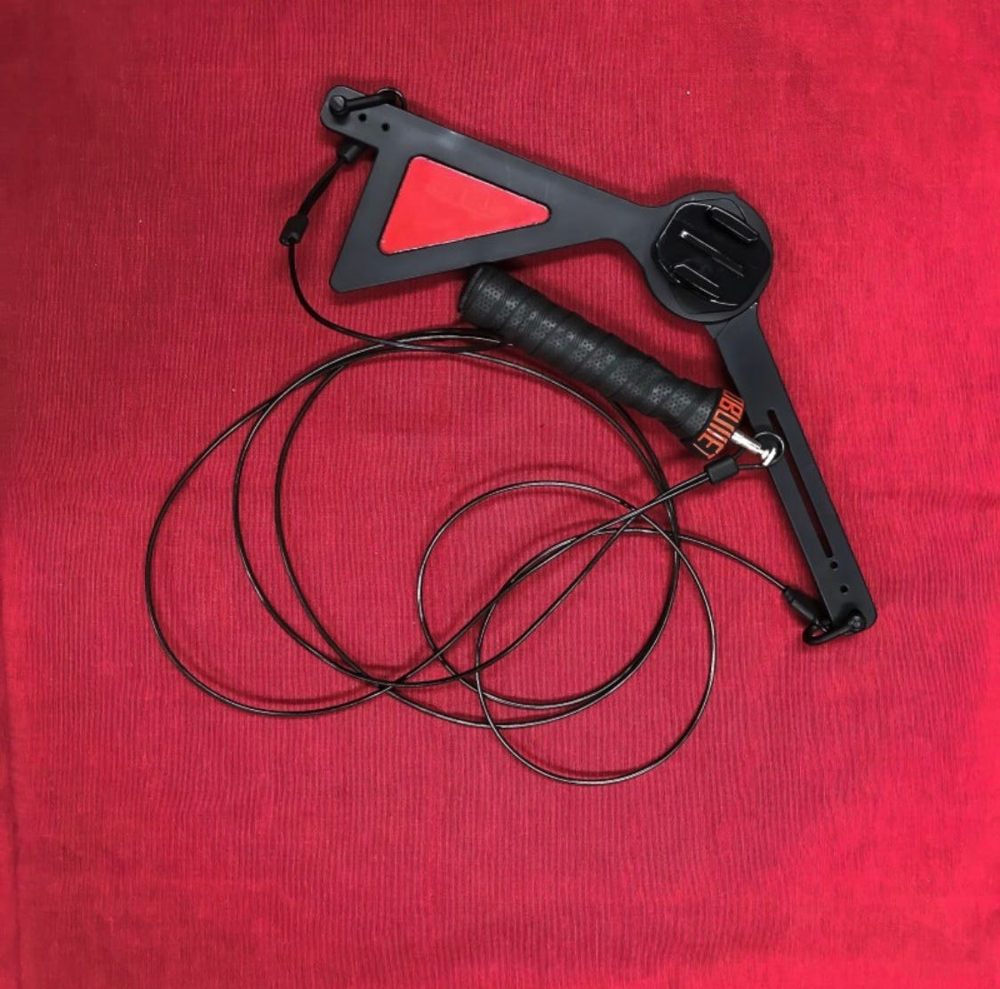

### 横瀬部 第５回目週報

こんにちは、古橋研究室3年の安保龍一です！

今回は第５回目のミーティング内容を報告します。

### ミーティング概要

これまでのミーティングによって横瀬部として「横瀬のプロモーションビデオを作成する」事が決定し、[先週のミーティング](https://medium.com/furuhashilab/横瀬部第４回目週報-ca968537faab?source=collection_home---1------9-----------------------)でどのようなプロモーションビデオをモデルにするかについて話し合いました。各々が参考動画を用いた結果、『大学生という利点を生かして動画に差別化を図る』というコンセプで活動を進めていく方向になりました。（大学生という若さ、ドキドキワクワク感を動画に入れる）

> プロモーションビデオのモデル

**そして今回は、、**

> ・撮影スポット

> ・撮影方法

> ・当日の大まかなスケジュール

上記の3つについて話し合いました！

**撮影スポット**

プロモーションビデオの撮影スポットについては、次回までに[slack](https://furuhashilab.slack.com/archives/CKZLM5PSN/p1574674422000600)に候補地を１人最低２つ上げることになったので来週のミーティングでディスカッションする予定です。

**撮影方法**

今回の話し合いのメインとなったのがビデオの撮影方法です。現時点で用いるデバイスはGoPro、ドローン、ビデオカメラの３つの予定を予定しています。GoProの撮影方法として、あるアイテムを使うという意見が出ました。[写真のようなツール](http://blog.naver.com/mandoo_net/221417582443)を用いることで動画に躍動感が出て、我々がコンセプトに掲げた大学生らしさの表現に役にたつと思います。また、このツールを来週のミーティングで作成する予定です。

[만두넷 : 네이버 블로그
Edit descriptionblog.naver.com](http://blog.naver.com/mandoo_net/221417582443)

### 最後に、

12月14日の撮影当日まで残すと20日となりました。撮影練習など実践的な活動を増やして、スムーズに撮影できるように準備を進めて行きたいです。また来週のミーティングでは、撮影スポットのディスカッションとアイテム作成を予定しています。来週の報告をお待ちください！！

以上
