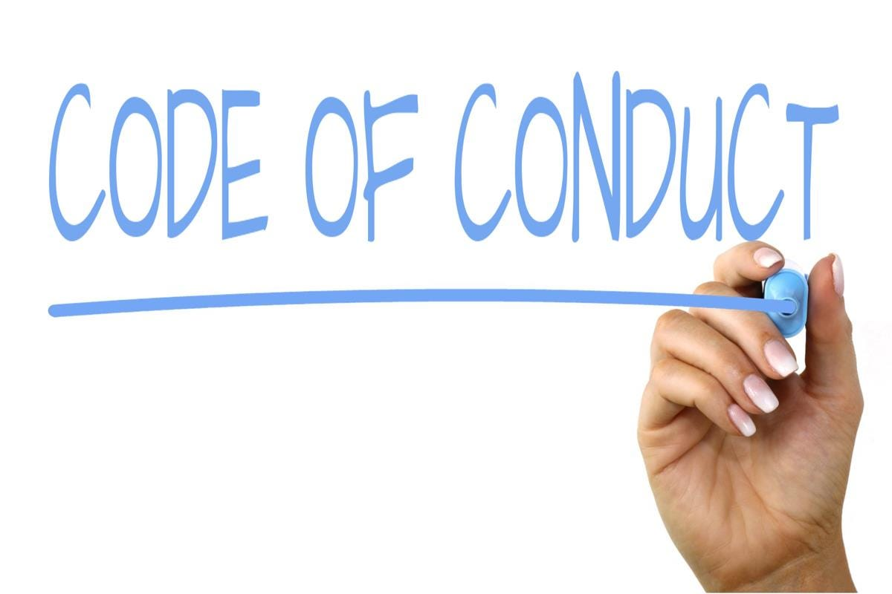

### オープンなコミュニティだからこそ行動規範 Code of Conduct を大事にする。

### 災害ドローン救援隊DRONEBIRDは誰でも参加できる。

古橋研究室が取り組んでいる、空撮用ドローンを用いた社会貢献活動「[災害ドローン救援隊DRONEBIRD](http://dronebird.org/)」。ついに、その隊員の数も[訓練グループ](https://www.facebook.com/groups/dronebirdbootcamp/)だけで200名を超える規模になってきた。

各地で行われるドローンの操縦訓練や自治体と連携した防災訓練、そして災害時、実際に行う現地での撮影活動など、2019年はその活動も実践的に機能し、8月以降の九州北部豪雨、台風15号、台風19号など各地で[災害協定締結自治体](https://github.com/crisismappersjapan/agreement4dronebird_CMJxLGOV)と連携したドローン空撮を実施した。

この活動はスキルと経験があれば、できるだけ多くの方が参加できるようその入口は開放している。訓練グループに参加し、実際に訓練を通してそのスキルを確認できれば、災害時に協力も要請する。できる限りその門戸は広くしておきたい。

しかし、誰でも参加できるというということは、時にはマイナスに働くこともある。我々の活動の趣旨とは異なる考えを持った方がDRONEBIRDの名前を使って活動するケースも今後発生する可能性は否定できない。活動中に意見の相違がでてくるかもしれない。組織が大きくなってきたからこそ、我々がなぜボランティアとして空撮用ドローンを用いて、被災地各地を空撮し、そのデータをオープンにしているのか。その考え方を共有しておく必要がある。

### 行動規範 Code of Conduct を守る。

考え方をどう表現するか。国際シンポジウムやワークショップではよく **“[Code of Conduct](https://en.wikipedia.org/wiki/Code_of_conduct)”** をつくることが多い。日本語訳をするならば **“行動規範” **だ**。**Code of Conduct で有名なものは Google の社是として提示された **“[Don’t be evil](https://en.wikipedia.org/wiki/Don%27t_be_evil)”** であろう。実際にはこの行動規範から Google 自身が逸脱する行為を行ったときは、[内部の社員から批判を受け、米国防総省とのプロジェクト(Project Maven)から離脱する](https://www.gizmodo.jp/2018/04/ditch-project-maven-says-google-employees.html)など一定の効果を上げている。**“[災害救援における国際赤十字・赤新月運動やNGOのためのCode of Conduct](https://en.wikipedia.org/wiki/Code_of_Conduct_for_the_International_Red_Cross_and_Red_Crescent_Movement_and_NGOs_in_Disaster_Relief)”**も有名で、1995年から国際的には認知されている。

[Googleが参加する軍事プロジェクト｢Project Maven｣、社員たちが反対の請願キャンペーンを展開
塚本 紺 ｢戦闘目的じゃない、なんて言い訳は通じないよ！｣ アメリカ国防総省とのパートナーシップを結んだGoogleに対して、何千人もの社員からこのパートナーシップを終了するよう請願キャンペーンが行なわれているようです。 先月、…www.gizmodo.jp](https://www.gizmodo.jp/2018/04/ditch-project-maven-says-google-employees.html)

できるだけシンプルに、わかりやすく、他の団体でも再利用可能な形で流通している Code of Conduct は Ada Initiative 及びボランティアによって作成された [Geek Feminism wiki](http://geekfeminism.wikia.com/wiki/Conference_anti-harassment/Policy) であろう。実際に [GitHub 主催の勉強会](https://techplay.jp/event/575585)に参加した時に教えてもらい、その後 [古橋研究室の Code of Conduct](https://github.com/furuhashilab/README/issues/4) として forkしている。多少の改変も加えた形で [CrisisMappersJAPAN/災害ドローン救援隊DRONEBIRD/JapanFlyingLabs 行動規範 Code of Conduct](https://github.com/crisismappersjapan/doc4cmj/blob/master/codeofconduct.md) を作成した。

_**CrisisMappersJAPAN/災害ドローン救援隊DRONEBIRD/JapanFlyingLabs 行動規範 Code of Conduct_
_[https://github.com/dronebird/docs4dronebirds/issues/14_**](https://github.com/crisismappersjapan/doc4cmj/blob/master/codeofconduct.md)

もちろんまだまだ完璧ではないため、随時更新を行っていく。修正提案などは誰でも書込み可能な [GitHub Issue を公開](https://github.com/dronebird/docs4dronebirds/issues/14)しているので、忌憚のない意見をいただきたい。

いずれにしても、我々災害ドローン救援隊DRONEBIRDは、この行動規範に則って行動し、[我々の Code of Conduct ](https://github.com/crisismappersjapan/doc4cmj/blob/master/codeofconduct.md)に賛同いただけない方は残念ながら行動を共にはできないため、それぞれの道を歩んでいただきたい。行動規範をよく読んでいただき、我々と想いを共にできる方は、是非ドローンを世の中を良くするための一つのツールとして活用する社会実装を実現するために、[我々の仲間として参画](https://www.facebook.com/groups/dronebirdbootcamp/)いただければ幸いである。

_この投稿は [DRONEBIRD Advent Calendar 2019 ](https://qiita.com/advent-calendar/2019/dronebird)として投稿しました。_
