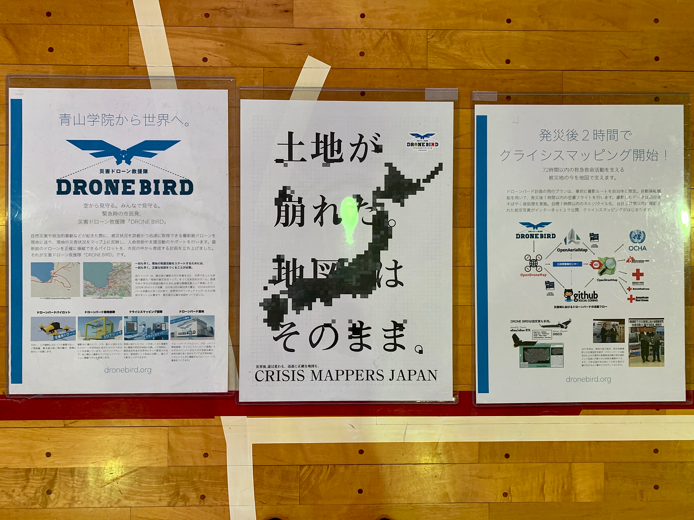
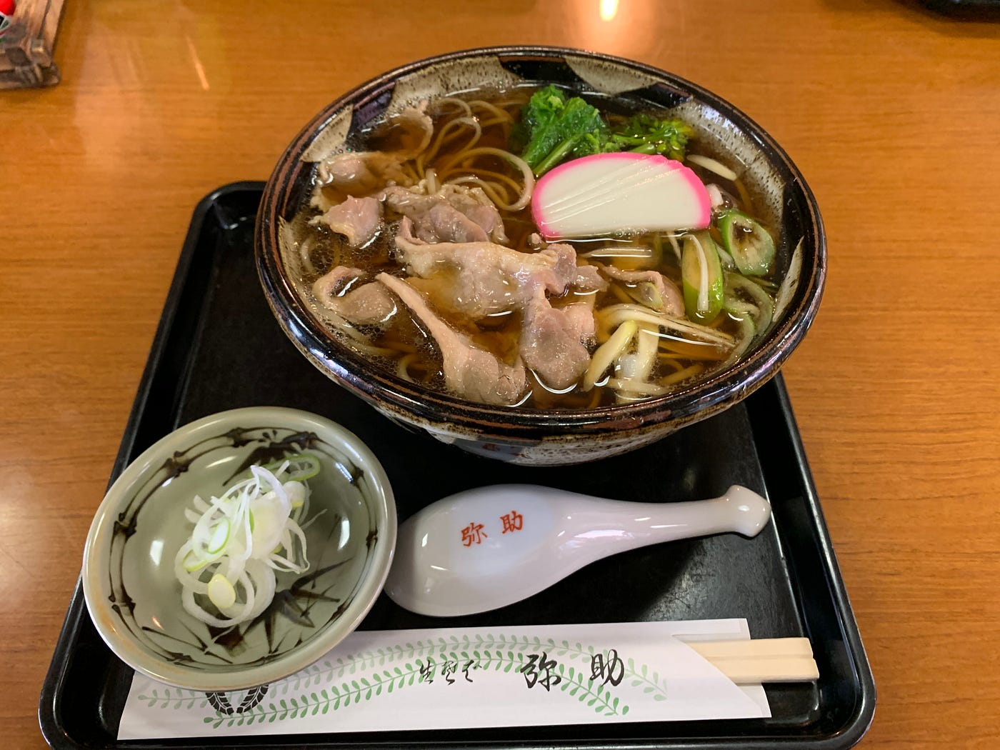

### 12/02 防災訓練＠狛江市

こんにちは安保龍一です。

今回は狛江市の狛江市第三小学校で行われた防災訓練に参加してきました。今年は台風などでことごとく防災訓練が中止になっていたので、今回の訓練が久しぶりの開催となりました。

平成31年12月1日に[狛江市立第三小学校](https://goo.gl/maps/DPRDhrAGwyejT7Wv7)にて開催された狛江市防災訓練にドローン操作のアシスタントとして参加してきました。

今までドローン操作の経験がない中で誰かに物事を教えるという少しカオスな状況になりましたが、ドローン操作の潜在能力を発揮して参加した地域の方々に少しでも防災に対しての関心や知識をもってもらえたと思っています。

**今回使用したドローン紹介**

> ・Dji Tello

> 初心者の僕が即使えるようになったくらい操縦が簡単なドローン。

> 課題としては、飛行時間が１０分前後ということがあり今回のような体験型のイベントでは多くの方が参加するため充電が追いつかない。また、携帯電話を用いた操縦では離陸後に大きな問題がなかったが、Bluetoothでコントローラーに接続し離陸させると機体が勝手に左に動いて行くという現象がおっこた。離陸後に機体を一度操すると同じような現象は起きないこともわかっています。何が原因なのだろうか、、、？

> （今回は離陸後に自分自身で機体操縦を行い対応しました）

> 携帯電話の操作に慣れない年配の方々が離着陸に戸惑っていた印象も受けた。待ち時間に簡単な操作方法を載せたプリントなどを配布するとスムーズに操作体験に入れるし、より楽しめると思う。子供が操作するときはより注意を払って、操作をある程度制限することも必要かと。

[Tello - Drone & Accessories - DJI Store
Introducing Tello, a mini drone that makes flying fun and easy. Browse through a wide selection of accessories, read…store.dji.com](https://store.dji.com/jp/shop/tello-series)

朝早くからの防災訓練でしたが189名の地域住人に参加していただきました。自然災害がつきものである日本において、防災に関する知識や関心を持つということは欠かせないことであると思います。今回の訓練にも多くのお子さんが参加していたので、より多くの子どもたちにも参加してもらえたら嬉しいです。実際に参加してみて参加者から様々なことを質問されるので、ドローンに関する知識をよりつける必要があると実感しました。

### **最後に、**

防災訓練後には非常食として災害時に大活躍する[アルファ化米](https://ja.wikipedia.org/wiki/アルファ化米#非常食や保存食として)をいただきました。味の方は、、、想像のはるか上をいく美味しさでした！！

そのまま小学校前の[弥助そば](https://tabelog.com/tokyo/A1326/A132603/13068966/)さんによってお蕎麦をいただいてきました。狛江市第三小学校の近くを訪れた際は是非！！

**『Strava記録』**

<iframe height=’405' width=’590' frameborder=’0' allowtransparency=’true’ scrolling=’no’ src=’[https://www.strava.com/activities/2902745341/embed/b0824ec3da4517bd74af98e53f9d62482c3c65e3'](https://www.strava.com/activities/2902745341/embed/b0824ec3da4517bd74af98e53f9d62482c3c65e3')></iframe>
