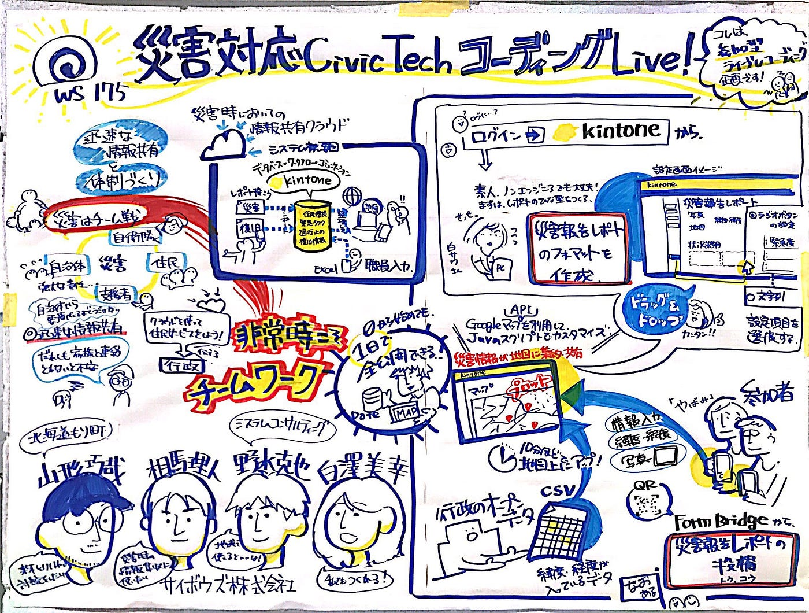
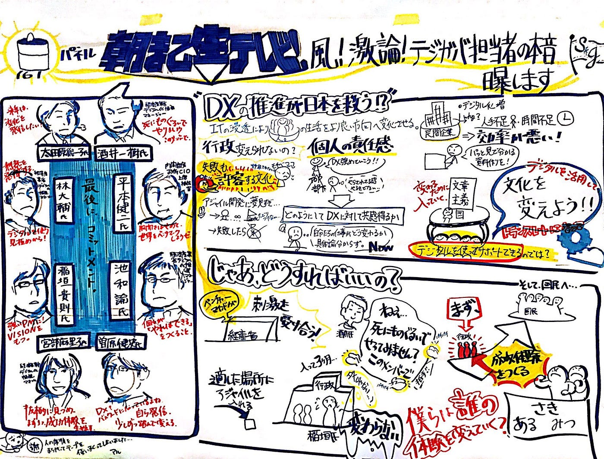

### アドベントカレンダー12/2

古橋研究室4年の末光香織です。

今回は複数人でやるグラレコのついてお話ししていきます。

私がグラレコを始めた時一人で描くことが多かったので2人で描く・3人で描くとなった時は驚きました。2人で描くとか難しそうじゃない？とも思いましたが、実はそんなことなかったのです。

何事にもメリットデメリットはつきもの。。

複数人でやるグラレコのメリットデメリットを紹介しようと思います。

#### メリット

一人でやるときと異なるのは…

#### 情報量の多さと正確さ

#### デザイン性の高さ

#### スピード

などが挙げられます。

> 情報量の多さと正確さ

基本的に複数人でグラレコをする時はメインとサブに別れて作業します。

メインはグラレコを描き上げていく人・サブは基本的にスピーカーの話す情報を付箋に書いてメインの横に貼っていきます。

情報を聴く専門がいるような感じなのでメインが描きながら聞き逃してしまった情報を捕捉したり、聞き間違えてしまった情報を修正することができます。

> デザイン性の高さ

メインが一通り描き終わったところをよりわかりやすくするために色やイラストを付け足すことができます。

最初に話したことが最後に話していたことと実は繋がっていた！なんてことありませんか？

この関係性が一目でわかるように色付けしていくことでより精度の高いグラレコにすることができるのです。

> スピード

二人で情報の取捨選択・装飾などができるのでトークの時間内にグラレコを完成させることができます。いくつものトークセッションがあるカンファレンスイベントなどでグラレコを行うことが多いので時間内に終わらせることはとても重要なのです。

#### デメリット

反対に複数人で行うとこのような問題も…。

#### イラストの統一性にばらつきが見える

#### サブに頼りすぎとグラレコじゃなくなる

なんてことがあります。

> イラストの統一性にばらつきが見える

それぞれイラストの個性があるのは当たり前のことですが、使用するカラーペンの色やイラストについて事前に話し合っておくことでばらつきを防ぎ、統一感を出すことができます。

> サブに頼りすぎるとグラレコじゃなくなる

サブによる付箋ばかりを見て描いていると自分で話を聞かなくなります。またグラレコ最大の特徴でもあるその場の空気の表現もできなくなってしまいます。サブがいるのはとてもありがたいことですが、基本は自分自身で聞き取り描くことが大事なのです。

このような感じで複数人グラレコのメリットデメリットを挙げてみました。最近は二、三人でグラレコをすることが多いのですがそこで思うのは、事前の打ち合わせが大事だということです。

レイアウトや似顔絵など事前に準備できることはやっておきましょう！
