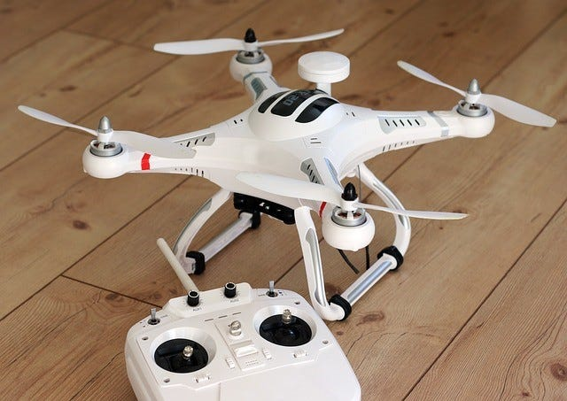
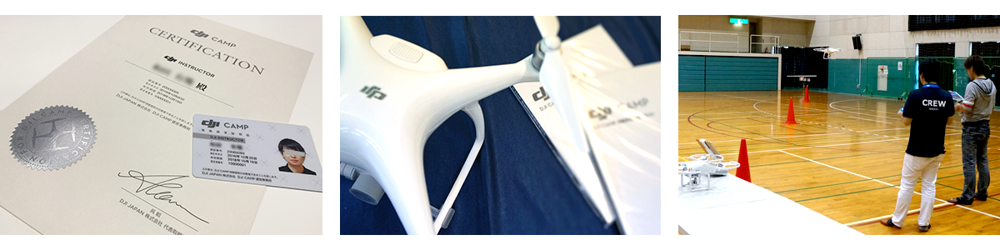
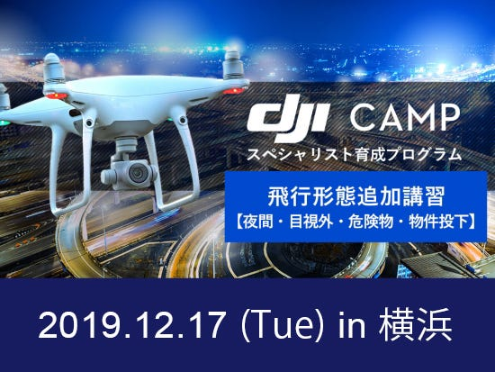

### ドローン部週報 ５週目

こんにちは、古橋ゼミ3年の森です。

ドローン部週報として、自分でトピックを決めて週報を書くことになったので、今日はドローン認定資格が取れる「DJI CAMP」について説明します。

①はじめに ～DJI CAMP って？？～

DJI CAMPとは、DJIのドローンをより正しく、安全に使いこなせるようになるために、DJI JAPAN株式会社が企業向けに独自に開催しているドローン操縦士養成プログラムです。

ドローンに関わる正しい知識やドローンの確かな操縦技術、安全に対する高い意識などを習得し、評価します。

そして筆記試験や実技試験、レポート作成などをクリアすると、「DJIスペシャリスト」としての認定証を発行してもらえます。

②実際に取得するには？？

DJI CAMPを受講するには、法人または個人事業主であることやドローンの飛行操縦経験が10時間以上あること、などの条件があるそうです。

このキャンプを開催しているのは「DJI CAMPインストラクター企業」だそうで、まずは各インストラクター企業に直接申し込みます。

申し込んだ日程で所定のカリキュラムを受講し、試験に合格すると、DJIスペシャリスト認定証の発行が申請できるようになります。

③資格を取得するメリットは？？

DJI CAMPを修了してDJIスペシャリストになれれば、自分のドローンに対する知識や技術を証明でき、企業の信頼性にもつながります。

それだけではなくDJIスペシャリストに認定されると、地方航空局長や空港事務所長宛に、航空法に基づく飛行許可申請を提出する際、有利になると言われています。そのほか、DJIユーザー向けのドローン保険（DJI賠償責任保険）が、約10%割引されるといったメリットもあります。

結論として、自分は今日までドローンに関連するキャンプがあるという自体知らなかったので、概要やメリットや試験について知ることが出来、新たな知識を得ることが出来ました。引き続き自身の技術の向上に努めていきたいと思います！
