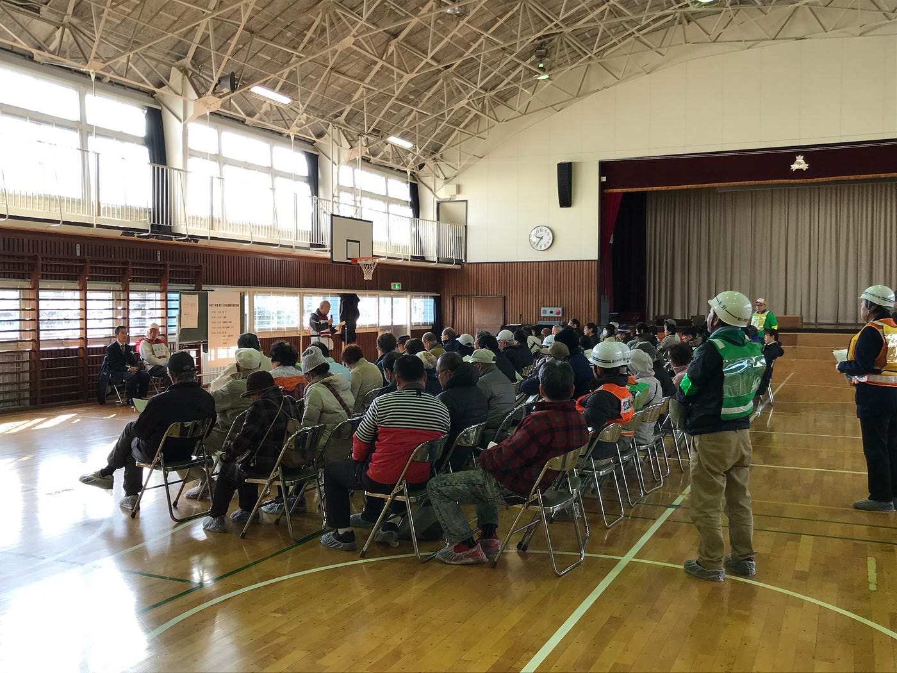
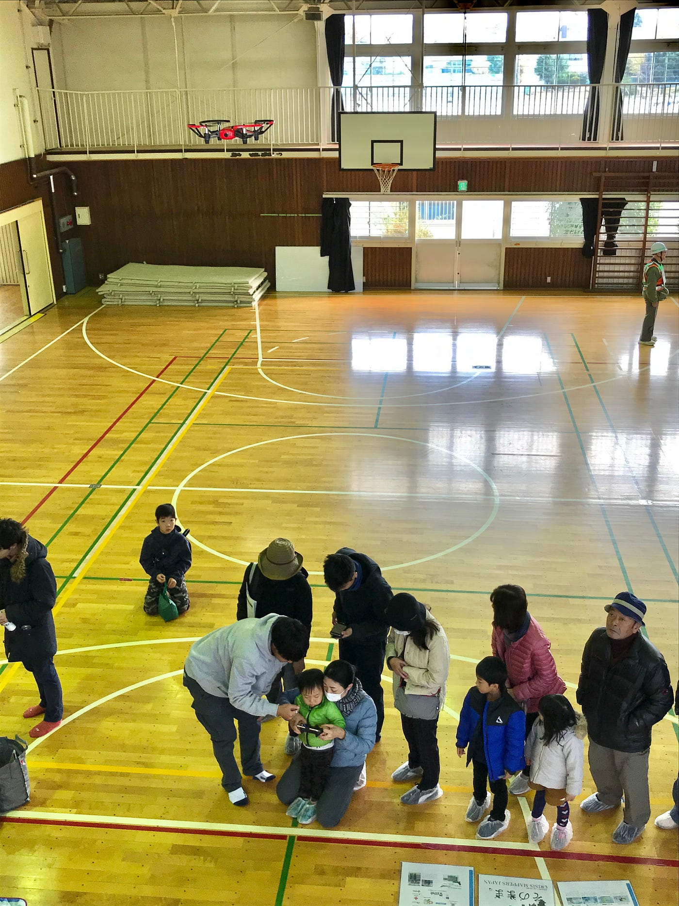
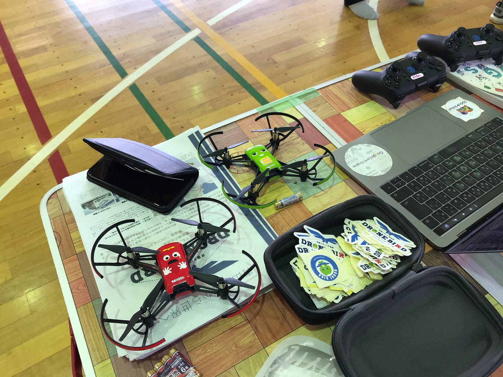

### 狛江市総合防災訓練

こんにちは

青山学院地球社会共生学部古橋ゼミ3年の浜田皐太です。

12月１日(日)に狛江市にて行われた総合防災訓練に運営側として参加しましたので報告いたします。

### イベント詳細

> 平成 31 年度狛江市総合防災訓練
 
 (1) 日 時 令和元年 12 月1日(日)
 午前9時 00 分から午前 11 時 00 分まで(荒天中止) 
 
 (2) 場 所 狛[江第三小学校(](http://www.komae.ed.jp/ele/03/)狛江市猪方1丁目11番1号

朝早い集合なのであまり人が来ないだろうなと思っていたもののかなり多くの人たちが参加していました。係りの人から軽く説明があったあとすぐに体験時間がスタートしたので我々古橋研究室はドローン体験を実施しました。ありがたいことにかなりの方がドローン操縦体験に並んでくれました。

お恥ずかしながらこの総合防災訓練までドローンを操縦したことがありませんでした。しかしながら今回のイベントでは教える側にまわるのでイベント前に必死で操縦の仕方をドローン部から教わりなんとか防災訓練参加者に教えることができました。

このイベントでは小さい子も参加していて印象的だったのは、３歳くらいの子ですらサポートはありつつ、一人でにドローンを操縦することができたことです。

小さい子にドローンの操縦を体験してもらったことは古橋研究室として今回のイベントで一番大きな成果だったと感じました。

たくさんの人にドローンを知ってもらったことでいざ災害が起こった際に古橋研究室がドローンを飛ばすことも協力的になってくれるのかと思うと価値あるイベントにすることができました。

### 今回市民の方に体験してもらったドローン

_**DJI Tello：_**[https://store.dji.com/jp/product/tello?vid=38421](https://store.dji.com/jp/product/tello?vid=38421)

### まとめ

> 予想以上の方に参加してもらったのでドローンのバッテリーが持たなかったのがしょうがない部分でもあり課題点でもありました。もう少し一人の体験時間を少なくするしかなかったのかなと思いました。

> あとは冬の体育館ということもあって上履き、カイロ本当に大事ww

[昼のウォーキング - 皐太 浜田's 0.2 mi walk
皐太 浜. completed 0.2 mi on Dec 1, 2019.www.strava.com](https://www.strava.com/activities/2902938074)
