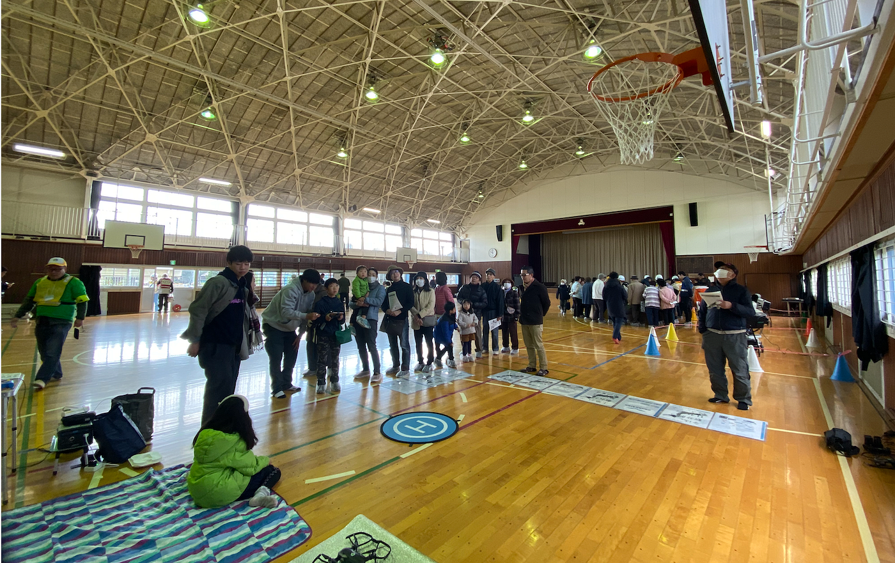
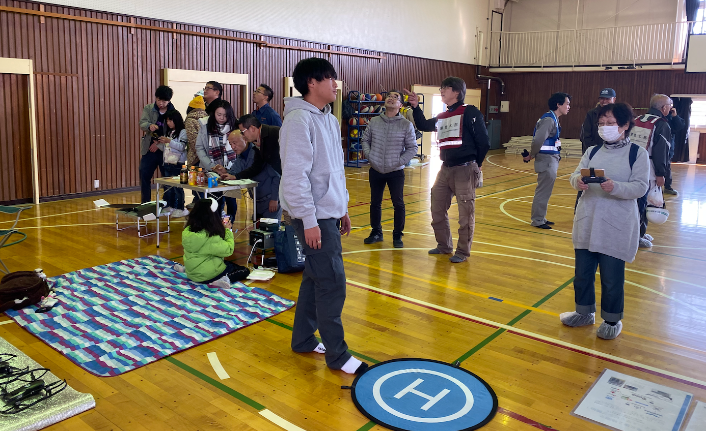
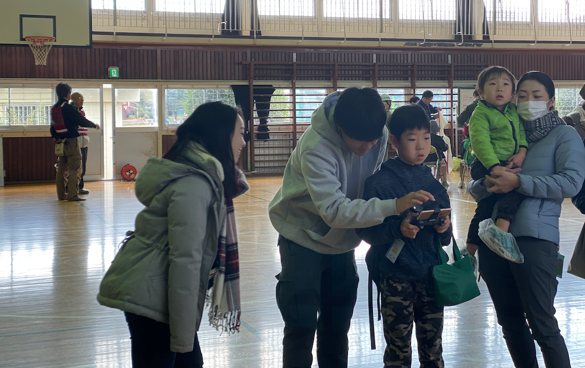

### 狛江市防災訓練 参加レポート

こんにちは！古橋研究室3年生の大庭啓太です。

今回は、12月1日（土）に開催された狛江市の防災訓練に参加したので、その様子とそこからの学びを書いていきます。

まず、今回参加した防災訓練は「[平成 31 年度狛江市総合防災訓練](https://www.city.komae.tokyo.jp/index.cfm/47,102509,571,3375,html)」。

この訓練に、[NPO 法人クライシスマッパーズ・ジャパン](http://crisismappers.jp/)が狛江第三小学校における展示・体験コーナーへ協力をしたので、そのお手伝いという形で自分も参加しました。

具体的には[災害ドローン救援隊「DRONE BIRD」](http://dronebird.org/)の活動を市民の皆さんに知ってもらい、触れてもらうために、資料の展示とドローンの体験会を行いました。

### イベントの概要

> 日 時

> 令和元年 12 月１日(日) 午前９時 00 分から午前 11 時 00 分まで（荒天中止）

> 場 所

> 狛江第三小学校（狛江市猪方 1 丁目 11 番 1 号）

早朝9時からのイベントということで、古橋研究室のメンバーは30分前の8時半に小学校に集合。

防災訓練自体は、9時からですが、私たちDRONE BIRDの体験会は、10時すぎからということで、30分ほどで準備を済ませ、

古橋研究室メンバーはドローンの練習や動作確認を行いました。

### 今回使用したドローンは以下の２つ

> **DJI Tello**

> 市民の方に飛行体験をしてもらう際に用いたドローンはこのTELLOです。今回は、小学生や年配の方が多く体験しにきてくれたので、教えやすくぴったしだと感じました。

[https://store.dji.com/jp/product/tello?vid=38421](https://store.dji.com/jp/product/tello?vid=38421)

> **DJI Mavic Air**

> Mavic Airは主に、古橋研究室メンバーの練習用に使用。個人的に3回ほど練習が出来たので、とても良い機会になりました。

[DJI Mavic Air - Foldable 4K Drone - DJI
As the most portable DJI drone to house a 3-axis gimbal, the Mavic Air is capable of shooting 8K Sphere panoramas, HDR…www.dji.com](https://www.dji.com/jp/mavic-air?site=brandsite&from=nav)

### DRONE BIRDの体験ブース

今回は、DRONE BIRDの体験ブースの概要と運営について記録を残しておこうと思います。

これから防災訓練や防災フェスタに参加する研究室メンバーは是非参考にしてみてください。

> **レイアウト**

面積はだいたい、バスケットコートの半分ほどでしたので、最初はTELLO一台体制で体験ブースを設置しました。

しかし、開始早々に、長蛇の列！！

今回は、時間にも制限があったので、全員に体験してもらうことが難しい…

そこで、中央のカーペットを挟んで奥側にTELLOもう一台を追加して体験ブースを早急に設営！！

**→なんとか全員に体験していただくことが出来ました**

> **体験会の運営方法**

今回は、研究室メンバー6人いて、余裕があったので、体験者一人に対して２学生体制（残りの二人は待っている方への対応）で進めました。

基本的に１列に並んでもらい、様子を見ながら２つの体験コーナーに振り分けていく形で運営しました。

結果、参加者の方々の待ち時間も短くなり、良い形だったのではないかなと思います。

### **まとめ**

今回は、初めての防災訓練参加ということで、どんな感じなのかと想像出来ませんでしたが、無事に終了することが出来ました。

次回に向けて活かせそうな点が上記以外にもあったので、まとめて終わりにしたいと思います。

> ・上履き持参は正解だった（寒くない）

> ・先生以外にDRONE BIRDの活動やドローンの詳細なスペックを市民の方々に説明できる学生が数名いるとGOOD

> ・ガチャムクドローンのバッテリーをあえて違うものを入れると体験者にドローンの向きを説明しやすい（例：ガチャピンのドローンにはにはムックのバッテリー）

> ・ガチャムクのステッカーは子供達に大人気

これからも機会があれば、避難訓練に参加できればしていきたいと思います。

ありがとうございました！

[https://strava.app.link/rogHHtEi51](https://strava.app.link/rogHHtEi51)
