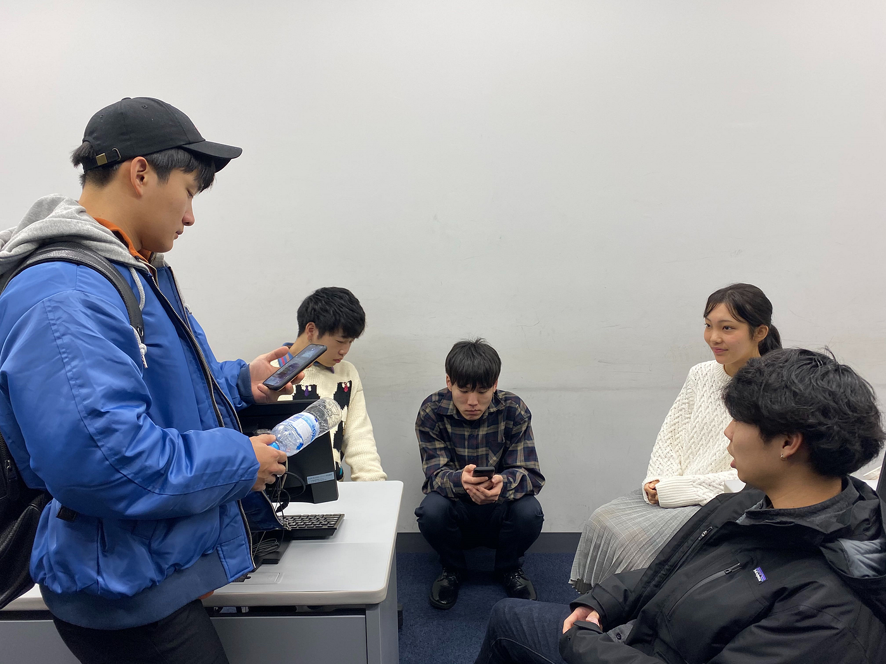
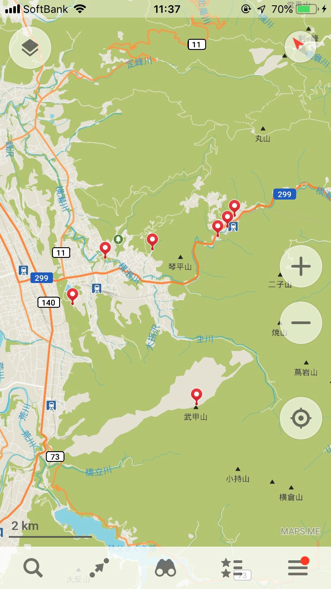

### 横瀬部第6回目週報

こんにちは！古橋ゼミ3年の佐藤遼です。

今回は第6回目のミーティング内容を報告します。

### **今回決まったこと**

先週皆から横瀬での撮影場所候補を集めたので、これら全てを回ることにしました！

**決まった場所**

・_刈米マスつり場_

_・あしがくぼキャンプ場_

_・ウォーターパークシラヤマ_

_・羊山公園_

_・武甲山_

_・道の駅果樹公園あしがくぼ_

_・あしがくぼ笑楽校_

これら全てを回るには事前にどこから回るかなどを決めないといけないため、自分なりにまとめてみました！

回る順番としては、武甲山→羊山公園→ウォーターパークシラヤマ→刈米マスつり場→あしがくぼキャンプ場→道の駅果樹公園あしがくぼ→あしがくぼ笑楽校、の順番が良いのではないかと思います。

もしかしたら回る場所が増えるかもしれないので、その都度対応していく必要があると感じました！

### **最後に**

プロモーションビデオの撮影まで2週間を切りました！現地ではどんなハプニングがあるかわからないので入念な準備を行って、スムーズな撮影を心がけていきたいです！
