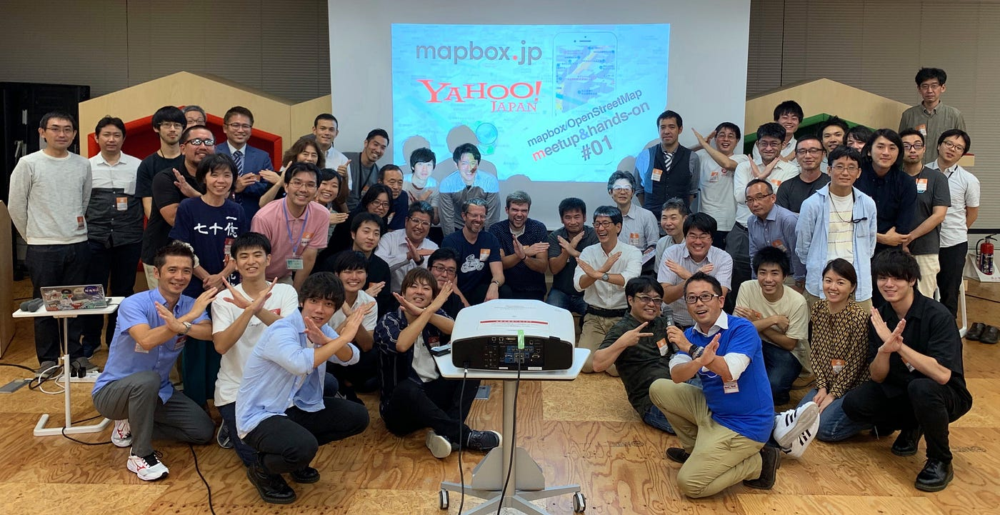
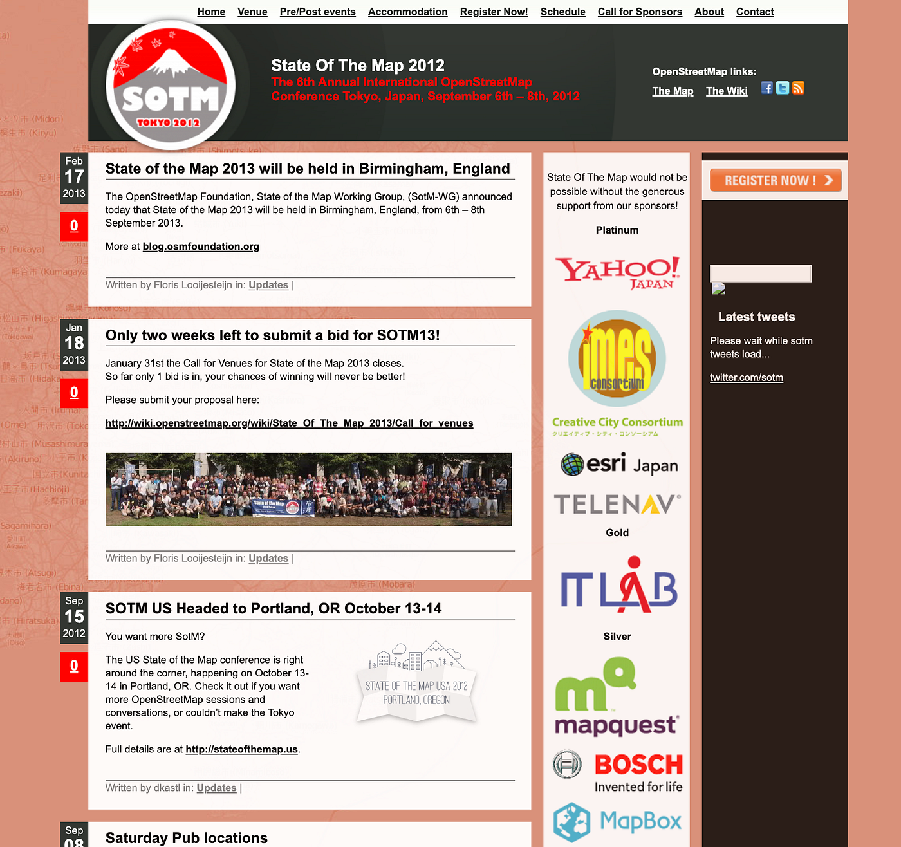
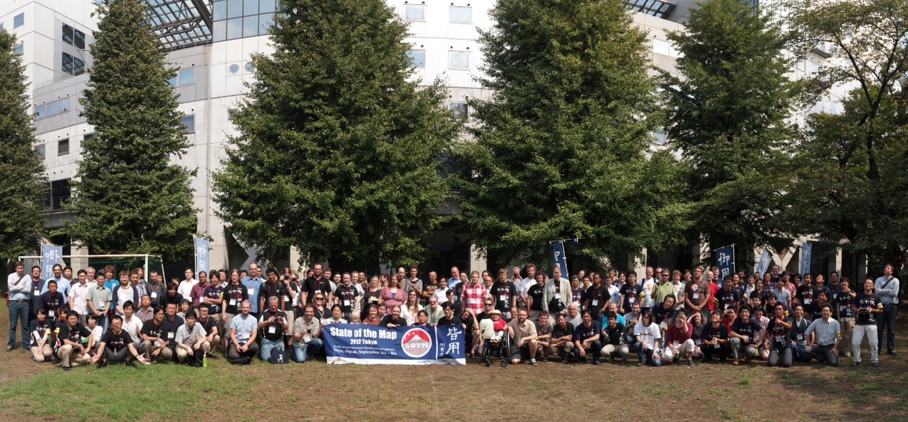
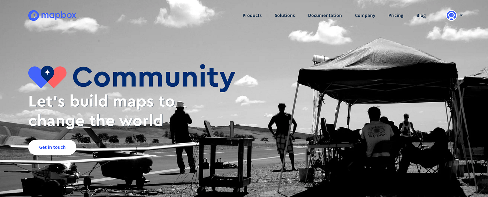
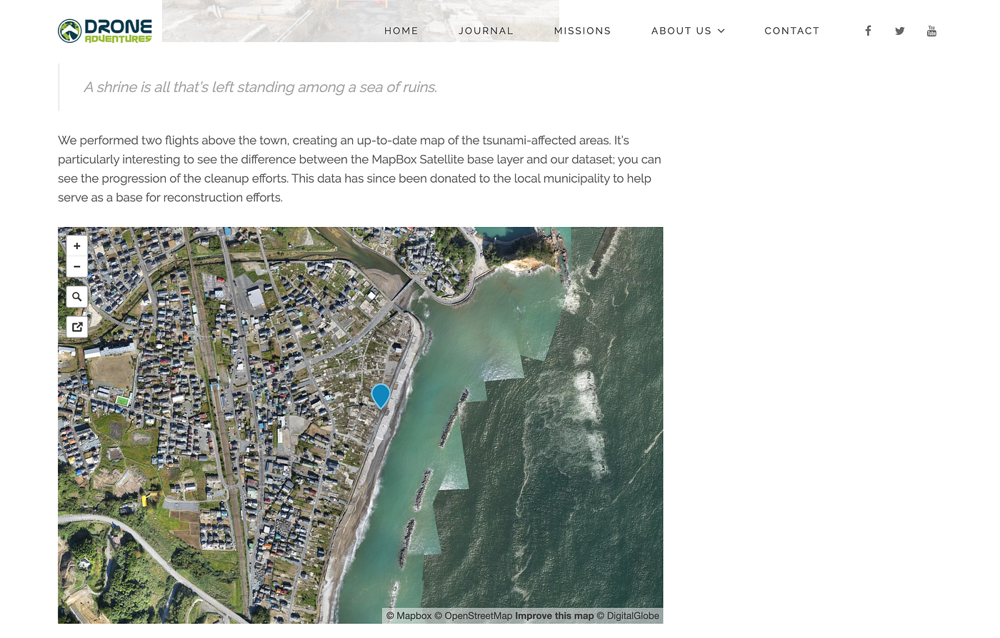
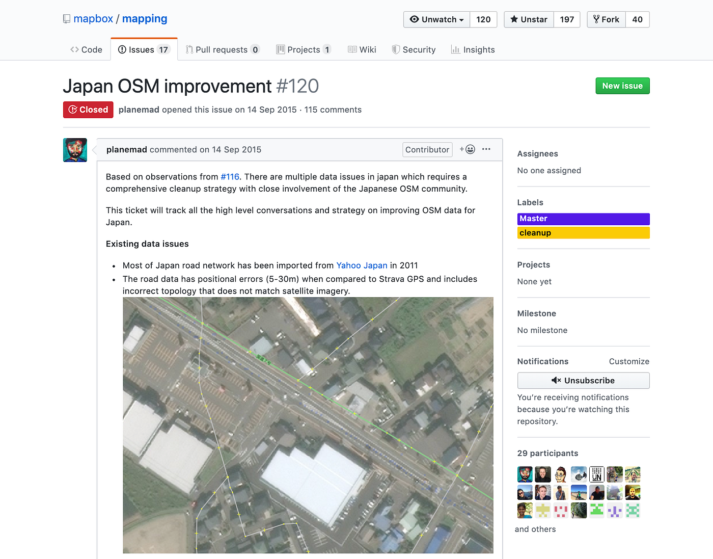
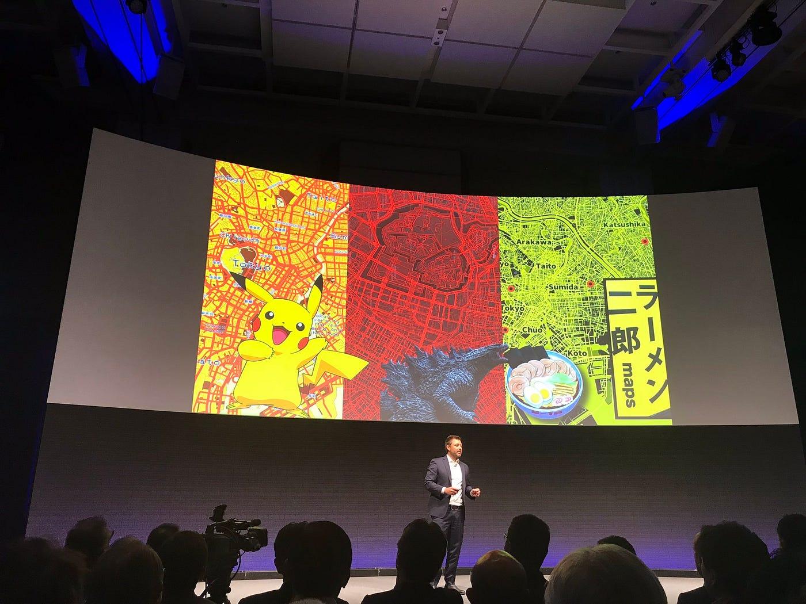
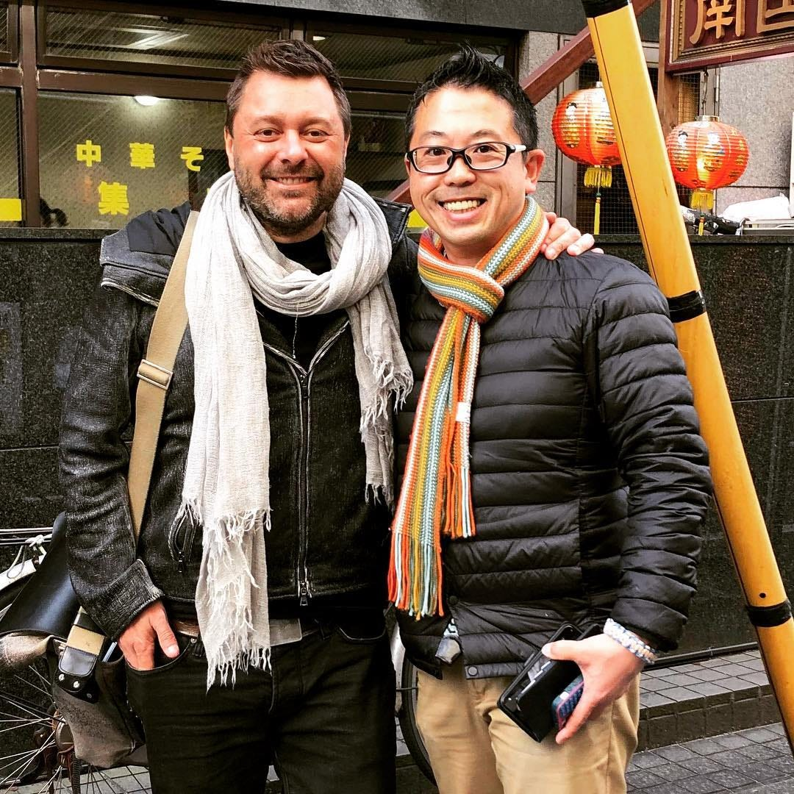
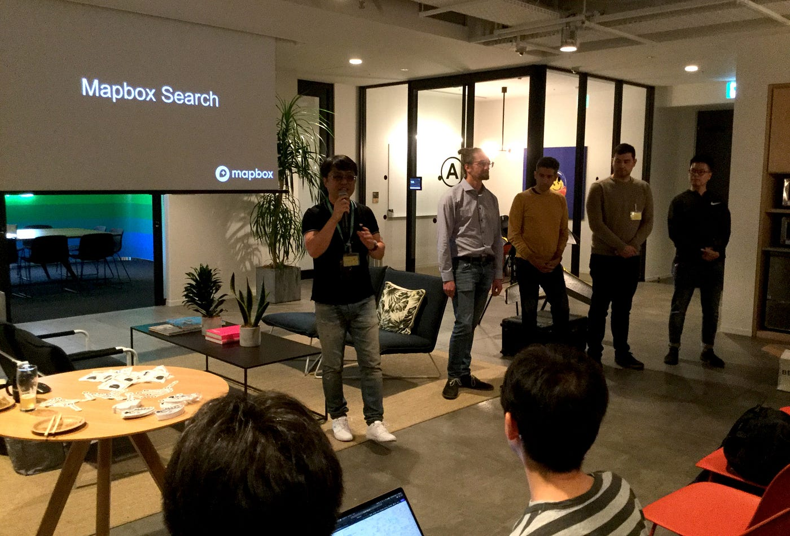

### なぜ古橋研究室が mapbox meetup を主催するのか？

### 2019年、mapbox が日本にやってきた。

ウェブ地図サービスmapboxをご存知の方がどのくらいいるだろうか。GoogleマップやAppleマップ、Yahoo!地図、マピオンなどの地図サービスを知っている人は多いかもしれないが、正直2019年現在 mapbox の名前を知っている人はよほどの地図マニアか業界関係者ではないかと思う。そして何より、Volunteered Geographic Information(VGI)の代表格であるOpenStreetMap の地図データを使いやすい地図APIやSDKに仕上げ、ウェブ地図からスマホのアプリまで多くのカスタマイズされた地図サービスを商用サービスとして提供するmapboxは、Google Maps API 一色だった業界を大きく塗り替え始めている。

この mapbox が日本を、そして世界を大きく変えていくと古橋研究室は考えている。ともすると、大学の研究室が単なるイチ企業に肩入れするとはけしからんという意見が出てくるかもしれないが、我々は mapbox だけでなく、Googleとも、AppleともFacebookとも、空間情報に関わる企業とはフラットに付き合い、技術的に、そしてこれからの空間情報社会の発展に寄与できるのであれば、できる限りの協力は惜しまない。

### その付き合いは2012年から…

mapbox 各種サービスのベースになっているのが OpenStreetMap の地図データ。前述の通りこれらの地図は世界中のボランティアがWikipediaのようにクラウドソーシング手法を用いて自由な世界地図を作ってきた。商用利用可能なライセンスだからこそmapbox社だけではなく、多くの企業が OpenStreetMap を自社サービスで活用している。このOSMの年次国際会議 [State of the Map(通称SotM)](https://stateofthemap.org/) 史上、初めてのアジア・オセアニア地域での開催は 2012年の [SotM Tokyo](https://2012.stateofthemap.org/) である。そして、mapbox社がこのSotMに大々的にスポンサリング参加したのも SotM Tokyo である。

筆者(古橋)はこのときの大会実行委員長を努め、mapbox チームとの密な交流が始まった。

### mapbox による各地の State of the Map 支援

その後、State of the Map は地域ごと、国ごとに様々な形に広がり、その多くは mapbox をはじめ多くの企業とコミュニティに支えられて OpenStreetMap の活動は世界中へと広がった。[mapbox のコミュニティ支援は SotM に限らず、様々な人道支援活動やクライシスマッピングにも広がり](https://www.mapbox.com/community/)、OpenStreetMap のフリーライダー企業も多い中で、まさに mapbox は二人三脚をするかのようにOSMコミュニティに寄り添ってきた歴史がある。ここではそんな昔話を少ししてみよう。

### 東日本大震災後の福島をドローンで空撮

2013年、mapbox の Alex から連絡があった。東日本大震災後の福島をドローンの目線で記録するために DroneAdventures の Adam(当時 senseFly所属) が日本に行くので、現地のコーディネートを頼みたいと。既に我々が senseFly の固定翼ドローン eBee を国内で運用しており、 Adam と合流して福島県飯舘村やいわき市久之浜、富岡町など人々がほとんどいなくなった地域の状況を撮影した。まだ日本の航空法改正前の頃だ。mapbox は撮影データの公開プラットフォームとして DroneAdventures の活動も支援しており、このとき撮影したドローン空撮オルソモザイク画像は現在も mapbox から公開されている。

**Fukushima, a drone’s-eye view
**[http://droneadventures.org/fukushima-a-drones-eye-view/](http://droneadventures.org/fukushima-a-drones-eye-view/)

### 青山学院大学 x mapbox で大規模に実施した日本のOSM道路位置修正プロジェクト

古橋が東京大学空間情報科学研究センターから青山学院大学に所属を移した2015年は、mapbox チームと我々青学チームがタッグを組み、日本のOSM道路データを正確な位置に修正しよう！と大規模な地図データ改修作業を行った。

当時の日本の OpenStreetMap 道路データの殆どは Yahoo!JAPAN が過去に買収し保有していた旧ALPS道路データ(1/2.5万)が 2011年にOSMに寄付され、3年ほどかけて日本全国をOSM Japanコミュニティがインポートしたものだった。1/2.5万縮尺のデータは国土地理院であれば17.5mの誤差までが認められており、大縮尺な地図として用いる場合には位置のズレが散見される。また、ベースの地図作成年が2010年と、5年前の地図データということで古くなってきている状況を mapbox チームは的確に指摘してきた。そこで、我々は合同チームを結成し、当時オープンデータとして利用可能で位置精度が高い国土地理院オルソ画像とStravaのGPS軌跡データを用いて、日本全国の道路データ位置正確性の向上と、交差点の正確なトポロジ構造を修正する「[Japan OSM improvement プロジェクト](https://github.com/mapbox/mapping/issues/120)」を実施した。国土地理院のオルソ空中写真データが提供されているエリアを地域別に分割し Tasking Manager のプロジェクトを立て、北から南へ一斉に確認・修正作業を行うもので、6ヶ月をかけて日本全国の道路データ品質を向上させた。

**Japan OSM improvement #120**
[https://github.com/mapbox/mapping/issues/120](https://github.com/mapbox/mapping/issues/120)

大きな成果として、地図データ品質が向上しただけではなく、GitHub を用いたプロジェクト運営方法と情報共有のやり方を学べたことは、その後の研究室の GitHub 活用の土台を作った。

### mapbox が教えてくれた GitHub レポジトリ “mapping” の活用法

GitHub が便利なことはもちろん知っていた。ただ、あくまでエンジニアの視点による Git の考え方や、GitHub が発明した Pull Request という仕組みに目がいっていた。そこに mapbox チームから GitHub の Issue ツールの便利さを叩き込まれたことで、これは非エンジニアの視点でも通用するプロジェクト管理ツールとしての GitHub 活用法が目の前に広がった。

特に mapbox の公開GitHubリポジトリ “[mapping](https://github.com/mapbox/mapping/)” は、その殆どが Issues に集約されており、先の日本OSM道路位置修正プロジェクトしかり、その他多くの mapbox が作業しているマッピング活動の詳細を確認することができる。

[https://github.com/mapbox/mapping/](https://github.com/mapbox/mapping/issues/120)

我々も、この mapping レポジトリを真似て[古橋研究室 mapping レポジトリ](https://github.com/furuhashilab/mapping)を運用しているし、[CrisisMappers Japan も同様の mapping レポジトリ](https://github.com/crisismappersjapan/mapping)に作業を集約し始めている。このようなGitHubの活用方法を整理すると、具体的には次の点で GitHub はオープンなジオコミュニティとの相性が良い。ぜひ参考にしてほしい。

- **継承性の高いプラットフォーム： **GAFA含め大手IT企業はほぼすべて GitHub でツールやデータの公開をする文化が定着している。オーナーである Microsoft社も GitHub の独立性を保証している。とりあえず GitHub に置いておけば、情報が失われる可能性は低い。

- **公開前提で使えば無料： **非公開リポジトリを大人数で管理運営したい場合は有料アカウントが必要だが、公開前提で利用する上ではほぼ無料(LFSなどのサービスを除く)。

- **Issue x Project でタスク管理： **誰が何をいつまでにやるのか、Trelloのようなカード管理も可能な Project 機能とそれぞれのタスクを Issue 化することで、一括したプロジェクトタスク管理ができる。個人的に気に入っているのが Automated Kanban 方式。

- **Markdown でコピペ楽々： **ドキュメンテーションが Markdown ベースなので、GitHub 上で文書作成をして、完成したものを OSM Diary や HOT Tasking Manager など関連ツールへの投稿として貼り付ける事が容易となり、文章の再利用が非常に効率的。

- **Gistという仮置場： **作業途中で発生した一時データをリポジトリに依存せず、パッとオンラインに置くことができる Gist は、たたき台や、小規模データの受け渡しに非常に便利。特に GeoJSON や STL、PDF、CSVファイルなどいくつかのファイル形式はそのままプレビューをレンダリングしてくれ、いちいち専用ツールを立ち上げる必要すらない快適さ。

- **ユーザープロファイルがポートフォリオ： **GitHub上での活動量は様々な形で可視化され、各個人のポートフォリオ兼ダッシュボードとして機能している。特に Contributions メッシュはその活動量は端的に表現されるので、一目瞭然だ。

このような GitHub 活用方法を古橋研究室では取り入れているが、そのヒントは mapbox とのやりとりから多くを学んだ。本当に感謝しているし、このノウハウは後述するハンズオンを介して積極的に広げていきたいと考えている。

### 正のフィードバックをどうやって作るか

このような形で、古橋研究室と mapbox とは様々な形でコラボし、我々も多くのノウハウと知識を得ることができた。以降も SotM Asia の立ち上げや Mapbox Studio を活用した空間情報デザインの授業など、コラボから次のコラボが生まれ、我々の成果がまた mapbox のソフトバンクワールドでの基調講演などで使われたりと相互のフィードバックがプラスに働く正のフィードバックを生むことになる。このブログもそういった意味で、一つのフィードバックでもあり、今後もノウハウは積極的に mapbox のみならずその周辺コミュニティに還元し、フィードバックしていくつもりである。

### Eric との約束から生まれた mapbox japan meetup と hands-on

2017年秋に発表されたソフトバンクVISION FUNDの mapbox に対する融資は驚きだった。VISION SDK も含めて、mapbox は積極的に単なるOSMデータを用いた地図API企業から、自動運転やロボティクスの未来を見据えた地図プラットフォーマーとしての存在に変わってきたのだと理解している。その後の 2018年のソフトバンクワールドカンファレンスで来日した mapbox CEO の Eric とディスカッションした時に Eric から言われた質問が、

> 『mapbox が日本のOSMコミュニティを支援するのに何が必要だ？』

だった。いくつかの選択肢が頭の中を駆け回ったが、こう答えた。

> 「リアルコミュニケーションがとれる ”場” を作りたい。例えば同じ VISION FUND の WeWork などを活用して。」

Eric も快諾してくれて、その後も何度かやり取りしながら、mapbox meetup と hands-on の形が徐々にできあがってきた。タイミングが揃ったのはそれから１年後の mapbox japan オフィスがいよいよスタートするという2019年の秋。10月に収容人数の多いソフトバンクグループの Yahoo! LODGE を借りてキックオフイベントを実施し、11月からは WeWork に拠点を移動して毎月コンスタントに meetup と、集中して mapbox の各種サービスに触れる hands-on を我々古橋研究室と災害ドローン救援隊DRONEBIRDを中心としたNPO法人CrisisMappers Japan, OSM Foundation Japan、OSGeo Japan などと連携してようやく形になってきたところである。

おかげさまで毎回 Meetup 公募開始数時間でチケットが完売になるなど、反響の多さに驚いているところだが、初回は Mapbox Studio を実際に操作してみるミニハンズオンや、日本での活動方針などの紹介、そして参加者と一緒になった Lightning Talk をセットに、今後も幅広い分野の方々と意見交換とmapboxやOpenStreetMapの活用事例を共有しあえる ”場” を作っていきたいと考えている。例えば 11月の meetup では、空撮用ドローンの自動飛行や撮影データ処理で mapbox がどのように使われているか、実機も含めた紹介がされたり、mapbox 側からは新しい日本の住所検索(ジオコーディング)βテストなど、活発な意見交換が行われた。

Meetupの課題としては、意見交換の内容に技術的な要素も多いため、ウェブ地図に関する基礎知識も含めて、meetup 前には、じっくり手を動かしながら、例えば Mapbox Studio やウェブ地図技術の基礎となっているタイルデータの扱い方など、有償の hands-on 講習会も行っている。現在は要望に合わせて、内容を少しずつ変えながら、meetup と hands-on の両方をより充実していく予定である。

今後もすばらしいゲストと mapbox と OpenStreetMap のコミュニティをつなぎながら、次世代のウェブ地図を紡いでいく “場” としての mapbox/OpenStreetMap meetup & hands-on を盛り上げ、この場から新たな地図の可能性を切り開いていきたいと考えている。

是非多くの方のご参加お待ちしてます！（とくに Lightning Talk ）

**mapbox/OpenStreetMap meetup コミュニティページ**
[https://www.facebook.com/groups/mapboxjpmeetup/](https://www.facebook.com/groups/mapboxjpmeetup/)

**mapbox/OpenStreetMap meetup&hands-on #01 レポート**[https://internet.watch.impress.co.jp/docs/column/chizu3/1214237.html](https://internet.watch.impress.co.jp/docs/column/chizu3/1214237.html)

**mapbox/OpenStreetMap meetup #02 レポート
**[https://geo-news.jp/archives/928](https://geo-news.jp/archives/928?fbclid=IwAR2rIq5nJvgz1H5SGqqhDi3SFO2EMTfneN9oTihI4foslpXDl4dxdjR74bc)
