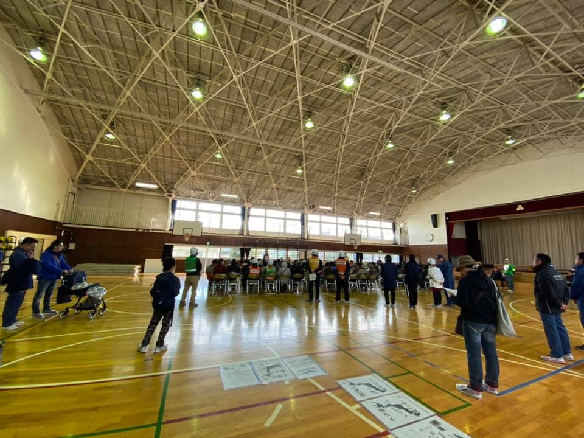
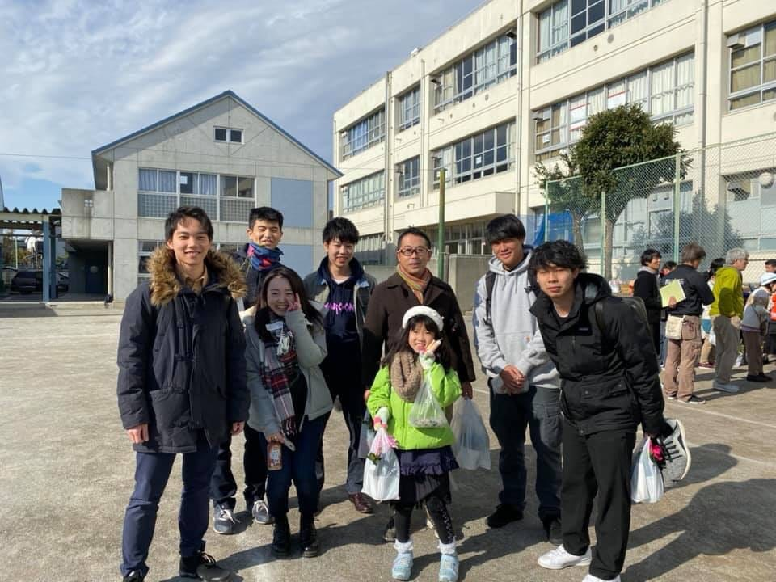

### 狛江市総合防災訓練

こんにちは。3年の古屋百々葉です！12月1日に、狛江市総合防災訓練が開催されました。

会場の様子はこんな感じでした！

今回の防災訓練は地元の小学校でやりました！

9時〜10時まで町内の方からの挨拶や避難所についてのお話がありました。朝も早いせいか年配の方が多いイメージでしたが、ご家族で来ている方もいらっしゃいました。私たちが行ったドローンの体験コーナーはご年配の方からもご家族の方からも好評でした。皆さんドローンに対して強い関心を持ってくださっていてすごくうれしかったです！

今回は、防災訓練の参加人数も多く、みんなで出際よく体験コーナー回せたと思います！

ムックとガチャピンのドローン一体ずつにだいたい2人体制で体験コーナーを回し、時間通りに参加者の皆さんに体験してもらえました！教えてない人達は、待ち列を整頓してくれてたり、待ってる間にドローンの簡単な操作方法などを教えてくれていたみたいで、実際に体験してもらう時にスムーズに行えたのはそのおかげでもあると思いました！！ただ、バッテリーの充電が最後の方間に合わず、戸惑ってしまうこともありました。バッテリーがもっと長持ちするドローンを体験用に使うか、バッテリーをもっと持っていけたら、いいのではないかなぁ！と思いました。

私はドローン部であるにも関わらず、ドローンについて知らないことが多すぎて、反省しました、、ほんとに、みんながいてよかったです、、皆さん助けてくれてありがとうございました！

最後には炊き出しのわかめご飯とお花ももらえて楽しい防災訓練でした！！

今回のストラバです。

[strava.app.link](https://strava.app.link/3KYHWBwG81)

[strava.app.link](https://strava.app.link/IFFVdEyG81)
