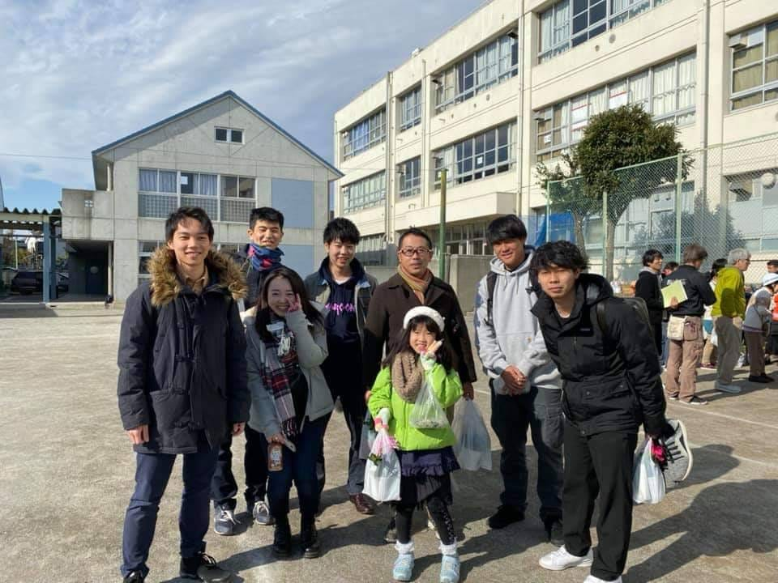
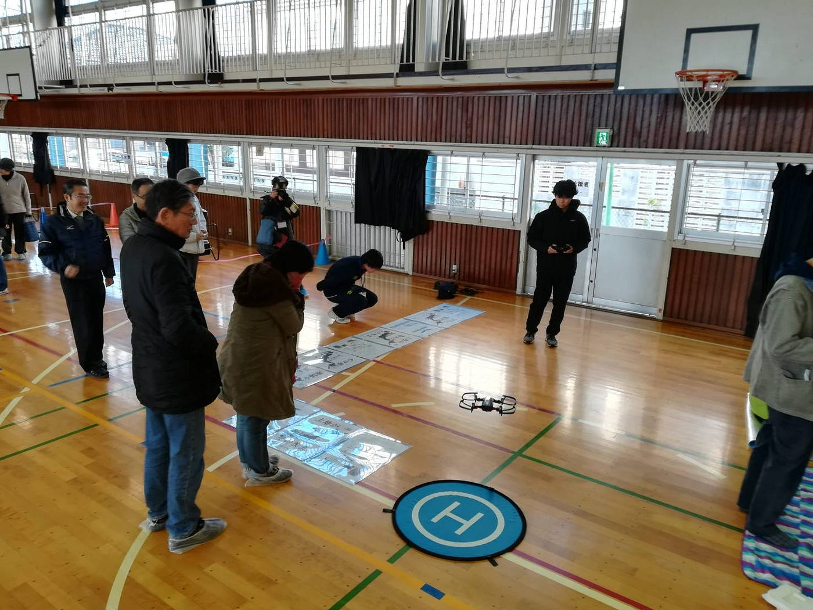
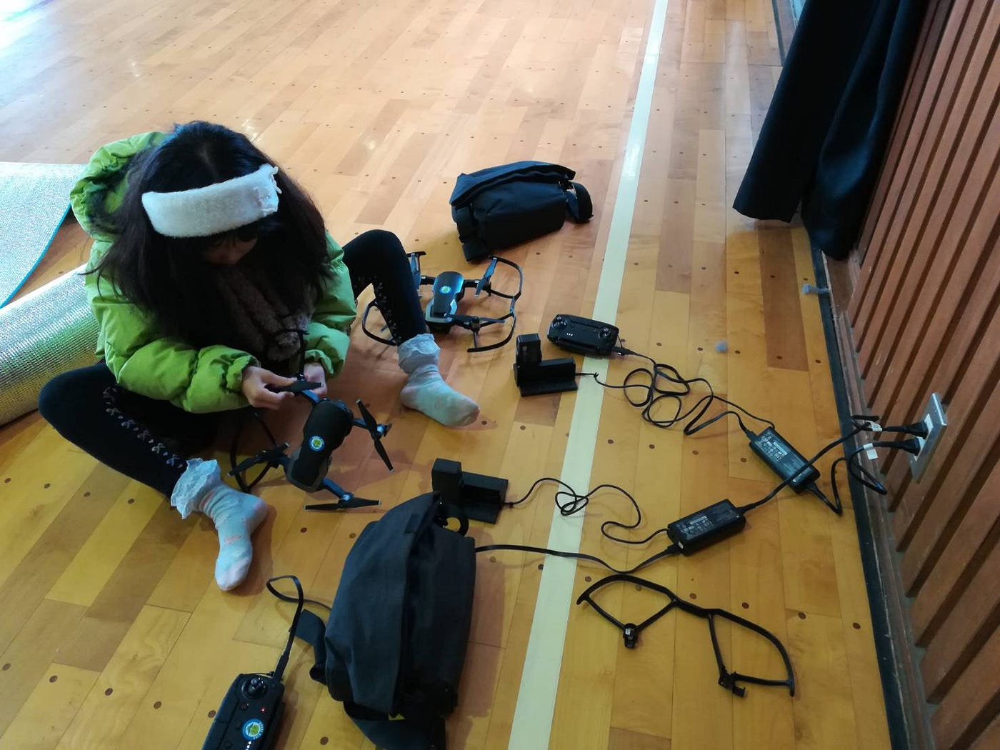
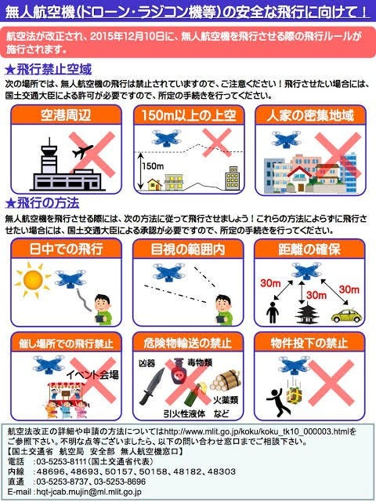
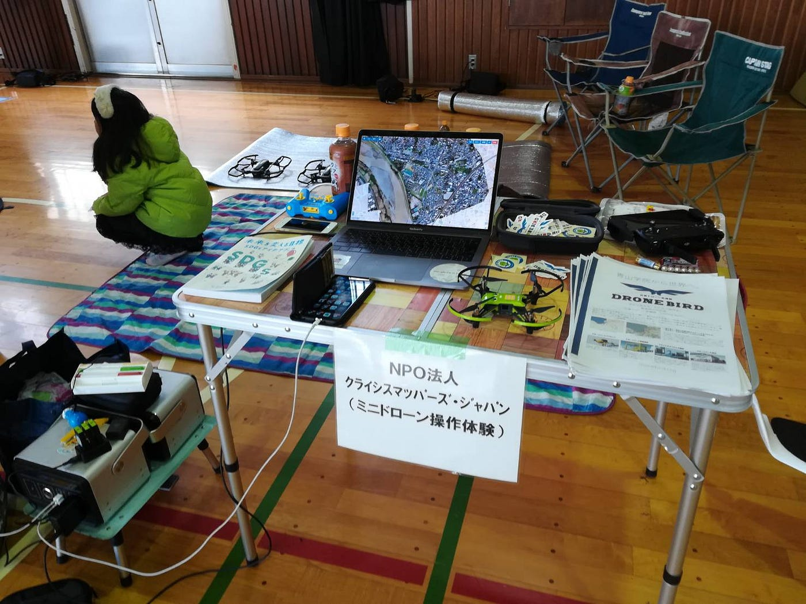

### 狛江市総合防災訓練2019 ～レンズカバーは外せます。～

こんにちは。3年の中西駿太です。2019年12月1日に、狛江市総合防災訓練が狛江市立第三小学校で開催されて、参加しました。

ドローン部のリーダーとして何も力を発揮できずとても屈辱感を味わいました。しかしながら、この経験は必ず自分を成長させるきっかけになると信じています。自分自身の未熟さを痛感すると同時に、ドローン部の練習により一層力を入れるべく邁進していく決意を固めるきっかけになりました。

防災訓練に参加する中でドローンのセッティングをスムーズに進めなければ足を引っ張ることになります。

実際に防災訓練に駆けつけた市民の方々にドローンの操縦体験をさせることになるので、その準備をしなければなりません。

今回の準備をした機材はMavic Air と Telloでした。なかなか充電が上手くできなかったり、カメラの映りが悪かったり機器とのマッチングが上手くいかなかったりと、私自身かなり困惑・興奮してしまいました。仲間や先生の娘さんにも手伝って頂きなんとか準備を整えることができました。本当にありがとうございました。

大盛況だったドローンの操縦体験コーナー。並んでいる方々に操作方法を教えていると、どの高さまで飛ばしていいのかや、どこなら自由に飛ばせるのか等々航空法に関連する質問をたくさん受けました。

そこで、私が説明した際に紹介したポスターを紹介します。航空法を管轄する国土交通省が公開している「[改正航空法](https://ja.wikipedia.org/wiki/%E8%88%AA%E7%A9%BA%E6%B3%95)概要[ポスター](https://ja.wikipedia.org/wiki/%E8%88%AA%E7%A9%BA%E6%B3%95)」です。航空法をサラッとわかりやすく理解するのに最適です。。

改正航空法概要ポスター<pdf> [https://www.mlit.go.jp/common/001110369.pdf](https://www.mlit.go.jp/common/001110369.pdf)

このポスターを見れば一目意然です。

上の三つの場面で飛ばしたい場合は原則ドローンの飛行は禁止で、国土交通省への手続きをしなければなりません。

例えば、150m以上の高さまでドローンを飛ばしたかったら国交省の許可を取らないといけないのです。

また、空港周辺と人家密集地域（DID）に該当するかどうかの確認方法は様々あります。例えば、国土地理院が提供している[地図](https://www.gsi.go.jp/chizujoho/h27did.html)で確認できます。

飛行の方法という項目には”日中の飛行”というのがあります。すなわち、夜にドローンを飛ばしたい場合は必ず国土交通省へ手続きを行い、承認を受ける必要があります。

そして、その航空法の対象外となるのが、 機体本体とバッテリーの重量合計が200ｇ未満のドローンなんです。しっかりと説明できるようにしたい項目です。

今回のドローン操作体験コーナーではお年寄りの方から小さな子ども達までたくさんの方々に参加頂きました。ドローンに対する関心の高さを実感し、ドローン部に求められている必要性は高いと感じました。

今回の反省も生かして、ピッコロ以外のドローンも積極的にセッティングし、飛ばしていきたいと思います。皆さんありがとうございました。

■Strava

往路：[https://www.strava.com/activities/2902741620](https://www.strava.com/activities/2902741620)

復路：[https://www.strava.com/activities/2902941952](https://www.strava.com/activities/2902941952)

以上
