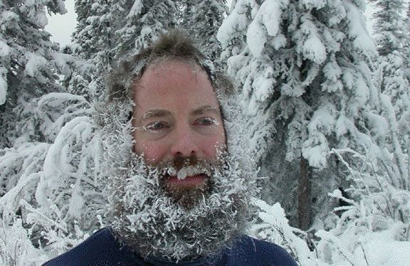
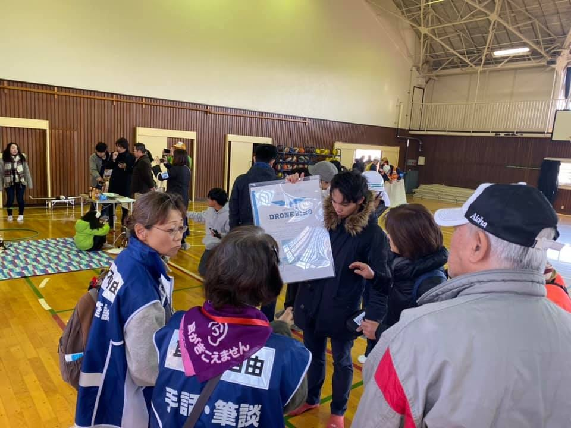

### 狛江防災訓練 冬の陣

いきなりですが皆さんこの俳句読んだことあります？？

> 冬の日や馬上に氷る影法師

これ松尾芭蕉の俳句で、 ある冬の朝のこと旅の途中寒すぎて、馬に乗ってたら馬の影法師になったがごとく凍てついてしまった。ってこと言ってるんですね。

いや〜まじで。芭蕉いい表現するわー。冬の朝めっちゃ寒いよな。
めっちゃわかる。マジ、おれ寒すぎて顔凍ってたもん。

芭蕉も言ってるし、僕自身も感じたのですが

### 防寒対策しっかりして！！！！！

ってことです！

午前中の寒い時間帯に行われる、防災訓練において防寒対策は必須です
自分の経験から防寒対策として、以下の物を用意することを勧めます！

・カイロ ….これまじで必要。常にぬくもりに触れられる
・室内履き….室内で行われる際に、足を冷やさないために必要
・温かい飲み物….保温性のある水筒とかに入れて持ってくるといいかも

防寒対策については以上です。もう一つ気になったことがあったのでこの記事で共有させてください！

それは……

### 高齢者の方が多い！ってことです

午前中にやることが多い防災訓練。若者がスヤスヤ寝てる中、じいさん・ばあさんは山に芝刈りではなく、防災訓練に来ていました。

ご年配の方に対して、ドローンというものはあまり身近ではないものらしく、興味をもって話を聞いていただけました。

ただ、身近ではない故に説明するときにポカーンとしていることもあり、自分の知識不足を実感しました。
そこで、ドローンをより身近に感じてもらうにはどうしたらよいか考えてみました。調べたところ、[高齢者の見守りサービス](https://drone-school-navi.com/dronenews_column/column/n20170925/)をドローンが行っていたり、[高齢者がドローンを使いビジネス](https://www.sankeibiz.jp/business/news/170321/bsc1703210500006-n1.htm)を行っていたりと様々な例を見つけることができました。
このように、高齢者の身近にもドローンを使った事例があることを話せば、より興味をもっていただけるのではないかと思いました！

イベントの時間帯、行う季節等から来客する層を予想し、それに見合った紹介の仕方を事前に考えれば、より質の高いイベント運営ができるのではないかと勉强させていただきました！

以下Strava記録です！ ご愛読ありがとうございました！
[https://www.strava.com/activities/2902741896](https://www.strava.com/activities/2902741896)
