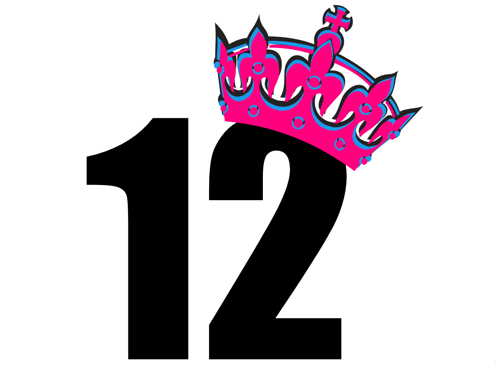
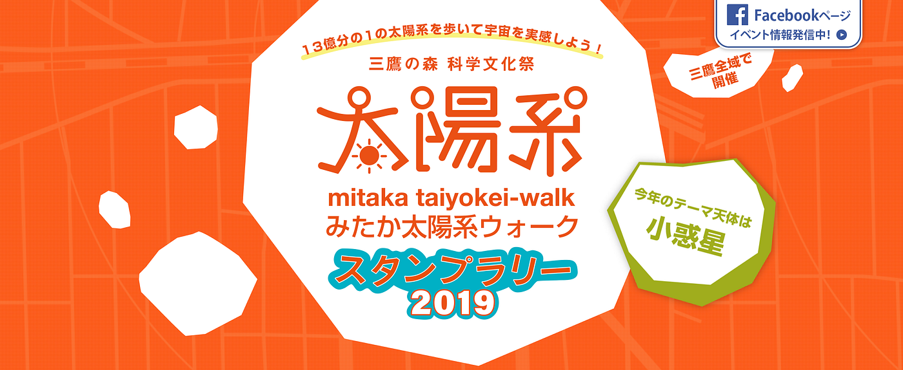
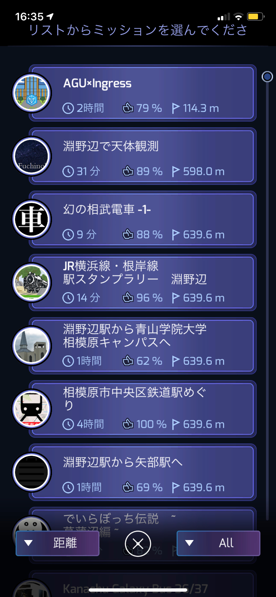

アドベントカレンダー12／13

こんにちは！古橋ゼミ3年の依田峻輔です。

残り12日！！クリスマス〜

今回はアドベントカレンダーでのゼミ論中間発表ということでブログを書きます！

私がゼミ論でまとめようと考えている内容は

**《位置情報ゲームの有効活用》です**

具体的には

この”みたか＜太陽系ウォーク＞と＜イングレス＞の

コラボレーションを目指したいと考えております！

理由としては

１、スタンプラリーのアナログだからこそ生じる問題を解決するため。

２、位置情報ゲームをより多くの人に触れてもらうため

です！

ではなぜイングレスと思う方もいると思うので少しお話を！

これ、**Ingressの中にあるスタンプラリー**だと思ってください。ひとつのMissionには**6つ以上のポータル**が登録されています（多いのだと20〜30のものも）。登録されているすべてのポータルで指定された行動をするとミッションクリア、そのMissionの**メダル**がもらえます。

当然ながら、その場所に行かないとMissionはクリアできないので、面白そうなミッションがあると多少遠くてもエージェントはクリアしにやって来ます。さらにMissionクリアすることを条件にリアルな店舗で特典なんか付けることによって、観光振興や商店街の活性化にも役立てられるでは！？！？！と思ったのがきっかけであります。

実際にこれまでにも**横須賀市・福岡県の芦屋町**などで地域復興を目的としたingressのイベントが行われ集客を集めるなどの事例がありました。

岩手県庁さんが、岩手Ingress活用研究会をつくってイベントを開催した結果、県内外から50人以上が参加があったそう！！

ですがこれまでに既存の地域イベントにingress を絡ませる取り組みは私自身発見できていないので問題解決の結果として、地域復興のモデリングの一つとして多くの地域の方が喜んでいただけたら幸いです！

そして、行うべき今後の課題は

### アポイントメント

何と言っても三鷹展望台主催のイベントなので、このアポイントメント次第で今後の進捗に大きな影響が。。なので早いうちに三鷹市に足を運んでみたいと思います。。(>_<)

古橋先生のお力添えを頂けたけたら三鷹ネットワーク大学にも協力をお願いしていただきたい次第であります。

とまだまだこれからなので頑張ります！
