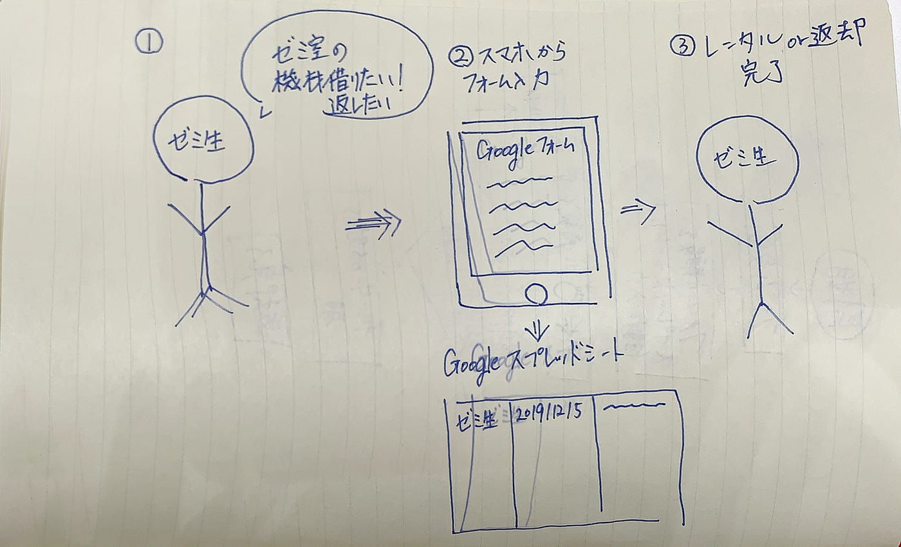
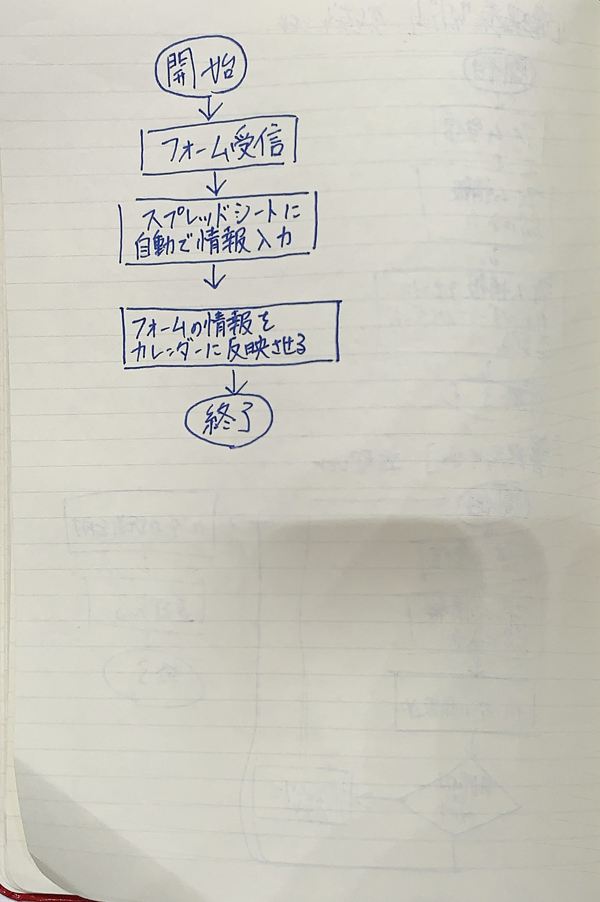
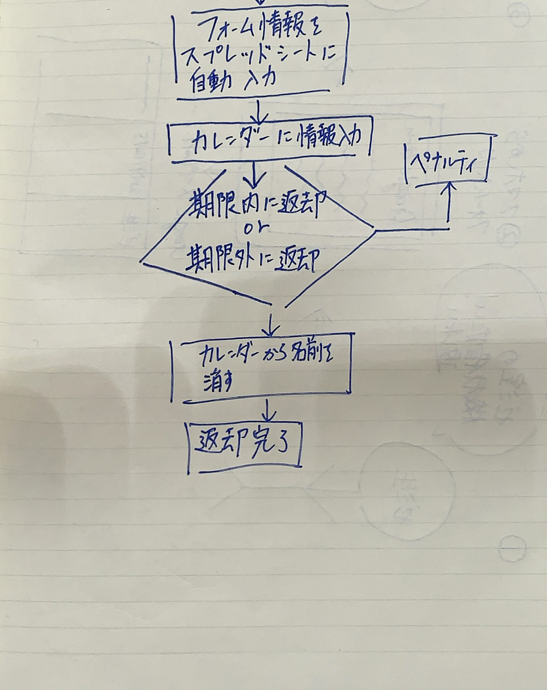
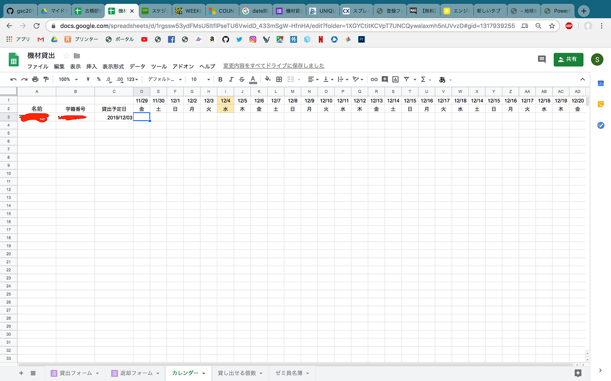
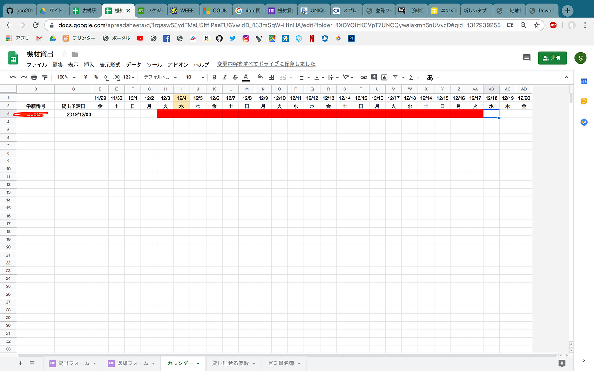

### 12/5 ゼミ論 『機材管理システム』の作成

アドベントカレンダー 12/5

この記事できるだけ多くの人に読んでほしいので、とりあえず、『クリスマス』『美女』でヒットした著作権フリーの写真貼りました。
サムネ詐欺ってやつですねー笑

んで、なんで美女の画像貼ってまで閲覧者稼ぎたかったかというと

#### ゼミ論でつまずいてるから助けて下さい泣

ってことなんですねー。

とりあえず平澤ゼミ論で何やってんの？？進捗どうなの？？という方は
[こちら](https://github.com/furuhashilab/gsc2019_Shogo-Hirasawa)を参考にしてください！

では早速何に困ってるの？？ってことなのですが。

私はGoogleスプレッドシートとGoogleフォームを使い機材管理システムを構築しようと考えています。

【機材レンタル者フロー】

【管理者フロー】
-貸出時-

返却時

管理者フローに書いてある、カレンダーに情報記入というところで苦戦しています・・・。

googleフォームの入力データをこのようにスプレッドシートに反映させます

その後、誰がいつまでどの機材を借りているのかを、このように自動で入力させたいです

この問題について、関数やスクリプトのアイデアあればご意見いただきたいです。

GASやスプレッドシートに強い方アドバイスいただけると嬉しいです泣
