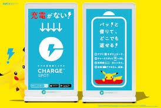

### 12/6ゼミ論「位置情報ゲームの経済効果」

こんにちは、３年の松本です！

私がやっているゼミ論のテーマは、「位置情報ゲームの経済効果」です。

位置情報ゲームといえば、皆さんご存知のポケモンゴーやイングレスなどが有名ですが、これらのゲームは「空間を移動してゲームをやり進める」という特徴があります。

そして現在、様々な商業施設や企業、社会団体が、この特性を生かして様々な取り組みを行っています！

私のゼミ論では、ポケモンゴーのChargeSpotがもたらす経済効果について調べていきたいと思います！

