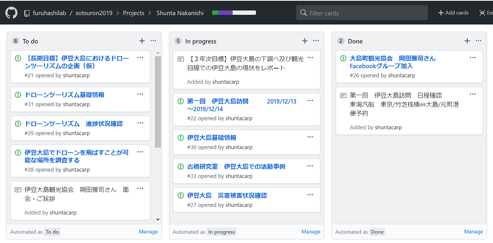
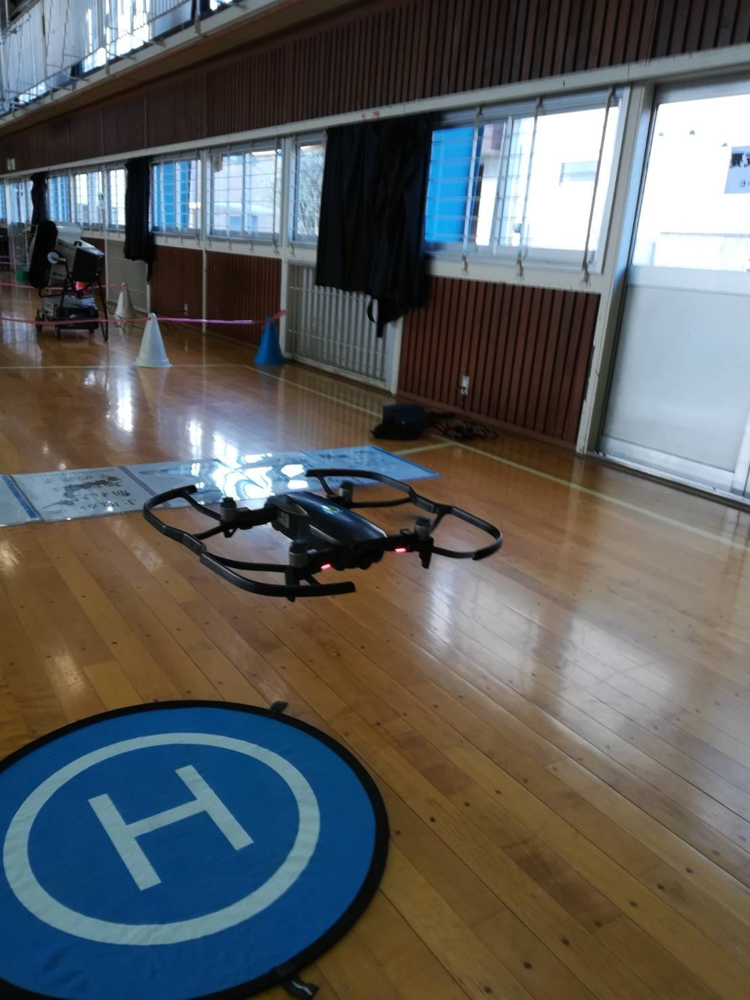

### 12/11 ゼミ論 伊豆大島×ドローン？

_古橋研究室アドベントカレンダー12/11（水）担当 中西駿太_

こんにちは。地球社会共生学部・古橋研究室所属３年の中西駿太です。

私は、仮ではありますが、**[伊豆大島](https://ja.wikipedia.org/wiki/%E4%BC%8A%E8%B1%86%E5%A4%A7%E5%B3%B6)における[ドローンツーリズム](https://www.japandrone-t.com/)の提案**を長期目標にゼミ論の取り組みを始めようと思っています。

しかしながら、自分でも気づきはしましたが、あまりにも最終ゴールが壮大すぎて、やるべきことも多いため、最終目標は変更するつもりです。最終目標は現時点では事実上白色状態になっています。そのため、最終目標を明確にすることができない状況で作業を進めていくことになりとても不安を抱えたまま取り組みを始めています。今後教授と、ご協力頂く[伊豆大島観光協会](http://www.izu-oshima.or.jp/)の岡田様と今後相談をしていきたいと思います。

ゼミ論発表の後たくさんの質問や懸念を私に伝えていただき本当にありがとうございました。

とりあえず、三年次では**伊豆大島の下調べ・観光目線での伊豆大島の現状レポート**を目標に定めましたのでそれに向かって活動をしていきたいと考えています。

その皮切りとして、12/13～12/14に伊豆大島を訪問し伊豆大島観光協会の岡田様とお会いする予定です。そこで、具体的な計画もお話しできたらと思います。

あくまでもテーマの核は、伊豆大島観光振興のお手伝いをし、台風や土砂災害の被害があったけど、「大島は元気です！」「是非大島にお越しください。」といった情報発信を行うということです。したがって、ドローンを関連して行なうかどうかはあまり関係はありません。

しかし、ドローン部の部長でもありますので是非ドローンに関連付けた活動にはしたいと思っています。

テーマを含めて今後方法を伊豆大島観光協会の方と話し合いをして決定したいと思います。

ありがとうございました。

以上
