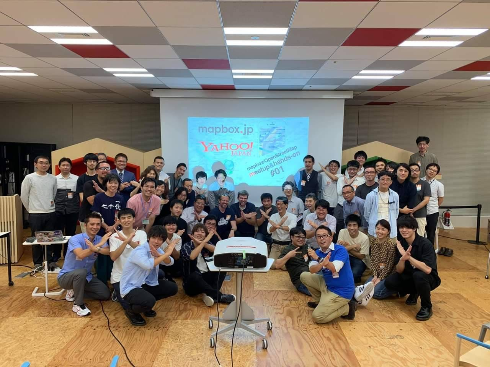
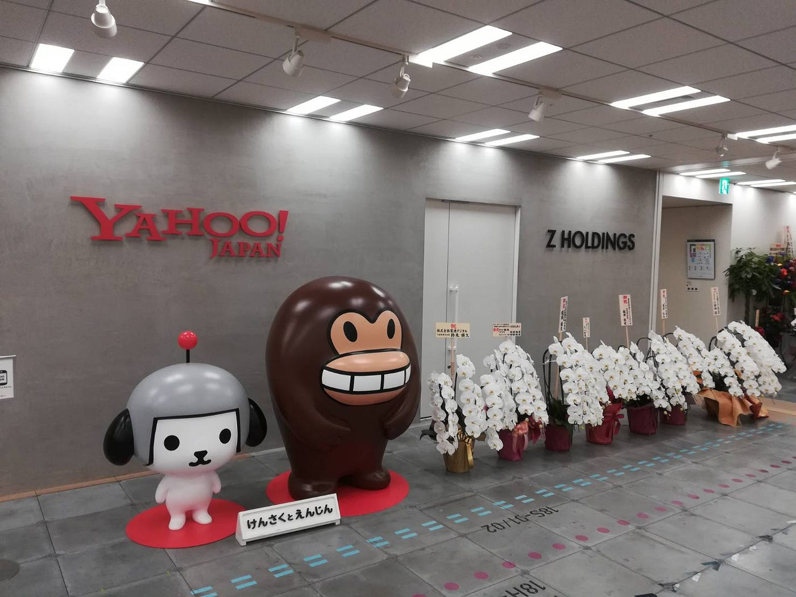
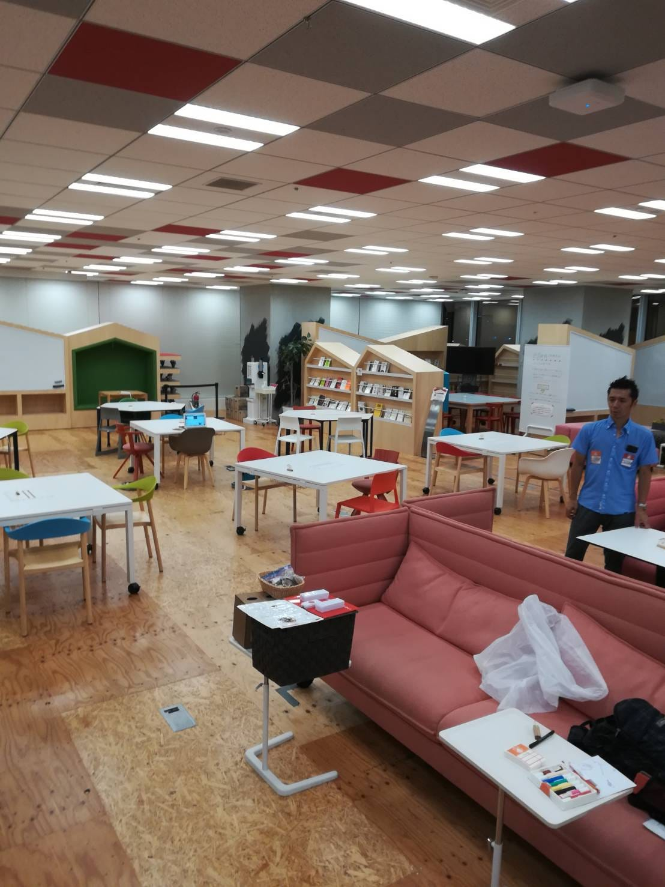
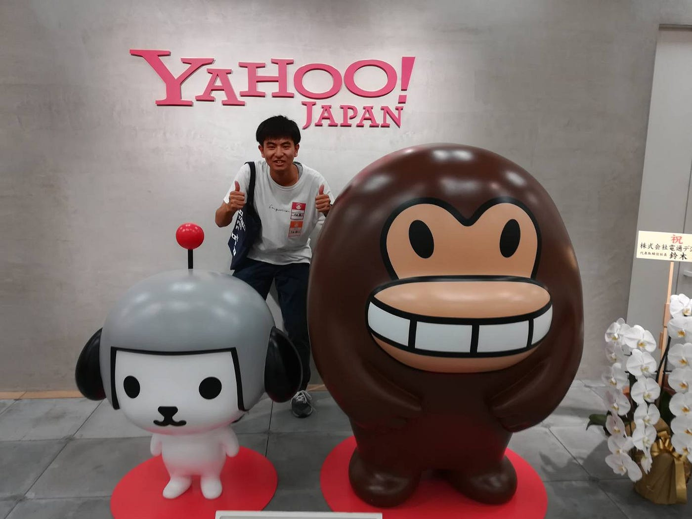
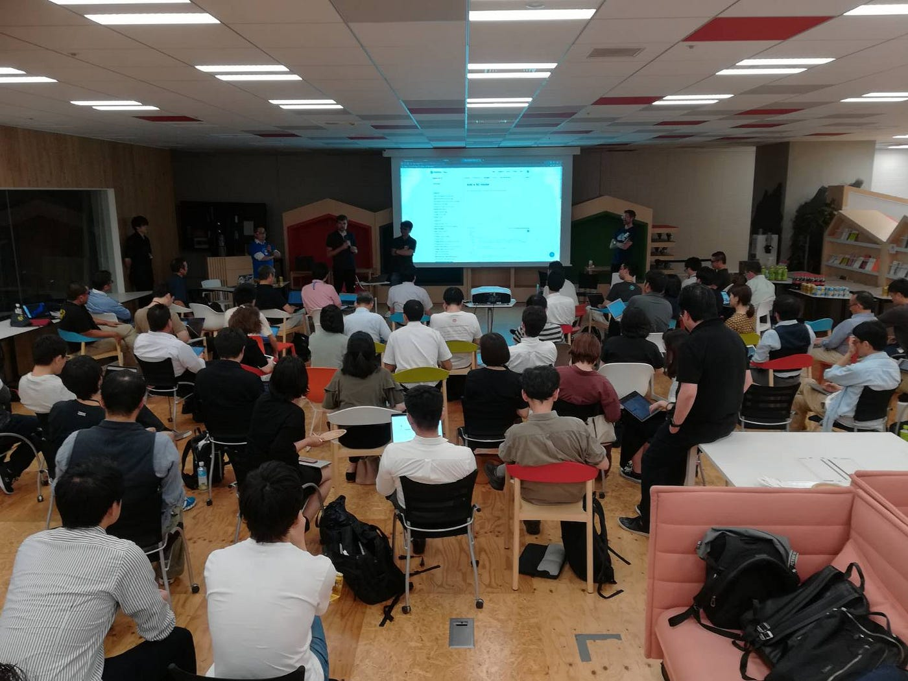
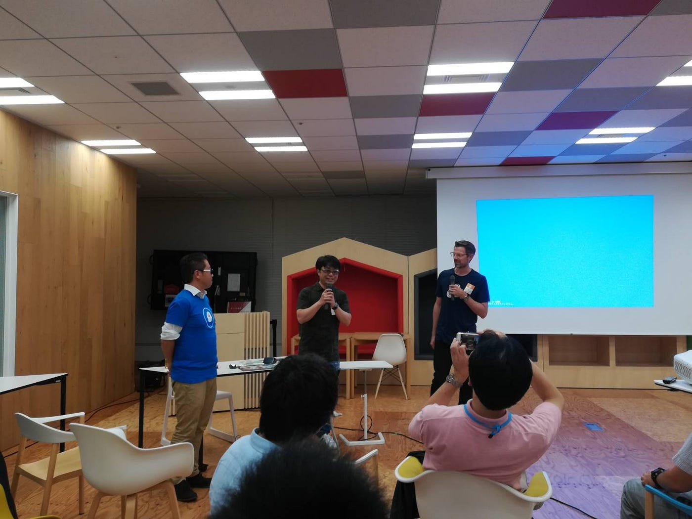

### mapbox/OpenStreetMap meetup&hands-on #01 Participation Report

みなさんこんにちは。青山学院大学地球社会共生学部 古橋研究室 ３年の中西駿太です。

先日10/4(金)に東京都千代田区にある「Yahoo! Japan」本社18FにあるYahoo! Lodge で開催された「mapbox/OpenStreetMap meetup&hands-on #01」に学生スタッフとして参加・運営をしてきましたので報告致します。

我々学生スタッフは17:30にYahoo!LODGEに到着し、設営準備をしました。
まずそもそもYahoo!LODGEに入る際には必ず「YahooID」を取得し、入館時に入館コードを取得しなくてはなりません。一緒に参加した友人はそれをすっかり忘れてたみたいでスムーズに入館することができなかったようです。Yahoo!LODGEに入館する際に身分証の提示を求められてましたので忘れずに持参してください。

Yahoo!LODGE内はフリースペースのようになっており一般の方も利用していました。制服姿の学生も使っていて驚きました。

_スタッフスケジュール
17:30 集合
18:00 飲み物を2Fのファミマに取りに行く
 レイアウト準備開始
18:30 開場・受付
19:00頃 食事搬入
19:00–19:20 オープニング・セッション
19:20–19:40 “State of the mapbox.jp” by mapbox team
19:40–20:40 ハンズオンセッション “Mapbox Studio” by 古橋 大地(青山学院大学 教授)
20:40–21:00 Q&A by mapbox team
21:00–21:30 Lightning Talks( 5 min x 5 talks ) 
21:30–22:00 懇親会
22:00 閉会
22:30 撤収_

始めてのゼミに関わるイベントの運営でしたが、ベンチャーというか”今どきの会社・企業”のイメージを肌で感じることができました。また、Yahoo!本社に入ることができたのもとても貴重な経験となりました。

今回のイベントとはあまり関係ありませんがケータリングサービスがとても良かったです。余った夕食をあくまでも”残飯処理”というスタッフの仕事の一環としてたらふく食べさせて頂きました。ケータリングサービスを行っていたのは青山学院大学のOBの方で先輩が作られた料理はとても美味しかったです。

今回が#1と書いてある通り、記念すべき第一回のmapbox/OpenStreetMap meetup&hands-onでした。

mapbox/OpenStreetMap meetup&hands-onはソフトバンクVISION FUNDグループとして本格的に日本において活動をスタートさせ、同時にYahoo! JAPANとの協力を発表したウェブ地図サービス 「mapbox」 と、そのベースとなっている私たちが大好きな「 OpenStreetMap」 を活用したユーザーコミュニティの交流イベントです。

この機会にmapbox/OpenStreetMap meetup&hands-onが始まったのは、2019年に「Yahoo!地図」が mapbox ベースに大幅リニューアルすることによって、旧ALPS地図データ資産はYahoo! JAPANに返り咲くことになりました。こういったYahoo! JAPANがこれまでに歩んできた地図サービスの過去を振り返り、その未来を mapbox と OpenStreetMap と共に考えるコミュニティの立ち上げを目的に、未来のウェブ地図のあり方について語る機会が設けられたのです。

残念ながら、私は入口のエレベーターで会場の案内をしたり、ケータリングサービスの補助をしたりとスタッフとして参加させていただいたのでお話しをきちんと聞くことはできなかったですが、地図に新たな時代が到来するといった期待感、高揚感を感じることができました。

次にイベントに参加する際はしっかりとイベントの内容や議題内容を事前に予習した上で参加すると身につく知識がより増えると思いました。これらの反省を生かしてまたイベントに参加したいと思います。

記念すべき第一回のmapbox/OpenStreetMap meetup&hands-on、そして、自分自身最初のイベント運営スタッフを成功することができて本当に良かったです。また、ひとつ大きな経験をすることができました。

皆さんありがとうございました。

以上
