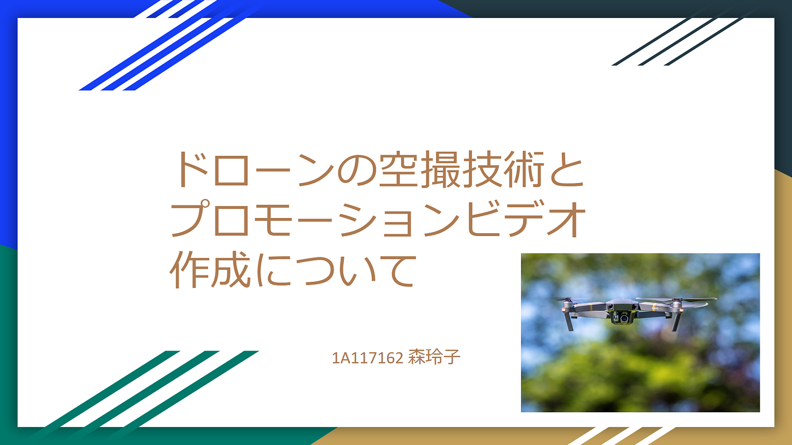
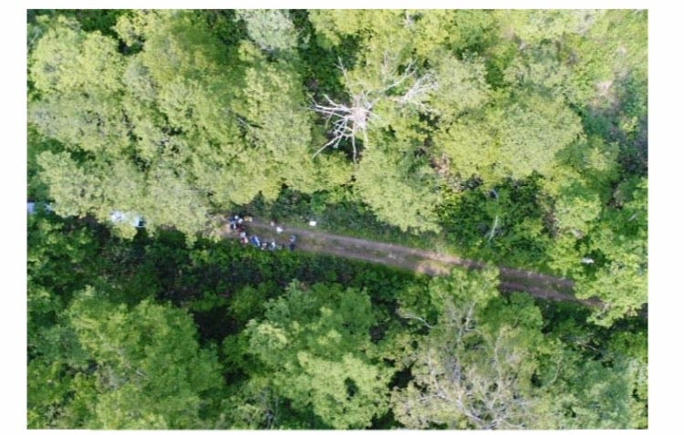
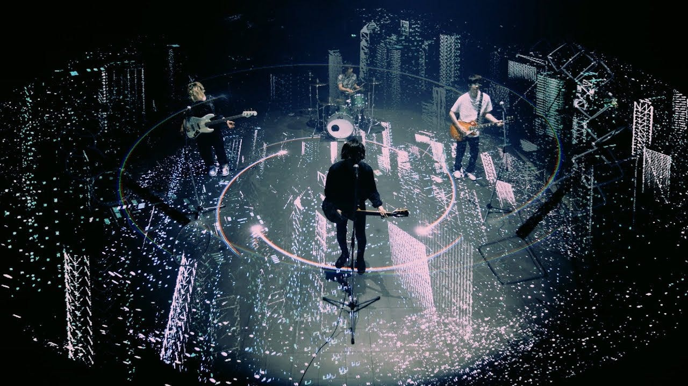
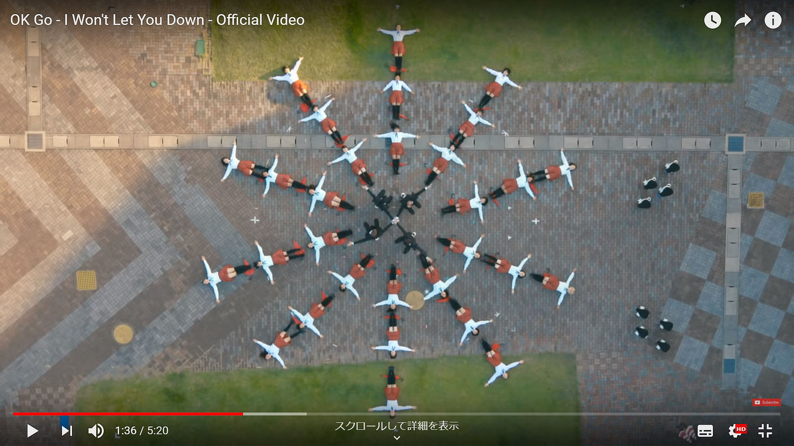
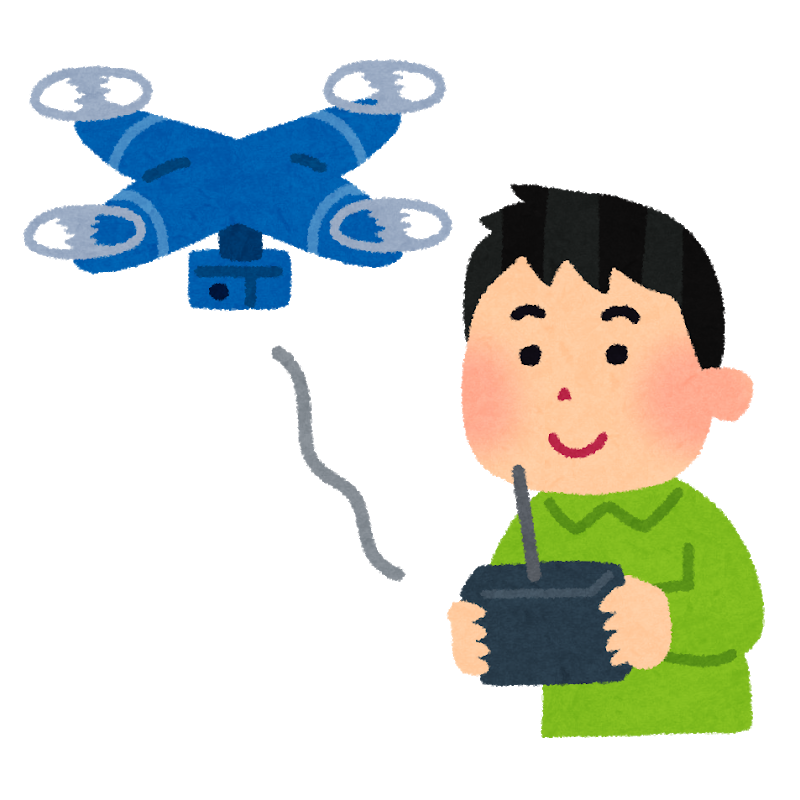

### アドベントカレンダー 12/9

こんにちは！古橋ゼミ3年の森玲子です。

私は、ゼミ論のテーマを「ドローンの空撮技術とPVの作成について」に設定し、先日中間発表を行いました。

### ①設定した背景として

・ドローン部に所属していて中でも撮影技術に関心があったこと。

・自分の趣味である音楽鑑賞とドローンの関係について知りたい！

### ②先行研究

・北海道大学では、ドローンを使用しながら学生に「撮影技術や植物の育成、緑被率の確認」といった教育を受けさせています。

・実際のPV例として、BUMP OF CHICKENの「シリウス」があります。撮影でドローンを使用しているだけでなく実際にドローンが飛行しているのが特徴的です。

### ③中間発表で得た質問・先生からのアドバイス

１．質問やご意見

・自分自身ではPV作成をするのか？しないのか？

・調査で得た結果をどうするのか？最終的にどのように応用するのか？

・一般人が真似できるような、プロの人たちの撮影技術がわかるといい

・撮影方法の何に注目するのか

などなど、沢山の指摘や意見を頂きました。

２．古橋先生からのアドバイスとして

・類似した調査をされていた、しょうまさんに話を聞いて自身の調査の参考にすると良い・・・？

・ PVに限定した撮影手法やフレーミングなどを型として抽出して、「標準化」する！

・ とにかくドローンを使ったPVをみまくって 、YouTubeの再生リストを つくる！

※一例として、OK GoのPVを紹介してくださいました。初見でした、知識不足・・・

同じく沢山の貴重なご助言を頂きました・・・。

### ④これからの方針

③でも述べました皆さん・先生からのご質問やご意見、アドバイスを経て、これからの方針を考えました。

１．まずは、実際にはPVを作成するところまでは厳しいと思うため技術の調査のみに絞ることにしました。

調査で得た結果は、『私自身が「ドローンによる撮影方法の知識」を、まだ何も知らない一般の人よりも多く知っているレベルに達すること』、に応用していきたいと思います。

２．また、古橋先生からのアドバイスからにもあったように、しょうまさんに色々伺ってみることや、PVの撮影方法のみに焦点をしぼっていくこと、とにかく一つでも多くのPVを一日一個でも見て、リストを作成することです。かなり大掛かりな作業で課題も多いですが、地道に頑張って行きたいと思います。

～参考文献～

・**北海道大学 ドローンを活用した教育・研究・森林管理**

[https://jauf.cambria.ac/topics/pdf/n-hokkaido-2017.pdf](https://jauf.cambria.ac/topics/pdf/n-hokkaido-2017.pdf)

**・[空飛ぶマシンに魅せられて]Vol.02 FPV(First Person View)の衝撃**

[https://www.drone.jp/column/20151005180642.html](https://www.drone.jp/column/20151005180642.html)

**・人気バンドのMVにも！ドローンだから出来る新しい自由視点映像！**

[https://viva-drone.com/drone-drama-freedom-movie/](https://viva-drone.com/drone-drama-freedom-movie/)

以上、森のゼミ論中間報告とさせていただきます。ありがとうございました！
