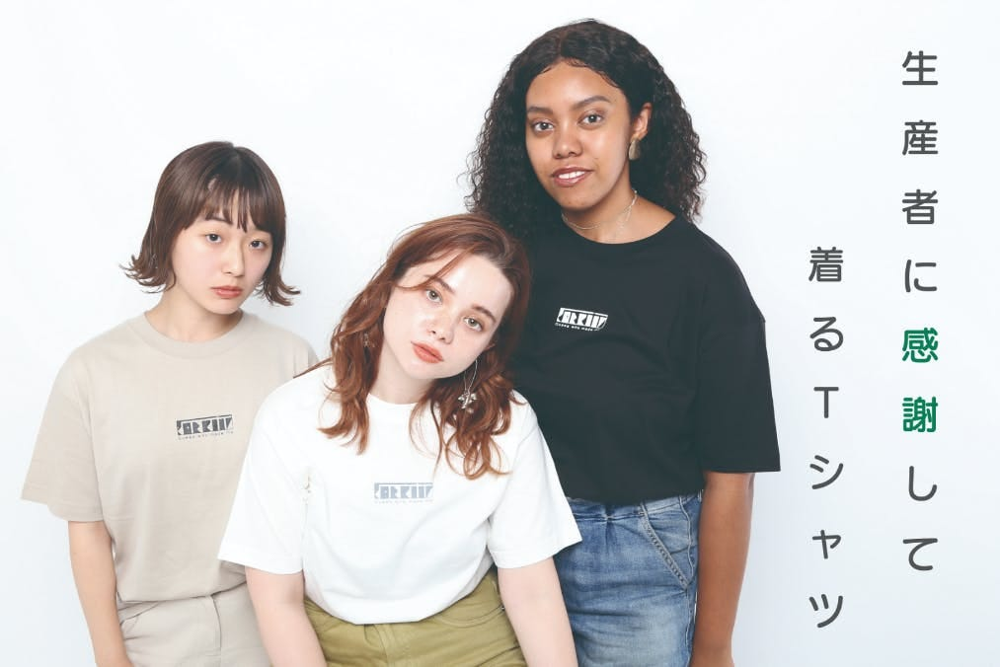
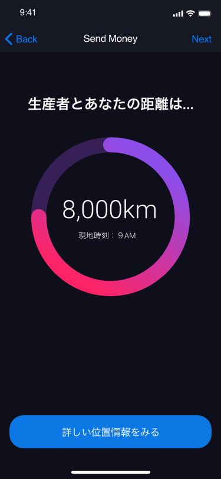
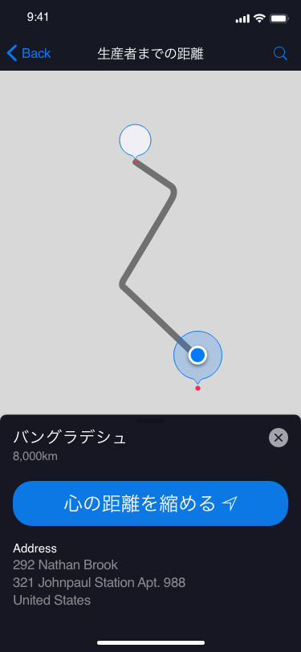
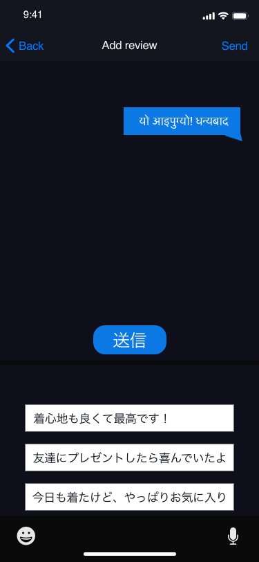

### エシカルファッションと位置情報について考えてみる

古橋ゼミ3年生の大庭です。

今回はアドベントカレンダーということで、私が現在ゼミ論で取り組んでいるテーマについて書いていきたいと思います。

私のゼミ論のテーマは、「ファッション×位置情報」です。

古橋ゼミは、”位置情報”を扱うゼミなので、そこについて疑問はないかもしれませんが、「なぜにファッション？」と思った方も少なくないでしょう。

### きっかけ

古橋ゼミの授業が始まる前より、個人的にエシカルファッションブランド[TSUNAGU PRODUCT](https://www.tsunagu-product.com/)を運営してきました。

第一弾商品「[継なぐTシャツ](https://camp-fire.jp/projects/view/173789)」は、消費者と生産者をツナグをテーマとしたTシャツで、

クラウドファンディングを通して約150人の方々にTシャツを購入していただきました。

「継なぐTシャツ」は、素材やデザインを通して、生産者と消費者をツナグ仕掛けを盛り込みました。

「これに加えて何かできないだろうか？」と思ったことが今回のプロジェクトの始まりです。

### 生産者との距離がわかり、感謝の思いが伝えられるアプリ

今回、私が考えているのは、Tシャツやその他商品のタグについているQRコードを読み込むと、自動でアプリが立ち上がり、

自分と自分が着ているものを作った人の距離が表示されるという昨日です。

現地の時間や天気などがわかれば、もっと作った人を身近に感じることができるのではないかと考えています。

そして、一方的な情報提示だけではなく、生産者にメッセージを送れる機能があれば、

生産者側も、仕事や生活の励みになるのではないだろうかと考えています！

加えて、ゼミの仲間からは「寄付できる機能」があるともっといいのではないかとの意見もいただいたので、検討を進めています！！

### 現在段階の機能案（仮）

メッセージの機能は自動で翻訳され、生産者の第一言語で届く仕様となっています。

### 今後

TSUNAGU PRODUCTは、なんと年末から年始に向けて、高校や大学からの講演依頼が数個ありますw

そこに加えて、とある繊維会社さんからコラボのお話も！！

この位置情報アプリの開発も協力していただける会社や個人様がないか見つけていこうと思います！
