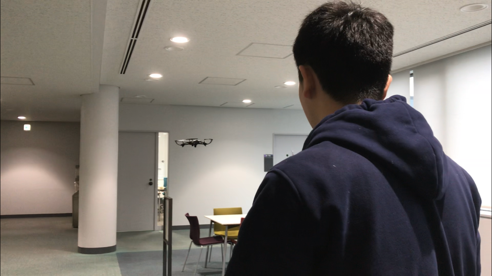

### ドローン部週報 第６週目

こんにちは、古橋研究室３年の吉田です！

今回は活動内容の報告、そしてドローンの海外空撮について説明していきたいと思います。

### 活動報告

今回は９階ではなく研究室のある７階のラウンジで行いました。

この活動日の前日（12/1）にあった狛江市防災訓練で恥ずかしい思いをしたというあるメンバーは[ピッコロ](https://www.yodobashi.com/community/product/100000001003079611/index.html)を卒業して他のドローンについて知識を深めたいと話していました。

最近は参加率が低下しているため、それを改善すると共に、操縦の向上以外にも実践的要素をこれからの活動に組み込んでいきたいと思います。

### ドローンの海外空撮について

海外旅行をしていて、ここでドローン空撮をしたい！と思ったことはありますか？？？

**私はあります。**

でも申請やら何やらするのがめんどくさそうで考えるのをやめていました。実際、私が留学で行ったタイのドローン空撮に関しては、

・ドローン保険に入る
・タイ国家放送通信委員会への申請
・タイ民間航空庁への申請

が必要らしく、タイ民間航空庁への申請は２〜３ヶ月もかかってしまうらしいです。これじゃ短期旅行では何もできないですね、、

しかし、そんな面倒なことをしなくてもドローン空撮ができる国があります！

#### オーストラリアです！

レクリエーション目的なら、資格や飛行許可の申請をする必要はありませんが、以下のルール守らなければなりません。

> ・地上から120メートル(400フィート)以上での飛行は禁止

> ・公衆の安全に影響を及ぼすエリアの近くまたは上空での飛行は禁止

> ・緊急活動が行われている場所での(事前の許可のない)飛行は禁止。具体的には自動車事故、警察の活動、火事や関連する消化活動、捜索救助活動を含む。

> ・人から30メートル以内での飛行は、それらの人がコントトロール配下にない限り、またはドローンを制御することができない限り禁止

> ・一度に一機のドローンのみ飛行可能

> ・飛行するドローンが100グラム以上の場合:

> 空港やヘリポートなどの航空施設から最低5.5km離れて飛行すること(通常、管制塔を有する施設)

> 有人航空機の運行が定常的に行われていない航空施設においては、有人航空機のオペレーションが行われていない時に限ってそれらの施設から5.5km以内での飛行が認められる。有人航空機のオペレーションが行われているとわかった時には、それら航空機から離れさせて、安全性を確保しながら即時に着陸させること。これは以下のケースにも適用される。

> 航空施設の境界線以内でドローンを飛ばしていない場合

> 航空機の離着陸経路の範囲内でドローンを飛ばしていない場合

> ・日中に限り飛行すること。また目視の範囲で飛行すること。

> これは操縦している機体を操縦者自身の目で常に認識し、追跡できることを意味する。(ゴーグルを装着した状態や映像スクリーン経由での確認ではない)

> ・人混み上空での飛行は禁止。これには祭事やスポーツイベント、賑わっているビーチ、公園、車の通りの多い道路や歩行者用道路も含む。

> ・他の航空機や人々、建物に被害を与えるような方法での飛行は禁止

> ・飛行禁止エリア、飛行制限エリアでの飛行は禁止

> ・他人のプライバシーに配慮すること。本人の同意なしにドローンを用いて記録や写真を取らないこと。これらは州法に違反する可能性がある。

> （[https://dronebangkok.live/2018/06/11/australia-drone-laws/](https://dronebangkok.live/2018/06/11/australia-drone-laws/)より引用）

日本の飛行ルールと似ているものがありますね。
（日本の規制に関しては[第４週目の週報](https://medium.com/furuhashilab/%E3%83%89%E3%83%AD%E3%83%BC%E3%83%B3%E9%83%A8-%E9%80%B1%E5%A0%B1-%E7%AC%AC%EF%BC%94%E9%80%B1%E7%9B%AE-1e78a2b2e04f)に記載してますのでそちらをご覧ください。）

これらのことを守ればオーストラリアでは飛ばし放題！
ドローン空撮初心者には特にオススメの国みたいですよ！

また、オーストラリアの民間航空当局[CASA](https://www.casa.gov.au/drones)が作成したドローン規制を説明する動画もありますので、そちらも合わせて是非ご覧ください！

Flying for fun - drone rules in Australia

他の国の規制について簡易的にでも知りたいという方は**[「Drone Laws For Every Country In The World（Recreational Use Only）」**](https://www.google.com/maps/d/viewer?mid=1OkEtyCaGNjKhLeMr6L2IU975SP8&ll=1.8304479169886587%2C-103.89415049999991&z=2)をご覧ください。

このMap内の緑のアイコンは「一般的にドローンの使用が許可されている」、赤のアイコンは「ドローンの持ち込みあるいは使用が禁止、もしくは厳しく制限されている」など、海外のドローン規制状況に応じてアイコンが色分けされています。

しかし、これはあくまで**簡易的**なものに過ぎません。きちんと調べたい方は在日大使館に問い合わせてみるのがいいでしょう。

### 最後に

日本で飛ばすにも海外で飛ばすにも最低限のルールがあり、それが守られなければドローンの空撮はもっともっと制限されてしまいます。
ドローンを日常的に扱いたいという人は基本的な知識をきちんと理解した上で、大いに楽しみましょう！
